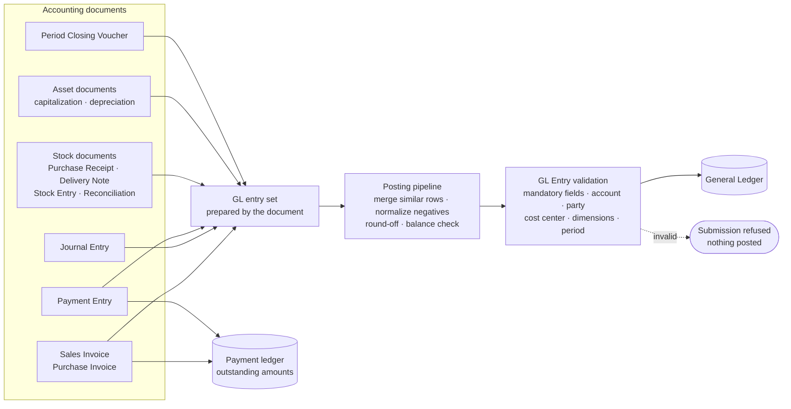
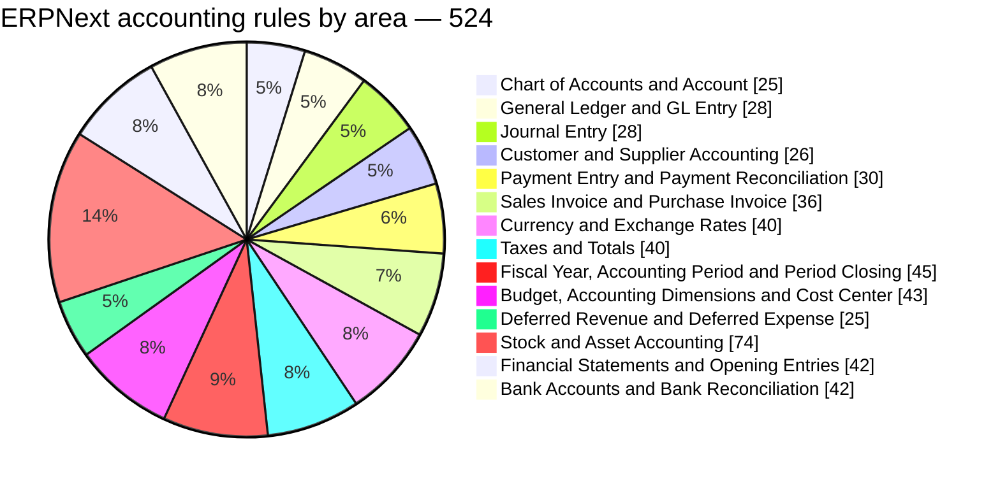

# ERPNext Accounting Engine Rules
## The accounting engine and control baseline of SBC ERP

| | |
| --- | --- |
| **Document** | ERPNext Accounting Engine Rules — catalog |
| **Edition** | 2026 |
| **Scope** | 524 accounting rules across 14 accounting areas of the ERPNext Accounting engine |
| **Audience** | Financial controllers, chief accountants, auditors, implementation consultants and solution architects |
| **Use** | Accounting engine and control baseline for SBC ERP for Oil & Gas |

> This catalog states the accounting rules of the **ERPNext Accounting engine** as testable rules: what the engine validates, how it posts, which state changes it allows and how accounting moves between documents. SBC ERP uses this engine as its accounting engine and control baseline. Each rule has a stable `ERP-*` identifier and names the ERPNext source where the behavior is implemented.

## Contents

- [1. About the ERPNext Accounting engine](#1-about-the-erpnext-accounting-engine)
- [2. How the rules were stated](#2-how-the-rules-were-stated)
- [3. How to read a rule](#3-how-to-read-a-rule)
- [4. Coverage at a glance](#4-coverage-at-a-glance)
- [5. Chart of Accounts and Account](#5-chart-of-accounts-and-account)
- [6. General Ledger and GL Entry](#6-general-ledger-and-gl-entry)
- [7. Journal Entry](#7-journal-entry)
- [8. Customer and Supplier Accounting](#8-customer-and-supplier-accounting)
- [9. Payment Entry and Payment Reconciliation](#9-payment-entry-and-payment-reconciliation)
- [10. Sales Invoice and Purchase Invoice](#10-sales-invoice-and-purchase-invoice)
- [11. Currency and Exchange Rates](#11-currency-and-exchange-rates)
- [12. Taxes and Totals](#12-taxes-and-totals)
- [13. Fiscal Year, Accounting Period and Period Closing](#13-fiscal-year-accounting-period-and-period-closing)
- [14. Budget, Accounting Dimensions and Cost Center](#14-budget-accounting-dimensions-and-cost-center)
- [15. Deferred Revenue and Deferred Expense](#15-deferred-revenue-and-deferred-expense)
- [16. Stock and Asset Accounting](#16-stock-and-asset-accounting)
- [17. Financial Statements and Opening Entries](#17-financial-statements-and-opening-entries)
- [18. Bank Accounts and Bank Reconciliation](#18-bank-accounts-and-bank-reconciliation)
- [Appendix A. Rule index](#appendix-a-rule-index)
- [Appendix B. ERPNext source files referenced](#appendix-b-erpnext-source-files-referenced)

---

## 1. About the ERPNext Accounting engine

ERPNext is an established open-source ERP whose accounting module has been developed and used in production for many years. Its accounting engine provides double-entry accounting, General Ledger controls, chart of accounts structures, receivables and payables, journals, multi-currency, fiscal periods and closing, budgets, accounting dimensions, taxes, deferred accounting, stock and asset accounting, bank reconciliation and financial statements.

Every accounting document in ERPNext reaches the ledger through one posting pipeline:



> ERPNext is a trademark of Frappe Technologies Pvt. Ltd. and is distributed under the GNU General Public License v3. This catalog describes the accounting behavior of the engine for the purpose of adopting it as a control baseline. It is not affiliated with or endorsed by Frappe Technologies.

---

## 2. How the rules were stated

1. **Behavior, not code.** Each rule describes an observable validation, posting effect or state transition of the ERPNext Accounting engine. No source code is reproduced.
2. **Source traceability.** Each rule names the ERPNext function, document controller or module where the behavior is implemented.
3. **Stable identifiers.** Each rule has a permanent `ERP-*` identifier, grouped by accounting area, so implementation, tests and audit evidence can refer to it.
4. **Accounting standards come first.** Where engine behavior conflicts with IFRS, IAS, Oman law, tax requirements, an approved accounting policy or a signed contractual accounting treatment, the authoritative requirement prevails.
5. **Configuration is not a universal rule.** Where the engine's behavior depends on settings, the rule is stated as a configurable policy.
6. **Baseline controls added for SBC ERP.** A small number of rules strengthen the baseline where an enterprise Oil & Gas deployment needs a control that the engine leaves to configuration or practice. Those rules are marked with the origin *SBC baseline control*.

---

## 3. How to read a rule

```text
ERP-GL-001 — Every accounting voucher must produce a balanced entry set
Strength · Origin
Rule statement
ERPNext source
```

| Strength | Meaning |
| --- | --- |
| MUST | Mandatory. A transaction that breaks the rule is refused. |
| MUST, qualified | Mandatory under the stated condition, for example *MUST when configured*. |
| SHOULD | Expected default behavior. |
| MAY | Optional capability, used where policy enables it. |

| Origin | Meaning |
| --- | --- |
| ERPNext | Behavior of the ERPNext Accounting engine, with its source named under the rule. |
| SBC baseline control | A control added to the baseline for an enterprise Oil & Gas deployment. |

---

## 4. Coverage at a glance

| Measure | Value |
| --- | ---: |
| Rules in this catalog | 524 |
| ERPNext engine rules | 506 |
| SBC baseline controls | 18 |
| Strength MUST (including qualified) | 478 |
| Strength SHOULD (including qualified) | 40 |
| Strength MAY (including qualified) | 6 |

| Accounting area | Rules | ERPNext engine | SBC baseline control |
| --- | ---: | ---: | ---: |
| [Chart of Accounts and Account](#5-chart-of-accounts-and-account) | 25 | 25 | 0 |
| [General Ledger and GL Entry](#6-general-ledger-and-gl-entry) | 28 | 27 | 1 |
| [Journal Entry](#7-journal-entry) | 28 | 28 | 0 |
| [Customer and Supplier Accounting](#8-customer-and-supplier-accounting) | 26 | 26 | 0 |
| [Payment Entry and Payment Reconciliation](#9-payment-entry-and-payment-reconciliation) | 30 | 30 | 0 |
| [Sales Invoice and Purchase Invoice](#10-sales-invoice-and-purchase-invoice) | 36 | 36 | 0 |
| [Currency and Exchange Rates](#11-currency-and-exchange-rates) | 40 | 38 | 2 |
| [Taxes and Totals](#12-taxes-and-totals) | 40 | 38 | 2 |
| [Fiscal Year, Accounting Period and Period Closing](#13-fiscal-year-accounting-period-and-period-closing) | 45 | 42 | 3 |
| [Budget, Accounting Dimensions and Cost Center](#14-budget-accounting-dimensions-and-cost-center) | 43 | 42 | 1 |
| [Deferred Revenue and Deferred Expense](#15-deferred-revenue-and-deferred-expense) | 25 | 25 | 0 |
| [Stock and Asset Accounting](#16-stock-and-asset-accounting) | 74 | 73 | 1 |
| [Financial Statements and Opening Entries](#17-financial-statements-and-opening-entries) | 42 | 39 | 3 |
| [Bank Accounts and Bank Reconciliation](#18-bank-accounts-and-bank-reconciliation) | 42 | 37 | 5 |
| **Total** | **524** | **506** | **18** |



---

## 5. Chart of Accounts and Account

Account structure, root types, group and ledger accounts, posting eligibility, account currency, control accounts and governance of accounts with history.

**Primary ERPNext sources:** `accounts/doctype/account/account.py`, `accounts/doctype/gl_entry/gl_entry.py`, `accounts/party.py`.

**25 rules**

### 5.1 Hierarchy and structural rules

<a id="erp-coa-001"></a>

#### ERP-COA-001 — Root accounts are groups

`MUST` · Origin: **ERPNext**

A root account cannot be a posting ledger. Root nodes represent structural categories.

*ERPNext source:* `Account.validate_root_details`

<a id="erp-coa-002"></a>

#### ERP-COA-002 — Parent account must exist

`MUST` · Origin: **ERPNext**

A non-root account must not reference a missing parent.

*ERPNext source:* `Account.validate_parent`

<a id="erp-coa-003"></a>

#### ERP-COA-003 — An account cannot parent itself

`MUST` · Origin: **ERPNext**

Self-parenting must be rejected.

*ERPNext source:* `Account.validate_parent`

<a id="erp-coa-004"></a>

#### ERP-COA-004 — Parent must be a group account

`MUST` · Origin: **ERPNext**

A posting ledger cannot be used as the parent of another account.

*ERPNext source:* `Account.validate_parent`

<a id="erp-coa-005"></a>

#### ERP-COA-005 — Parent and child must belong to the same company

`MUST` · Origin: **ERPNext**

Normal COA hierarchy cannot cross company boundaries.

*ERPNext source:* `Account.validate_parent`

<a id="erp-coa-006"></a>

#### ERP-COA-006 — Ledger accounts with children are invalid

`MUST` · Origin: **ERPNext**

An account with child nodes cannot be converted to or retained as a posting ledger.

*ERPNext source:* `Account.validate_group_or_ledger`, `convert_group_to_ledger`

<a id="erp-coa-007"></a>

#### ERP-COA-007 — Posted accounts cannot freely change structural mode

`MUST` · Origin: **ERPNext**

An account with existing GL activity cannot be converted between group and ledger where the conversion would invalidate history.

*ERPNext source:* `Account.validate_group_or_ledger`, `convert_ledger_to_group`

<a id="erp-coa-008"></a>

#### ERP-COA-008 — Root classification is mandatory

`MUST` · Origin: **ERPNext**

Root Type and Report Type must be defined.

*ERPNext source:* `Account.validate_mandatory`

<a id="erp-coa-009"></a>

#### ERP-COA-009 — Root type set is controlled

`MUST` · Origin: **ERPNext**

SBC ERP should use a controlled root classification such as Asset, Liability, Equity, Income and Expense. Extensions require an explicit reporting design.

*ERPNext source:* Account tree/root model

### 5.2 Posting eligibility

<a id="erp-coa-010"></a>

#### ERP-COA-010 — Group accounts cannot receive transactional postings

`MUST` · Origin: **ERPNext**

GL posting against a group account is rejected.

*ERPNext source:* `GLEntry.validate_account_details`

<a id="erp-coa-011"></a>

#### ERP-COA-011 — Disabled/inactive accounts cannot receive new postings

`MUST` · Origin: **ERPNext**

Posting to disabled accounts must fail.

*ERPNext source:* `gl_validator.validate_disabled_accounts`, `GLEntry.validate_account_details`

<a id="erp-coa-012"></a>

#### ERP-COA-012 — Account must belong to transaction company

`MUST` · Origin: **ERPNext**

Every posted account must match the company on the voucher.

*ERPNext source:* `GLEntry.validate_account_details`

<a id="erp-coa-013"></a>

#### ERP-COA-013 — Account type changes must protect historical ledgers

`MUST` · Origin: **ERPNext**

Account-type changes that conflict with historical Stock Ledger or GL activity must be blocked or require a controlled migration.

*ERPNext source:* `Account.validate_stock_account_type_change`

<a id="erp-coa-014"></a>

#### ERP-COA-014 — Account currency becomes constrained after posting

`MUST` · Origin: **ERPNext**

Once accounting entries exist, account currency must not be changed in a way that makes historical entries inconsistent.

*ERPNext source:* `Account.validate_account_currency`

<a id="erp-coa-015"></a>

#### ERP-COA-015 — Account number uniqueness

`SHOULD` · Origin: **ERPNext**

Account number/code must be unique within the intended company/COA namespace.

*ERPNext source:* `Account.validate_account_number`

### 5.3 Account semantics

<a id="erp-coa-016"></a>

#### ERP-COA-016 — Receivable account requires receivable semantics

`MUST` · Origin: **ERPNext**

Customer receivable postings should use accounts classified as Receivable.

*ERPNext source:* Sales Invoice and party validation

<a id="erp-coa-017"></a>

#### ERP-COA-017 — Payable account requires payable semantics

`MUST` · Origin: **ERPNext**

Supplier payable postings should use accounts classified as Payable.

*ERPNext source:* Purchase Invoice and party validation

<a id="erp-coa-018"></a>

#### ERP-COA-018 — P&L accounts are excluded from opening postings

`MUST` · Origin: **ERPNext**

Opening entries must not post directly to Profit and Loss accounts unless an explicit migration policy handles retained earnings and opening balances.

*ERPNext source:* `GLEntry.check_pl_account`

<a id="erp-coa-019"></a>

#### ERP-COA-019 — Balance-side restriction can be configured

`SHOULD` · Origin: **ERPNext**

Where an account is configured to remain Debit or Credit, postings that make its balance violate that restriction should be rejected.

*ERPNext source:* `validate_balance_type`, `Account.validate_balance_must_be_debit_or_credit`

<a id="erp-coa-020"></a>

#### ERP-COA-020 — Frozen accounts require privileged authorization

`MUST` · Origin: **ERPNext**

A frozen account cannot be posted to by ordinary users. A configured authorized role may override the freeze where policy permits.

*ERPNext source:* `validate_frozen_account`

<a id="erp-coa-021"></a>

#### ERP-COA-021 — Default company accounts require controlled replacement

`MUST` · Origin: **ERPNext**

An account used as a company default must not be deleted or structurally altered without replacing the dependent configuration first.

*ERPNext source:* `Account.validate_default_accounts_in_company`

<a id="erp-coa-022"></a>

#### ERP-COA-022 — Stock accounts are system-integrated

`MUST` · Origin: **ERPNext**

Accounts designated for perpetual inventory should not be casually posted through ordinary manual journal logic when stock accounting is authoritative.

*ERPNext source:* Journal Entry stock-account validation and Stock Controller

<a id="erp-coa-023"></a>

#### ERP-COA-023 — CWIP accounts require controlled source flows

`MUST` · Origin: **ERPNext**

Capital Work in Progress accounts should be updated through supported asset/procurement/capitalization flows, not arbitrary manual journals, except approved correction processes.

*ERPNext source:* `gl_validator.validate_cwip_accounts`

<a id="erp-coa-024"></a>

#### ERP-COA-024 — Tax account cannot be a group

`MUST` · Origin: **ERPNext**

A tax line must use a posting account, not an account group.

*ERPNext source:* `services.taxes.validate_account_head`

<a id="erp-coa-025"></a>

#### ERP-COA-025 — Write-off account must be valid P&L ledger

`MUST` · Origin: **ERPNext**

Invoice write-off accounts must be non-group accounts in the same company and suitable for P&L posting.

*ERPNext source:* Sales/Purchase Invoice write-off validation

---

## 6. General Ledger and GL Entry

The posting pipeline that turns every accounting voucher into balanced, validated, atomic GL entries.

**Primary ERPNext sources:** `accounts/general_ledger.py`, `accounts/doctype/gl_entry/gl_entry.py`, `accounts/services/gl_validator.py`.

**28 rules**

### 6.1 Posting integrity

<a id="erp-gl-001"></a>

#### ERP-GL-001 — Every accounting voucher must produce a balanced entry set

`MUST` · Origin: **ERPNext**

Total debit and total credit in company/base currency must balance within the configured precision and permitted rounding tolerance.

*ERPNext source:* `process_debit_credit_difference`

<a id="erp-gl-002"></a>

#### ERP-GL-002 — Material imbalance is rejected

`MUST` · Origin: **ERPNext**

A difference beyond permitted rounding tolerance must stop posting.

*ERPNext source:* `process_debit_credit_difference`

<a id="erp-gl-003"></a>

#### ERP-GL-003 — Small precision differences use controlled round-off

`SHOULD` · Origin: **ERPNext**

Small differences caused by currency precision may be posted to a configured round-off account rather than silently discarded.

*ERPNext source:* `make_round_off_gle`

<a id="erp-gl-004"></a>

#### ERP-GL-004 — Zero-value GL rows are normally removed

`SHOULD` · Origin: **ERPNext**

Rows with no debit and no credit should not become ordinary ledger entries, except explicitly supported special accounting cases.

*ERPNext source:* `merge_similar_entries`

<a id="erp-gl-005"></a>

#### ERP-GL-005 — Negative debit/credit is normalized

`SHOULD` · Origin: **ERPNext**

Negative debit values should be converted to equivalent credit and negative credit values to equivalent debit before final posting, preserving net economics.

*ERPNext source:* `toggle_debit_credit_if_negative`

<a id="erp-gl-006"></a>

#### ERP-GL-006 — Similar GL rows may be merged only when accounting identity matches

`MUST` · Origin: **ERPNext**

Merging is safe only when account, party, cost center, project, finance book, voucher references, dimensions and other identity fields match.

*ERPNext source:* `get_merge_properties`, `merge_similar_entries`

<a id="erp-gl-007"></a>

#### ERP-GL-007 — Voucher must yield a valid entry set

`MUST` · Origin: **ERPNext**

If a transaction that should post accounting produces an invalid number of GL entries, posting must fail rather than produce a partial journal.

*ERPNext source:* `make_gl_entries`

<a id="erp-gl-008"></a>

#### ERP-GL-008 — Posting is atomic

`MUST` · Origin: **SBC baseline control**

Either the complete validated accounting effect posts, or none of it posts.

### 6.2 Required dimensions and master validation

<a id="erp-gl-009"></a>

#### ERP-GL-009 — Mandatory GL fields are server validated

`MUST` · Origin: **ERPNext**

Required fields such as company, account, voucher identity, posting date and amount context must be validated at posting.

*ERPNext source:* `GLEntry.check_mandatory`

<a id="erp-gl-010"></a>

#### ERP-GL-010 — Receivable posting requires customer context

`MUST` · Origin: **ERPNext**

A normal posting to a Receivable account requires a valid customer/party.

*ERPNext source:* `GLEntry.check_mandatory`

<a id="erp-gl-011"></a>

#### ERP-GL-011 — Payable posting requires supplier context

`MUST` · Origin: **ERPNext**

A normal posting to a Payable account requires a valid supplier/party.

*ERPNext source:* `GLEntry.check_mandatory`

<a id="erp-gl-012"></a>

#### ERP-GL-012 — P&L posting requires cost center where configured

`MUST` · Origin: **ERPNext**

Profit and Loss ledger rows must carry the required cost center.

*ERPNext source:* `GLEntry.pl_must_have_cost_center`

<a id="erp-gl-013"></a>

#### ERP-GL-013 — Group cost centers cannot be posted

`MUST` · Origin: **ERPNext**

Transactional postings require leaf/posting cost centers.

*ERPNext source:* `GLEntry.validate_cost_center`

<a id="erp-gl-014"></a>

#### ERP-GL-014 — Cost center must belong to company

`MUST` · Origin: **ERPNext**

Cross-company cost center use is rejected.

*ERPNext source:* `GLEntry.validate_cost_center`

<a id="erp-gl-015"></a>

#### ERP-GL-015 — Required accounting dimensions must be present

`MUST` · Origin: **ERPNext**

If a dimension is configured as mandatory for an account or report type, its value must be present on the GL row.

*ERPNext source:* `GLEntry.validate_dimensions_for_pl_and_bs`, `validate_allowed_dimensions`

<a id="erp-gl-016"></a>

#### ERP-GL-016 — Dimension allow/restrict lists are enforced

`MUST` · Origin: **ERPNext**

Account-specific allowed or blocked dimension values must be enforced server-side.

*ERPNext source:* `validate_allowed_dimensions`

### 6.3 Period and date controls

<a id="erp-gl-017"></a>

#### ERP-GL-017 — Closed accounting periods block posting

`MUST` · Origin: **ERPNext**

New, amended and cancellation accounting effects within a closed accounting period must be rejected unless an explicit controlled exception exists.

*ERPNext source:* `validate_accounting_period`

<a id="erp-gl-018"></a>

#### ERP-GL-018 — Frozen accounting date blocks unauthorized posting

`MUST` · Origin: **ERPNext**

Posting on or before the account-freeze date requires authorized role handling.

*ERPNext source:* `check_freezing_date`

<a id="erp-gl-019"></a>

#### ERP-GL-019 — Period Closing Voucher locks earlier dates

`MUST` · Origin: **ERPNext**

Once books are closed through a date, ordinary accounting entries dated on or before that close date cannot be created or amended.

*ERPNext source:* `validate_against_pcv`

<a id="erp-gl-020"></a>

#### ERP-GL-020 — Opening entries after period closing are restricted

`MUST` · Origin: **ERPNext**

A new opening entry must not be introduced after a Period Closing Voucher has established closed books, except through a controlled migration/reopening procedure.

*ERPNext source:* `validate_opening_entry_against_pcv`

### 6.4 Cancellation and reversals

<a id="erp-gl-021"></a>

#### ERP-GL-021 — Cancellation reverses accounting effect

`MUST` · Origin: **ERPNext**

Cancellation must create or mark reversing accounting effects according to immutable-ledger policy; it must not simply make historical impact disappear without trace.

*ERPNext source:* `make_reverse_gl_entries`, `set_as_cancel`

<a id="erp-gl-022"></a>

#### ERP-GL-022 — Reversal keeps voucher traceability

`MUST` · Origin: **ERPNext**

Reversal entries must retain source voucher identity and audit linkage.

*ERPNext source:* General Ledger reversal pipeline

<a id="erp-gl-023"></a>

#### ERP-GL-023 — Payment/outstanding state must move with reversal

`MUST` · Origin: **ERPNext**

Reversal must also update linked payment-ledger/outstanding state where the original posting affected it.

*ERPNext source:* `make_gl_entries`, payment ledger integration

### 6.5 Budget and dimension integration

<a id="erp-gl-024"></a>

#### ERP-GL-024 — Budget checks run before/around posting

`MUST where enabled` · Origin: **ERPNext**

Expenses subject to budget policy must be validated before ledger completion.

*ERPNext source:* `BudgetValidation`, `validate_expense_against_budget`

<a id="erp-gl-025"></a>

#### ERP-GL-025 — Cost center allocation preserves totals

`MUST` · Origin: **ERPNext**

Allocating a ledger row across child cost centers must preserve the original debit/credit total after permitted rounding.

*ERPNext source:* `distribute_gl_based_on_cost_center_allocation`

<a id="erp-gl-026"></a>

#### ERP-GL-026 — Dimension balancing may create explicit offset entries

`SHOULD` · Origin: **ERPNext**

If accounting dimensions require independent balancing, the system may create explicit offset entries to a configured account rather than hiding dimension imbalance.

*ERPNext source:* `make_acc_dimensions_offsetting_entry`

### 6.6 Reporting currency

<a id="erp-gl-027"></a>

#### ERP-GL-027 — Reporting currency amount requires an exchange rate

`MUST` · Origin: **ERPNext**

When reporting currency differs from source/base currency, a valid reporting exchange rate must exist.

*ERPNext source:* `GLEntry.set_amount_in_reporting_currency`

<a id="erp-gl-028"></a>

#### ERP-GL-028 — Ledger stores currency context

`MUST` · Origin: **ERPNext**

GL should preserve account currency, transaction currency, company/base currency and reporting-currency context as applicable.

*ERPNext source:* GL Entry fields and validation

---

## 7. Journal Entry

Manual and system journals: line validity, party rules, special entry types, reversal and cancellation.

**28 rules**

### 7.1 Core entry rules

<a id="erp-je-001"></a>

#### ERP-JE-001 — Journal must contain account rows

`MUST` · Origin: **ERPNext**

A Journal Entry cannot be submitted with an empty accounts table.

<a id="erp-je-002"></a>

#### ERP-JE-002 — Each line must have debit or credit

`MUST` · Origin: **ERPNext**

Both debit and credit cannot be zero on the same line.

<a id="erp-je-003"></a>

#### ERP-JE-003 — Same line cannot contain both debit and credit

`MUST` · Origin: **ERPNext**

A line is either debit or credit after normalization, not both.

<a id="erp-je-004"></a>

#### ERP-JE-004 — Total debit equals total credit

`MUST` · Origin: **ERPNext**

Journal total debit and total credit must balance, subject only to explicitly supported exchange-gain/loss processing and defined precision handling.

<a id="erp-je-005"></a>

#### ERP-JE-005 — Company context is mandatory

`MUST` · Origin: **ERPNext**

Every line and referenced master must belong to the Journal Entry company unless the Journal Entry is a controlled intercompany transaction.

<a id="erp-je-006"></a>

#### ERP-JE-006 — Posting date must pass fiscal/period controls

`MUST` · Origin: **ERPNext**

Journal submission must satisfy fiscal year, accounting period, frozen date and period-close rules.

### 7.2 Party controls

<a id="erp-je-007"></a>

#### ERP-JE-007 — Receivable/payable lines require party

`MUST` · Origin: **ERPNext**

Party Type and Party are required for Receivable or Payable accounts unless an explicitly approved system flow is exempt.

<a id="erp-je-008"></a>

#### ERP-JE-008 — Party type must agree with account semantics

`MUST` · Origin: **ERPNext**

Customer/Supplier/other party type must not contradict the account type.

<a id="erp-je-009"></a>

#### ERP-JE-009 — Party and account currency rules apply

`MUST` · Origin: **ERPNext**

Party-account currency compatibility must be validated.

### 7.3 Advance and reference rules

<a id="erp-je-010"></a>

#### ERP-JE-010 — Order payments marked as advances

`MUST` · Origin: **ERPNext**

A payment against Sales Order or Purchase Order is treated as an advance, not as settlement of an invoice.

<a id="erp-je-011"></a>

#### ERP-JE-011 — Customer advance direction

`MUST` · Origin: **ERPNext**

Customer advances use the accounting direction appropriate to a customer liability/credit position. Source behavior: customer advance row cannot be a debit in the validated advance context.

<a id="erp-je-012"></a>

#### ERP-JE-012 — Supplier advance direction

`MUST` · Origin: **ERPNext**

Supplier advances use the accounting direction appropriate to a supplier advance asset/debit position.

<a id="erp-je-013"></a>

#### ERP-JE-013 — Journal cannot reference itself as against-JE

`MUST` · Origin: **ERPNext**

A Journal Entry cannot use itself as its own settlement reference.

<a id="erp-je-014"></a>

#### ERP-JE-014 — Referenced Journal Entry must contain matching unsettled account

`MUST` · Origin: **ERPNext**

Settlement against another Journal Entry requires a compatible unmatched amount for the referenced account.

<a id="erp-je-015"></a>

#### ERP-JE-015 — Reference direction follows asset/liability logic

`MUST` · Origin: **ERPNext**

References against asset/liability accounts must use a direction that actually settles the referenced balance rather than increasing it.

### 7.4 Currency

<a id="erp-je-016"></a>

#### ERP-JE-016 — Foreign account currency requires multi-currency mode

`MUST` · Origin: **ERPNext**

If any line uses a currency different from company currency, the Journal Entry must operate in multi-currency mode.

<a id="erp-je-017"></a>

#### ERP-JE-017 — Exchange rate mandatory for foreign-currency line

`MUST` · Origin: **ERPNext**

Every foreign-currency line requires a valid exchange rate.

<a id="erp-je-018"></a>

#### ERP-JE-018 — Company-currency lines use rate 1

`MUST` · Origin: **ERPNext**

A line whose account currency equals company currency uses an exchange rate of 1 for company conversion.

<a id="erp-je-019"></a>

#### ERP-JE-019 — Company currency amounts derived consistently

`MUST` · Origin: **ERPNext**

Debit/credit in company currency must derive from account/transaction currency amounts using the approved rate and precision policy.

### 7.5 Manual posting restrictions

<a id="erp-je-020"></a>

#### ERP-JE-020 — Stock accounts protected under perpetual inventory

`MUST` · Origin: **ERPNext**

Where perpetual inventory is enabled, stock-asset accounting should be driven by stock transactions; ordinary Journal Entries must not bypass the stock ledger.

<a id="erp-je-021"></a>

#### ERP-JE-021 — CWIP accounts protected

`MUST` · Origin: **ERPNext**

CWIP accounts should not be manually changed through general Journal Entry when asset workflows own the balance.

<a id="erp-je-022"></a>

#### ERP-JE-022 — Linked Stock Entry must be submitted

`MUST` · Origin: **ERPNext**

If a Journal Entry is generated/linked from a Stock Entry, the stock transaction must be in the required submitted state.

### 7.6 Bank/reference controls

<a id="erp-je-023"></a>

#### ERP-JE-023 — Bank-type journal requires transaction reference where configured

`MUST` · Origin: **ERPNext**

Reference number/date requirements for bank-related Journal Entry types must be validated.

<a id="erp-je-024"></a>

#### ERP-JE-024 — Reference date without reference number is invalid

`MUST` · Origin: **ERPNext**

A transaction reference date cannot exist without its corresponding reference number where the pair is required.

### 7.7 Intercompany

<a id="erp-je-025"></a>

#### ERP-JE-025 — Intercompany entries use controlled account mapping

`MUST` · Origin: **ERPNext**

Intercompany Journal Entries must validate that accounts belong to the correct companies and that linked intercompany references are consistent.

<a id="erp-je-026"></a>

#### ERP-JE-026 — Linked intercompany totals must remain equal

`MUST` · Origin: **ERPNext**

Changes to a linked intercompany Journal Entry must not create an unequal debit/credit relationship with the counterpart.

### 7.8 Cancellation

<a id="erp-je-027"></a>

#### ERP-JE-027 — Cancellation reverses GL

`MUST` · Origin: **ERPNext**

Cancelling a Journal Entry reverses its ledger effect and unlinks/reconciles dependent references as required.

<a id="erp-je-028"></a>

#### ERP-JE-028 — Post-submit edits are tightly limited

`MUST` · Origin: **ERPNext**

Fields that affect accounting meaning cannot be freely modified after submission. Any permitted update-after-submit field must not silently change posted economics.

---

## 8. Customer and Supplier Accounting

Party identity, receivable and payable accounts, party validation on GL entries, outstanding amounts and ageing.

**Primary ERPNext sources:** `accounts/party.py`, `accounts/services/party_validation.py`, GL validation, Sales/Purchase Invoice.

**26 rules**

### 8.1 Party-account relationship

<a id="erp-party-001"></a>

#### ERP-PARTY-001 — Customer uses receivable account

`MUST` · Origin: **ERPNext**

Standard customer balance postings use a Receivable account.

<a id="erp-party-002"></a>

#### ERP-PARTY-002 — Supplier uses payable account

`MUST` · Origin: **ERPNext**

Standard supplier balance postings use a Payable account.

<a id="erp-party-003"></a>

#### ERP-PARTY-003 — Party data only on suitable account types

`MUST` · Origin: **ERPNext**

Party Type and Party must not be attached to arbitrary expense/income/stock accounts. ERPNext permits party context on Receivable/Payable and limited special account semantics such as Equity.

<a id="erp-party-004"></a>

#### ERP-PARTY-004 — Party must exist and be accessible

`MUST` · Origin: **ERPNext**

A referenced Customer, Supplier, Employee or other supported party must exist and pass access control.

<a id="erp-party-005"></a>

#### ERP-PARTY-005 — Disabled party cannot transact

`MUST` · Origin: **ERPNext**

Disabled Customer/Supplier records cannot be used for new accounting transactions.

<a id="erp-party-006"></a>

#### ERP-PARTY-006 — Frozen party requires authorized role

`MUST` · Origin: **ERPNext**

A frozen party cannot transact unless the configured authorized role permits it.

<a id="erp-party-007"></a>

#### ERP-PARTY-007 — Company restriction applies to party

`MUST` · Origin: **ERPNext**

Where a party is restricted to certain companies, transaction company must be within the permitted set.

### 8.2 Party account master

<a id="erp-party-008"></a>

#### ERP-PARTY-008 — One party account per company/currency design

`MUST` · Origin: **ERPNext**

Duplicate party-account assignments that create ambiguous default settlement accounts must be prevented.

<a id="erp-party-009"></a>

#### ERP-PARTY-009 — Party account belongs to company

`MUST` · Origin: **ERPNext**

A party's receivable/payable account must belong to the transaction company.

<a id="erp-party-010"></a>

#### ERP-PARTY-010 — Party account currency is stable after accounting activity

`MUST` · Origin: **ERPNext**

Existing party GL activity constrains changing the party-account currency.

<a id="erp-party-011"></a>

#### ERP-PARTY-011 — Billing currency compatible with company or party account currency

`MUST` · Origin: **ERPNext**

Party billing currency must be supported by the company and receivable/payable account currency design.

<a id="erp-party-012"></a>

#### ERP-PARTY-012 — Party merge protects currency history

`MUST` · Origin: **ERPNext**

Parties with incompatible existing accounting currencies must not be merged without a controlled migration.

### 8.3 Outstanding and due date

<a id="erp-party-013"></a>

#### ERP-PARTY-013 — Receivable/payable outstanding is ledger-derived

`MUST` · Origin: **ERPNext**

Outstanding balance should be derived from posted accounting/payment allocations, not maintained as an independently editable number.

<a id="erp-party-014"></a>

#### ERP-PARTY-014 — Due date cannot precede source date

`MUST` · Origin: **ERPNext**

Invoice due date cannot be earlier than the applicable posting/bill date.

<a id="erp-party-015"></a>

#### ERP-PARTY-015 — Payment terms constrain due date

`MUST` · Origin: **ERPNext**

When a Payment Terms Template determines due date, manual due date must respect that template's policy.

<a id="erp-party-016"></a>

#### ERP-PARTY-016 — Payment schedule total reconciles to invoice total

`MUST` · Origin: **ERPNext**

The sum of payment schedule amounts must equal the rounded/grand total within approved tolerance.

<a id="erp-party-017"></a>

#### ERP-PARTY-017 — Duplicate schedule due dates are controlled

`SHOULD` · Origin: **ERPNext**

Duplicate due-date rows should be rejected or intentionally aggregated so allocation is not ambiguous.

### 8.4 Settlement behavior

<a id="erp-party-018"></a>

#### ERP-PARTY-018 — Settlement cannot exceed outstanding

`MUST` · Origin: **ERPNext**

Allocation to an invoice or other reference cannot exceed current outstanding unless the transaction explicitly supports an overpayment/advance path.

<a id="erp-party-019"></a>

#### ERP-PARTY-019 — Latest outstanding rechecked at submit

`MUST` · Origin: **ERPNext**

Payment submission must re-read current outstanding to avoid stale allocations.

<a id="erp-party-020"></a>

#### ERP-PARTY-020 — Fully paid document cannot accept another ordinary settlement

`MUST` · Origin: **ERPNext**

A reference that has become fully settled cannot accept duplicate allocation.

<a id="erp-party-021"></a>

#### ERP-PARTY-021 — Credit/debit notes respect original exposure

`MUST` · Origin: **ERPNext**

Return/credit/debit note handling must not create contradictory outstanding updates against the original invoice.

<a id="erp-party-022"></a>

#### ERP-PARTY-022 — Cancelling return with allocations requires unallocation first

`MUST` · Origin: **ERPNext**

A return invoice linked to payment allocations cannot be cancelled until the related allocation is removed or reversed.

### 8.5 Credit controls

<a id="erp-party-023"></a>

#### ERP-PARTY-023 — Customer credit limit can block transaction

`SHOULD/MUST by policy` · Origin: **ERPNext**

If credit control is enabled, Sales Invoice or other credit transaction submission should evaluate customer credit limits.

<a id="erp-party-024"></a>

#### ERP-PARTY-024 — Overdue billing threshold can block new billing

`SHOULD/MUST by policy` · Origin: **ERPNext**

The system may stop new billing when overdue exposure exceeds configured thresholds.

### 8.6 Supplier hold controls

<a id="erp-party-025"></a>

#### ERP-PARTY-025 — Supplier hold blocks configured transaction classes

`MUST when configured` · Origin: **ERPNext**

Supplier hold may block invoices, payments, or all buying activity according to hold type and release date.

<a id="erp-party-026"></a>

#### ERP-PARTY-026 — Held purchase invoice cannot be paid

`MUST` · Origin: **ERPNext**

Payment Entry should reject a Purchase Invoice that is on hold until released.

---

## 9. Payment Entry and Payment Reconciliation

Receipts and payments, allocation against invoices and orders, advances, over-allocation protection and unreconciliation.

**30 rules**

### 9.1 Payment type and mandatory data

<a id="erp-pay-001"></a>

#### ERP-PAY-001 — Payment type is controlled

`MUST` · Origin: **ERPNext**

Payment type must be one of the supported semantic flows such as Receive, Pay or Internal Transfer.

<a id="erp-pay-002"></a>

#### ERP-PAY-002 — Party required for party payments

`MUST` · Origin: **ERPNext**

Non-transfer customer/supplier payments require Party Type and Party.

<a id="erp-pay-003"></a>

#### ERP-PAY-003 — Internal transfer uses different accounts

`MUST` · Origin: **ERPNext**

Paid From and Paid To cannot be the same account for an internal transfer.

<a id="erp-pay-004"></a>

#### ERP-PAY-004 — Bank transaction reference is mandatory

`MUST` · Origin: **ERPNext**

Bank-related payments require the configured transaction/reference number and reference date.

<a id="erp-pay-005"></a>

#### ERP-PAY-005 — Payment difference must be resolved before submit

`MUST` · Origin: **ERPNext**

The final Payment Entry difference amount must be zero after allocation, deductions and exchange gain/loss treatment.

### 9.2 Reference validation

<a id="erp-pay-006"></a>

#### ERP-PAY-006 — Duplicate reference allocation is rejected

`MUST` · Origin: **ERPNext**

The same reference/payment-term combination must not be allocated twice in one payment.

<a id="erp-pay-007"></a>

#### ERP-PAY-007 — Reference document type is allow-listed

`MUST` · Origin: **ERPNext**

Payment Entry can allocate only to supported reference document types for the selected party/payment flow.

<a id="erp-pay-008"></a>

#### ERP-PAY-008 — Reference document must exist

`MUST` · Origin: **ERPNext**

A referenced invoice/order/journal must exist.

<a id="erp-pay-009"></a>

#### ERP-PAY-009 — Reference document must be submitted

`MUST` · Origin: **ERPNext**

Ordinary payment settlement cannot target a draft or cancelled document.

<a id="erp-pay-010"></a>

#### ERP-PAY-010 — Reference party must match payment party

`MUST` · Origin: **ERPNext**

A customer/supplier payment cannot be allocated to a document belonging to another party.

<a id="erp-pay-011"></a>

#### ERP-PAY-011 — Reference party account must match settlement account

`MUST` · Origin: **ERPNext**

The document's receivable/payable account must be compatible with the Payment Entry party account.

<a id="erp-pay-012"></a>

#### ERP-PAY-012 — Held Purchase Invoice cannot be paid

`MUST` · Origin: **ERPNext**

Payment allocation to a held Purchase Invoice is rejected.

### 9.3 Allocation amount

<a id="erp-pay-013"></a>

#### ERP-PAY-013 — Allocation cannot exceed positive outstanding

`MUST` · Origin: **ERPNext**

Positive allocation cannot exceed positive outstanding.

<a id="erp-pay-014"></a>

#### ERP-PAY-014 — Allocation cannot exceed negative outstanding magnitude

`MUST` · Origin: **ERPNext**

Allocation against credit/debit-note style negative outstanding must respect the negative outstanding boundary.

<a id="erp-pay-015"></a>

#### ERP-PAY-015 — Payment Request allocation cannot exceed its outstanding

`MUST` · Origin: **ERPNext**

When allocation is tied to a Payment Request, the amount cannot exceed the current Payment Request outstanding.

<a id="erp-pay-016"></a>

#### ERP-PAY-016 — Latest outstanding is revalidated

`MUST` · Origin: **ERPNext**

Submission must recheck current outstanding against latest ledger/payment state.

<a id="erp-pay-017"></a>

#### ERP-PAY-017 — Fully paid reference is rejected

`MUST` · Origin: **ERPNext**

A reference already fully paid cannot be allocated again through ordinary settlement.

<a id="erp-pay-018"></a>

#### ERP-PAY-018 — Term-based invoice requires payment-term selection

`MUST when enabled` · Origin: **ERPNext**

If invoice settlement is tracked by payment term, allocation must identify the payment-term row.

<a id="erp-pay-019"></a>

#### ERP-PAY-019 — Term allocation cannot exceed term outstanding

`MUST` · Origin: **ERPNext**

Allocation to a payment term cannot exceed that term's remaining outstanding.

<a id="erp-pay-020"></a>

#### ERP-PAY-020 — Overbilling allowance governs order advances

`MUST when paying orders` · Origin: **ERPNext**

Payment against Sales/Purchase Orders must respect billed/unbilled state and allowed overbilling tolerance.

### 9.4 Direction and amounts

<a id="erp-pay-021"></a>

#### ERP-PAY-021 — Receive/Pay direction must fit outstanding sign

`MUST` · Origin: **ERPNext**

The payment type must make economic sense for the sign of the party's outstanding exposure.

<a id="erp-pay-022"></a>

#### ERP-PAY-022 — Received and paid amount relationship is validated

`MUST` · Origin: **ERPNext**

Payment amount relationships must be internally consistent after currency conversion and fees/taxes.

<a id="erp-pay-023"></a>

#### ERP-PAY-023 — Base amounts are derived, not manually independent

`MUST` · Origin: **ERPNext**

Base paid/received and base allocated amounts must derive from source amounts and approved exchange rates.

<a id="erp-pay-024"></a>

#### ERP-PAY-024 — Unallocated amount is calculated

`MUST` · Origin: **ERPNext**

Unallocated amount must equal the remaining payment value after valid allocations, deductions and other supported adjustments.

<a id="erp-pay-025"></a>

#### ERP-PAY-025 — Exchange gain/loss is explicit

`MUST` · Origin: **ERPNext**

Currency settlement differences should post explicitly to configured exchange gain/loss accounts rather than be hidden in receivable/payable.

### 9.5 Cancellation and updates

<a id="erp-pay-026"></a>

#### ERP-PAY-026 — Payment cancellation reverses GL

`MUST` · Origin: **ERPNext**

Cancelling a Payment Entry reverses its accounting effect.

<a id="erp-pay-027"></a>

#### ERP-PAY-027 — Payment cancellation restores outstanding

`MUST` · Origin: **ERPNext**

Cancellation or unallocation must restore/update the outstanding of referenced documents.

<a id="erp-pay-028"></a>

#### ERP-PAY-028 — Payment Request state follows payment allocation

`MUST where used` · Origin: **ERPNext**

Payment Request state/outstanding must update when matching payments are submitted or cancelled.

<a id="erp-pay-029"></a>

#### ERP-PAY-029 — Payment schedule state follows settlement

`MUST where used` · Origin: **ERPNext**

Payment-term outstanding must update consistently with allocations and cancellation.

### 9.6 Security

<a id="erp-pay-030"></a>

#### ERP-PAY-030 — Account selection respects permissions

`MUST` · Origin: **ERPNext**

Payment account lookup and selection must enforce the user's authorized account scope.

---

## 10. Sales Invoice and Purchase Invoice

Invoice validity and posting, returns, credit and debit notes, payment terms, holds and the outstanding-amount lifecycle.

**Primary ERPNext sources:** `accounts/doctype/sales_invoice/sales_invoice.py`, `accounts/doctype/purchase_invoice/purchase_invoice.py`, `controllers/accounts_controller.py`.

**36 rules**

### 10.1 Common invoice rules

<a id="erp-inv-001"></a>

#### ERP-INV-001 — Invoice uses valid fiscal/posting date

`MUST` · Origin: **ERPNext**

Posting date must fall in a valid fiscal period and pass period-close/freeze controls.

<a id="erp-inv-002"></a>

#### ERP-INV-002 — Grand total cannot be negative in ordinary invoice flow

`MUST` · Origin: **ERPNext**

Normal invoices cannot produce an invalid negative grand total; returns/credit/debit note behavior uses explicit return semantics.

<a id="erp-inv-003"></a>

#### ERP-INV-003 — Return behavior is explicit

`MUST` · Origin: **ERPNext**

Returns must be identified as returns/credit notes/debit notes rather than relying on arbitrary negative quantities or totals alone.

<a id="erp-inv-004"></a>

#### ERP-INV-004 — Source-document links must be submitted

`MUST` · Origin: **ERPNext**

Referenced order, delivery or receipt documents used as accounting/fulfilment basis must be in the required submitted state.

<a id="erp-inv-005"></a>

#### ERP-INV-005 — Payment schedule reconciles to invoice total

`MUST` · Origin: **ERPNext**

Payment schedule total equals invoice total within tolerance.

<a id="erp-inv-006"></a>

#### ERP-INV-006 — Advance references must be valid

`MUST` · Origin: **ERPNext**

Applied advances must point to valid supported Payment Entry or Journal Entry references.

### 10.2 Sales Invoice

<a id="erp-inv-007"></a>

#### ERP-INV-007 — Debit To account required

`MUST` · Origin: **ERPNext**

Sales Invoice requires a receivable/debit account.

<a id="erp-inv-008"></a>

#### ERP-INV-008 — Sales receivable account is Balance Sheet

`MUST` · Origin: **ERPNext**

Debit To account must be a Balance Sheet account.

<a id="erp-inv-009"></a>

#### ERP-INV-009 — Customer Sales Invoice uses Receivable account

`MUST` · Origin: **ERPNext**

When a customer exists, Debit To account must have Receivable semantics.

<a id="erp-inv-010"></a>

#### ERP-INV-010 — Income account must be valid

`MUST` · Origin: **ERPNext**

Sales lines require an eligible income account in the correct company.

<a id="erp-inv-011"></a>

#### ERP-INV-011 — Stock item warehouse required when stock is updated

`MUST` · Origin: **ERPNext**

A stock-affecting Sales Invoice requires appropriate warehouse data for stock items.

<a id="erp-inv-012"></a>

#### ERP-INV-012 — Delivery-linked stock is not posted twice

`MUST` · Origin: **ERPNext**

If stock has already been moved through a Delivery Note, a Sales Invoice must not duplicate the stock movement.

<a id="erp-inv-013"></a>

#### ERP-INV-013 — Debit Note does not update stock

`MUST` · Origin: **ERPNext**

A financial Debit Note must not independently alter inventory.

<a id="erp-inv-014"></a>

#### ERP-INV-014 — Drop-ship invoice does not perform ordinary stock update

`MUST` · Origin: **ERPNext**

Drop-shipping items cannot be treated as if they moved through the company's ordinary warehouse stock in the same invoice flow.

<a id="erp-inv-015"></a>

#### ERP-INV-015 — Write-off needs account

`MUST` · Origin: **ERPNext**

A non-zero write-off requires a valid write-off account.

<a id="erp-inv-016"></a>

#### ERP-INV-016 — Change amount requires account

`MUST where cash/POS applies` · Origin: **ERPNext**

A non-zero customer change amount requires the designated accounting account.

<a id="erp-inv-017"></a>

#### ERP-INV-017 — Project/customer relationship may be validated

`SHOULD` · Origin: **ERPNext**

When project accounting is used, the selected project should be valid for the customer/company context.

### 10.3 Purchase Invoice

<a id="erp-inv-018"></a>

#### ERP-INV-018 — Credit To account required

`MUST` · Origin: **ERPNext**

Purchase Invoice requires the supplier payable/credit account.

<a id="erp-inv-019"></a>

#### ERP-INV-019 — Supplier payable account is Balance Sheet

`MUST` · Origin: **ERPNext**

Credit To account must be a Balance Sheet account.

<a id="erp-inv-020"></a>

#### ERP-INV-020 — Supplier Purchase Invoice uses Payable account

`MUST` · Origin: **ERPNext**

When a supplier exists, Credit To account must have Payable semantics.

<a id="erp-inv-021"></a>

#### ERP-INV-021 — Paid amount requires cash/bank account

`MUST` · Origin: **ERPNext**

A Purchase Invoice that records immediate payment requires a valid Cash or Bank account.

<a id="erp-inv-022"></a>

#### ERP-INV-022 — Paid plus write-off cannot exceed invoice total

`MUST` · Origin: **ERPNext**

Immediate paid amount plus write-off cannot exceed the invoice amount beyond permitted precision tolerance.

<a id="erp-inv-023"></a>

#### ERP-INV-023 — Return Purchase Invoice cannot be put on hold

`MUST` · Origin: **ERPNext**

Return invoices are not eligible for the same payment-hold semantics as ordinary supplier invoices.

<a id="erp-inv-024"></a>

#### ERP-INV-024 — Hold applies after submit

`MUST` · Origin: **ERPNext**

Invoice hold/release state is applied to an appropriate submitted invoice state.

<a id="erp-inv-025"></a>

#### ERP-INV-025 — Release date must be valid future date

`MUST` · Origin: **ERPNext**

If hold release is date-driven, the release date must be later than current date at the time of validation.

<a id="erp-inv-026"></a>

#### ERP-INV-026 — Purchase Invoice without outstanding cannot remain on payment hold

`MUST` · Origin: **ERPNext**

A fully settled Purchase Invoice should not remain payment-blocked as though money is still due.

<a id="erp-inv-027"></a>

#### ERP-INV-027 — Supplier invoice number uniqueness may be enforced

`SHOULD/MUST by policy` · Origin: **ERPNext**

Duplicate supplier invoice number within the configured scope/fiscal year should be blocked to prevent duplicate AP booking.

<a id="erp-inv-028"></a>

#### ERP-INV-028 — Purchase Receipt exchange-rate consistency

`MUST where perpetual inventory/landed-cost policy requires` · Origin: **ERPNext**

Purchase Invoice exchange rate should agree with linked Purchase Receipt or use an explicit landed-cost adjustment policy.

<a id="erp-inv-029"></a>

#### ERP-INV-029 — Purchase Receipt and Purchase Invoice must not duplicate stock movement

`MUST` · Origin: **ERPNext**

If stock was already received via Purchase Receipt, Purchase Invoice stock update must not recreate the same receipt.

<a id="erp-inv-030"></a>

#### ERP-INV-030 — Warehouse required for stock items in stock-updating purchase

`MUST` · Origin: **ERPNext**

Stock item accounting requires the warehouse that owns quantity and valuation.

### 10.4 Write-off and rounding

<a id="erp-inv-031"></a>

#### ERP-INV-031 — Write-off account is posting ledger in same company

`MUST` · Origin: **ERPNext**

Group accounts and cross-company accounts are invalid for write-off.

<a id="erp-inv-032"></a>

#### ERP-INV-032 — Write-off cost center belongs to company

`MUST` · Origin: **ERPNext**

Write-off cost center must be a valid posting cost center for the transaction company.

<a id="erp-inv-033"></a>

#### ERP-INV-033 — Rounding is explicit

`SHOULD` · Origin: **ERPNext**

Difference between grand total and rounded total should post through configured round-off logic where applicable.

### 10.5 Cancellation

<a id="erp-inv-034"></a>

#### ERP-INV-034 — Invoice cancellation reverses GL

`MUST` · Origin: **ERPNext**

Cancelling an invoice reverses posted financial effect.

<a id="erp-inv-035"></a>

#### ERP-INV-035 — Stock-affecting invoice cancellation reverses stock ledger consistently

`MUST` · Origin: **ERPNext**

If the invoice owned stock movement, cancellation must reverse both stock and accounting consistently.

<a id="erp-inv-036"></a>

#### ERP-INV-036 — Linked payment allocations block unsafe cancellation

`MUST` · Origin: **ERPNext**

Invoice cancellation must validate and unwind linked settlement/allocation state.

---

## 11. Currency and Exchange Rates

Company, account and transaction currencies, exchange rates, exchange gain and loss, revaluation and precision.

**Primary ERPNext sources:** `accounts/doctype/gl_entry/gl_entry.py`, `accounts/doctype/journal_entry/journal_entry.py`, `accounts/doctype/payment_entry/payment_entry.py`, `accounts/party.py`, `setup/utils.py`, `accounts/utils.py`.

**40 rules**

### 11.1 Currency model

<a id="erp-fx-001"></a>

#### ERP-FX-001 — Company currency is the base accounting currency

`MUST` · Origin: **ERPNext**

Each company has one base/default currency used for statutory/base ledger amounts.

<a id="erp-fx-002"></a>

#### ERP-FX-002 — Account currency is explicit

`MUST` · Origin: **ERPNext**

A posting account has an account currency. If no special account currency is configured, it follows the company currency.

<a id="erp-fx-003"></a>

#### ERP-FX-003 — Transaction currency is preserved

`MUST` · Origin: **ERPNext**

Where a transaction occurs in a currency different from company currency, the source transaction currency and amount must be retained.

<a id="erp-fx-004"></a>

#### ERP-FX-004 — Reporting currency is separate from base currency

`SHOULD` · Origin: **ERPNext**

A reporting currency, when enabled, is an additional presentation layer and must not overwrite company/base amounts.

<a id="erp-fx-005"></a>

#### ERP-FX-005 — Currency precision is currency-aware

`MUST` · Origin: **ERPNext**

Amount rounding uses the configured currency precision. SBC ERP must not apply one universal number of decimal places to all currencies.

<a id="erp-fx-006"></a>

#### ERP-FX-006 — Base-currency conversion is deterministic

`MUST` · Origin: **ERPNext**

Base amounts are derived from source amounts using the selected exchange rate and approved precision policy.

<a id="erp-fx-007"></a>

#### ERP-FX-007 — Same-currency conversion rate is one

`MUST` · Origin: **ERPNext**

If source/account currency equals company currency, conversion rate is 1.

### 11.2 Exchange rates

<a id="erp-fx-008"></a>

#### ERP-FX-008 — Foreign-currency posting requires an exchange rate

`MUST` · Origin: **ERPNext**

Posting cannot proceed with a zero/missing rate when currency conversion is required.

<a id="erp-fx-009"></a>

#### ERP-FX-009 — Exchange-rate date is controlled

`MUST` · Origin: **ERPNext**

The rate used must be associated with the transaction/posting/reference date according to accounting policy.

<a id="erp-fx-010"></a>

#### ERP-FX-010 — Exchange-rate source is traceable

`MUST` · Origin: **SBC baseline control**

Store source, rate date, rate value, retrieval/manual-entry actor and timestamp for every rate used in a posted transaction.

<a id="erp-fx-011"></a>

#### ERP-FX-011 — Manual exchange rate is distinguishable from fetched rate

`SHOULD` · Origin: **ERPNext**

A user-entered rate should remain identifiable for audit and approval.

<a id="erp-fx-012"></a>

#### ERP-FX-012 — Historical posted rate is preserved

`MUST` · Origin: **ERPNext**

Refreshing the exchange-rate master must not silently change rates already used on posted entries.

<a id="erp-fx-013"></a>

#### ERP-FX-013 — Missing historical rate blocks posting or requires approved override

`MUST` · Origin: **ERPNext**

The system must not silently substitute an unrelated current rate for a historical posting date.

<a id="erp-fx-014"></a>

#### ERP-FX-014 — Pegged currency behavior is configuration-driven

`MAY` · Origin: **ERPNext**

ERPNext supports pegged currencies. SBC ERP may support this only as an explicit currency policy with stored peg relationship and effective dates.

*ERPNext source:* `setup/utils.py:get_exchange_rate`

<a id="erp-fx-015"></a>

#### ERP-FX-015 — Inverse rate handling is consistent

`MUST` · Origin: **ERPNext**

If a rate is stored in the opposite direction, inversion must follow one deterministic convention and precision rule.

<a id="erp-fx-016"></a>

#### ERP-FX-016 — Rate must be positive

`MUST` · Origin: **ERPNext**

A conversion rate used for normal currency conversion must be greater than zero.

### 11.3 Account/party currency

<a id="erp-fx-017"></a>

#### ERP-FX-017 — Account currency cannot conflict with posted history

`MUST` · Origin: **ERPNext**

Changing an account's currency after transactions exist is blocked unless a controlled migration is performed.

<a id="erp-fx-018"></a>

#### ERP-FX-018 — Party account currency must match party accounting history

`MUST` · Origin: **ERPNext**

Existing customer/supplier ledger activity constrains the receivable/payable account currency.

<a id="erp-fx-019"></a>

#### ERP-FX-019 — Party merge cannot combine incompatible accounting currencies

`MUST` · Origin: **ERPNext**

Parties with incompatible posted accounting currency histories must not be merged automatically.

<a id="erp-fx-020"></a>

#### ERP-FX-020 — Receivable/payable settlement uses compatible currency

`MUST` · Origin: **ERPNext**

Payment party account, referenced invoice and settlement currency must have a supported conversion path.

### 11.4 Journal and payment FX

<a id="erp-fx-021"></a>

#### ERP-FX-021 — Multi-currency Journal Entry must be explicit

`MUST` · Origin: **ERPNext**

If a Journal Entry contains accounts in another currency, multi-currency mode must be enabled.

<a id="erp-fx-022"></a>

#### ERP-FX-022 — Journal line rate mandatory

`MUST` · Origin: **ERPNext**

Each foreign-currency journal line must have a valid exchange rate.

<a id="erp-fx-023"></a>

#### ERP-FX-023 — Payment source and target rates are independently validated

`MUST` · Origin: **ERPNext**

A multi-currency Payment Entry may need source-account and target-account rates; each must be valid for its currency pair.

<a id="erp-fx-024"></a>

#### ERP-FX-024 — Allocation stores transaction/base relationship

`MUST` · Origin: **ERPNext**

Payment allocation should preserve allocated amount in transaction currency and corresponding base amount.

<a id="erp-fx-025"></a>

#### ERP-FX-025 — FX difference is not hidden in allocation

`MUST` · Origin: **ERPNext**

Differences caused solely by exchange-rate movement must be identified separately from principal settlement.

### 11.5 Gain/loss and revaluation

<a id="erp-fx-026"></a>

#### ERP-FX-026 — Realized exchange gain/loss is explicit

`MUST` · Origin: **ERPNext**

Settlement at a rate different from the original invoice rate generates an explicit gain/loss accounting effect.

<a id="erp-fx-027"></a>

#### ERP-FX-027 — Gain/loss uses configured accounts

`MUST` · Origin: **ERPNext**

Realized/unrealized FX differences post to configured gain/loss accounts, not arbitrary balancing accounts.

<a id="erp-fx-028"></a>

#### ERP-FX-028 — Exchange gain/loss journal is linked to source

`MUST` · Origin: **ERPNext**

System-generated FX journals must retain linkage to the invoice/payment/reconciliation that caused them.

<a id="erp-fx-029"></a>

#### ERP-FX-029 — Cancelling settlement reverses linked FX gain/loss

`MUST` · Origin: **ERPNext**

Cancellation/unreconciliation must also cancel or reverse the related gain/loss entry.

*ERPNext source:* `accounts.utils.cancel_exchange_gain_loss_journal`

<a id="erp-fx-030"></a>

#### ERP-FX-030 — Revaluation is a distinct accounting process

`MUST` · Origin: **ERPNext**

Periodic foreign-currency revaluation must be distinguishable from realized settlement gain/loss.

<a id="erp-fx-031"></a>

#### ERP-FX-031 — Revaluation frequency may be automated

`MAY` · Origin: **ERPNext**

ERPNext supports scheduled daily/weekly/monthly revaluation. SBC ERP may provide automated revaluation where policy enables it.

<a id="erp-fx-032"></a>

#### ERP-FX-032 — Revaluation has an effective/key date

`MUST` · Origin: **ERPNext**

Unrealized gain/loss must be calculated using balances and rates as of a defined valuation date.

<a id="erp-fx-033"></a>

#### ERP-FX-033 — Revaluation must not rewrite original entries

`MUST` · Origin: **ERPNext**

Revaluation creates adjustment entries; it does not alter original invoice/payment GL values.

### 11.6 Reporting currency

<a id="erp-fx-034"></a>

#### ERP-FX-034 — Reporting rate required when reporting currency differs

`MUST` · Origin: **ERPNext**

If reporting-currency amounts are generated, a valid rate for the key date must exist.

<a id="erp-fx-035"></a>

#### ERP-FX-035 — Reporting amount is derived

`MUST` · Origin: **ERPNext**

Reporting-currency debit/credit is calculated from the base/source amount using the approved reporting rate.

<a id="erp-fx-036"></a>

#### ERP-FX-036 — Reporting currency is reproducible

`MUST` · Origin: **SBC baseline control**

A report rerun for a closed historical period should reproduce the historical reporting basis unless the user intentionally selects a different reporting-rate policy.

<a id="erp-fx-037"></a>

#### ERP-FX-037 — Rate provenance survives close

`SHOULD` · Origin: **ERPNext**

Closed-period FX rates used for reporting should be locked or versioned.

### 11.7 Purchase/inventory FX

<a id="erp-fx-038"></a>

#### ERP-FX-038 — Purchase Receipt/Purchase Invoice rate differences are controlled

`MUST` · Origin: **ERPNext**

When stock has already been valued at receipt, later invoice-rate differences must follow the defined inventory/landed-cost/price-variance process.

<a id="erp-fx-039"></a>

#### ERP-FX-039 — Inventory valuation is not silently rewritten by AP exchange changes

`MUST` · Origin: **ERPNext**

Changing payable currency economics after receipt must not silently rewrite physical inventory history outside the valuation/repost mechanism.

<a id="erp-fx-040"></a>

#### ERP-FX-040 — FX and price variance are distinguishable

`SHOULD` · Origin: **ERPNext**

SBC ERP should distinguish price variance, landed-cost variance and currency variance where material.

---

## 12. Taxes and Totals

Tax templates, calculation order, inclusive and exclusive taxes, rounding, discounts and grand-total calculation.

**Primary ERPNext sources:** `accounts/services/taxes.py`, `controllers/taxes_and_totals.py`, invoice controllers.

**40 rules**

### 12.1 Tax master and account validation

<a id="erp-tax-001"></a>

#### ERP-TAX-001 — Tax template must be active

`MUST` · Origin: **ERPNext**

A disabled tax/charges template cannot be applied to a new transaction.

<a id="erp-tax-002"></a>

#### ERP-TAX-002 — Tax account belongs to transaction company

`MUST` · Origin: **ERPNext**

Every tax account used on a document must belong to the document company.

<a id="erp-tax-003"></a>

#### ERP-TAX-003 — Tax account is a posting ledger

`MUST` · Origin: **ERPNext**

A group account cannot be selected as the tax account.

<a id="erp-tax-004"></a>

#### ERP-TAX-004 — Tax cost center belongs to company

`MUST` · Origin: **ERPNext**

Any cost center attached to a tax line must belong to the transaction company.

<a id="erp-tax-005"></a>

#### ERP-TAX-005 — Access to tax master respects company permissions

`MUST` · Origin: **ERPNext**

Users cannot apply tax masters from unauthorized companies.

<a id="erp-tax-006"></a>

#### ERP-TAX-006 — Foreign-currency tax account requires conversion context

`MUST` · Origin: **ERPNext**

Where a tax account currency differs from company currency, the required conversion rate must exist.

### 12.2 Charge calculation sequence

<a id="erp-tax-007"></a>

#### ERP-TAX-007 — Tax rows are evaluated in deterministic order

`MUST` · Origin: **ERPNext**

Tax/charge calculations that depend on previous rows must use a stable row sequence.

<a id="erp-tax-008"></a>

#### ERP-TAX-008 — Previous-row charge cannot be the first row

`MUST` · Origin: **ERPNext**

A charge based on a previous row amount/total cannot appear in row 1.

<a id="erp-tax-009"></a>

#### ERP-TAX-009 — Previous-row charge requires reference row

`MUST` · Origin: **ERPNext**

The referenced row number must be present.

<a id="erp-tax-010"></a>

#### ERP-TAX-010 — Previous-row reference points backward

`MUST` · Origin: **ERPNext**

A tax row cannot reference itself or a later row.

<a id="erp-tax-011"></a>

#### ERP-TAX-011 — Actual charge does not use row reference

`MUST` · Origin: **ERPNext**

A fixed/Actual charge must not carry a previous-row reference that changes its semantics.

<a id="erp-tax-012"></a>

#### ERP-TAX-012 — Net-total charge basis is explicit

`MUST` · Origin: **ERPNext**

A tax based on Net Total must be calculated from the defined taxable base, not an arbitrary display total.

<a id="erp-tax-013"></a>

#### ERP-TAX-013 — Item-wise tax mapping is preserved

`SHOULD` · Origin: **ERPNext**

Tax calculation should retain item-level tax allocation where needed for accounting, tax reporting, returns or valuation.

### 12.3 Inclusive taxes

<a id="erp-tax-014"></a>

#### ERP-TAX-014 — Inclusive tax must be explicitly marked

`MUST` · Origin: **ERPNext**

Inclusion of tax in item price must be a configured property, not inferred from a coincidental total.

<a id="erp-tax-015"></a>

#### ERP-TAX-015 — Actual charge cannot be inclusive

`MUST` · Origin: **ERPNext**

Fixed/Actual charges cannot be treated as inclusive item-rate tax.

<a id="erp-tax-016"></a>

#### ERP-TAX-016 — Inclusive dependency chain must be consistent

`MUST` · Origin: **ERPNext**

If an inclusive tax depends on earlier tax rows, the required earlier rows must also have compatible inclusion semantics.

<a id="erp-tax-017"></a>

#### ERP-TAX-017 — Valuation-only charge cannot be marked inclusive

`MUST` · Origin: **ERPNext**

A valuation-category charge cannot simultaneously behave as an inclusive selling/purchase tax.

### 12.4 Totals and rounding

<a id="erp-tax-018"></a>

#### ERP-TAX-018 — Net amount is computed before applicable taxes

`MUST` · Origin: **ERPNext**

Net item value and taxable base must be calculated consistently before dependent tax rows.

<a id="erp-tax-019"></a>

#### ERP-TAX-019 — Company-currency totals are derived using conversion rate

`MUST` · Origin: **ERPNext**

Base net, tax and grand totals derive from document-currency values using the approved conversion rate.

<a id="erp-tax-020"></a>

#### ERP-TAX-020 — Grand total is deterministic

`MUST` · Origin: **ERPNext**

Grand total must equal the defined composition of net amount, taxes, charges, discounts and applicable adjustments.

<a id="erp-tax-021"></a>

#### ERP-TAX-021 — Rounded total is distinct from grand total

`SHOULD` · Origin: **ERPNext**

If rounding is enabled, preserve both pre-rounding grand total and rounded total.

<a id="erp-tax-022"></a>

#### ERP-TAX-022 — Rounding difference is explicit

`SHOULD` · Origin: **ERPNext**

Material rounding difference should post through a configured round-off mechanism.

<a id="erp-tax-023"></a>

#### ERP-TAX-023 — Paid/outstanding calculations use final payable total

`MUST` · Origin: **ERPNext**

Paid amount, outstanding, change and write-off must reconcile to the final rounded/grand total according to policy.

<a id="erp-tax-024"></a>

#### ERP-TAX-024 — Zero-value tax lines follow policy

`SHOULD` · Origin: **ERPNext**

Zero tax rows may remain for disclosure/printing but must not create misleading GL postings.

### 12.5 Discounts

<a id="erp-tax-025"></a>

#### ERP-TAX-025 — Discount basis is explicit

`MUST` · Origin: **ERPNext**

Discount may apply to net total or grand total only according to the configured calculation basis.

<a id="erp-tax-026"></a>

#### ERP-TAX-026 — Discount recalculates dependent taxes

`MUST` · Origin: **ERPNext**

Where tax basis is affected by discount, dependent tax values must be recalculated deterministically.

<a id="erp-tax-027"></a>

#### ERP-TAX-027 — Early-payment discount tax loss is explicit

`MAY` · Origin: **ERPNext**

ERPNext supports booking the tax portion of early-payment discount loss separately. SBC ERP should only implement where required by accounting/tax policy.

<a id="erp-tax-028"></a>

#### ERP-TAX-028 — Discount cannot silently alter posted tax after settlement

`MUST` · Origin: **ERPNext**

A post-invoice discount that changes recognized tax requires an explicit adjustment/credit-note mechanism where required.

### 12.6 Returns and tax reversal

<a id="erp-tax-029"></a>

#### ERP-TAX-029 — Return reverses relevant tax effect

`MUST` · Origin: **ERPNext**

Credit/debit notes or returns reverse tax amounts according to the original taxable basis and jurisdictional rules.

<a id="erp-tax-030"></a>

#### ERP-TAX-030 — Return references preserve original tax context

`SHOULD` · Origin: **ERPNext**

The adjustment document should retain reference to the original invoice and original tax treatment.

<a id="erp-tax-031"></a>

#### ERP-TAX-031 — Tax reversal does not duplicate stock valuation reversal

`MUST` · Origin: **ERPNext**

Financial tax reversal and stock valuation reversal must be coordinated but not double-counted.

### 12.7 Purchase valuation charges

<a id="erp-tax-032"></a>

#### ERP-TAX-032 — Valuation charges affect inventory according to category

`MUST` · Origin: **ERPNext**

Charges categorized for valuation must flow into stock valuation according to the inventory accounting policy.

<a id="erp-tax-033"></a>

#### ERP-TAX-033 — Deductible tax is distinguished from valuation cost

`MUST` · Origin: **SBC baseline control**

Recoverable input tax should not be capitalized into inventory/asset cost unless policy/law requires it.

<a id="erp-tax-034"></a>

#### ERP-TAX-034 — Non-recoverable tax may enter cost

`SHOULD` · Origin: **ERPNext**

Non-recoverable purchase tax may form part of inventory/asset/expense cost according to accounting policy.

<a id="erp-tax-035"></a>

#### ERP-TAX-035 — Landed cost allocation preserves total

`MUST` · Origin: **ERPNext**

Allocated valuation charges across items must equal the source landed-cost amount within approved rounding tolerance.

### 12.8 Tax accounting

<a id="erp-tax-036"></a>

#### ERP-TAX-036 — Tax GL uses configured tax accounts

`MUST` · Origin: **ERPNext**

Tax liability/receivable effects must post to configured accounts.

<a id="erp-tax-037"></a>

#### ERP-TAX-037 — Tax posting retains source voucher

`MUST` · Origin: **ERPNext**

Tax GL entries remain traceable to the invoice/transaction.

<a id="erp-tax-038"></a>

#### ERP-TAX-038 — Tax correction uses adjustment transaction

`MUST` · Origin: **ERPNext**

Posted tax should not be directly edited in GL; corrections use credit/debit note, amendment, reversal or other approved adjustment.

<a id="erp-tax-039"></a>

#### ERP-TAX-039 — Tax currency is reconciled to base currency

`MUST` · Origin: **ERPNext**

Tax reporting amounts in base currency use the transaction's approved conversion basis.

<a id="erp-tax-040"></a>

#### ERP-TAX-040 — Tax jurisdiction configuration is versioned

`MUST` · Origin: **SBC baseline control**

Tax rates, exemptions and applicability rules should have effective dates so historical transactions remain reproducible.

---

## 13. Fiscal Year, Accounting Period and Period Closing

Fiscal years, accounting periods, frozen accounts, the Period Closing Voucher and protection of posted history.

**Primary ERPNext sources:** `accounts/doctype/fiscal_year/fiscal_year.py`, `accounts/doctype/accounting_period/accounting_period.py`, `accounts/doctype/period_closing_voucher/period_closing_voucher.py`, `accounts/services/gl_validator.py`, `accounts/general_ledger.py`, Accounts Settings.

**45 rules**

### 13.1 Fiscal year

<a id="erp-close-001"></a>

#### ERP-CLOSE-001 — Fiscal year has start and end dates

`MUST` · Origin: **ERPNext**

Every posting date resolves to an applicable fiscal year.

<a id="erp-close-002"></a>

#### ERP-CLOSE-002 — Fiscal-year date range is valid

`MUST` · Origin: **ERPNext**

Fiscal Year End Date follows the defined annual period from Fiscal Year Start Date.

<a id="erp-close-003"></a>

#### ERP-CLOSE-003 — Conflicting fiscal-year overlaps are rejected

`MUST` · Origin: **ERPNext**

Fiscal years for the same company scope must not overlap ambiguously.

<a id="erp-close-004"></a>

#### ERP-CLOSE-004 — Posting date belongs to selected fiscal year

`MUST` · Origin: **ERPNext**

A transaction's fiscal-year label and posting date must agree.

<a id="erp-close-005"></a>

#### ERP-CLOSE-005 — Fiscal year is company-aware

`MUST` · Origin: **ERPNext**

A fiscal year used by a company must be assigned/available to that company.

### 13.2 Accounting periods

<a id="erp-close-006"></a>

#### ERP-CLOSE-006 — Accounting Period start cannot exceed end

`MUST` · Origin: **ERPNext**

<a id="erp-close-007"></a>

#### ERP-CLOSE-007 — Closed period is not created into the future

`MUST` · Origin: **ERPNext**

An Accounting Period cannot end after the current date.

<a id="erp-close-008"></a>

#### ERP-CLOSE-008 — Accounting Periods do not overlap ambiguously

`MUST` · Origin: **ERPNext**

Overlapping closed periods are rejected.

<a id="erp-close-009"></a>

#### ERP-CLOSE-009 — Closing scope identifies affected transaction types

`MUST` · Origin: **ERPNext**

Period-close enforcement must define which document types/posting flows are blocked.

<a id="erp-close-010"></a>

#### ERP-CLOSE-010 — Closed period blocks new accounting transactions

`MUST` · Origin: **ERPNext**

New accounting effects in a closed period are rejected.

<a id="erp-close-011"></a>

#### ERP-CLOSE-011 — Closed period blocks cancellation accounting effects

`MUST` · Origin: **ERPNext**

Cancellation that would alter a closed period is rejected unless the period is formally reopened/adjusted.

<a id="erp-close-012"></a>

#### ERP-CLOSE-012 — Closed period is enforced server-side

`MUST` · Origin: **ERPNext**

UI restrictions alone are insufficient.

### 13.3 Freeze date

<a id="erp-close-013"></a>

#### ERP-CLOSE-013 — Company may define accounting freeze date

`SHOULD` · Origin: **ERPNext**

A freeze date may protect earlier periods even when no full period-close workflow is used.

<a id="erp-close-014"></a>

#### ERP-CLOSE-014 — Posting on/before freeze date requires privilege

`MUST when freeze enabled` · Origin: **ERPNext**

Ordinary users cannot post before/equal to the freeze date.

<a id="erp-close-015"></a>

#### ERP-CLOSE-015 — Authorized role is explicit

`MUST` · Origin: **ERPNext**

Any override role for frozen entries must be configured and auditable.

<a id="erp-close-016"></a>

#### ERP-CLOSE-016 — Administrator does not automatically bypass accounting control

`SHOULD` · Origin: **ERPNext**

Technical superuser status should not silently bypass financial close rules.

### 13.4 Period Closing Voucher

<a id="erp-close-017"></a>

#### ERP-CLOSE-017 — Period close follows valid sequence

`MUST` · Origin: **ERPNext**

The next close starts from the correct period boundary.

<a id="erp-close-018"></a>

#### ERP-CLOSE-018 — Start date cannot exceed end date

`MUST` · Origin: **ERPNext**

<a id="erp-close-019"></a>

#### ERP-CLOSE-019 — End date cannot exceed fiscal-year end

`MUST` · Origin: **ERPNext**

<a id="erp-close-020"></a>

#### ERP-CLOSE-020 — Previous year must be closed first

`MUST` · Origin: **ERPNext**

A later fiscal-year close cannot create a broken sequence when prior year remains unclosed.

<a id="erp-close-021"></a>

#### ERP-CLOSE-021 — Future close blocks inconsistent earlier close/cancel action

`MUST` · Origin: **ERPNext**

If a later close exists, an earlier close cannot be created/cancelled in a way that invalidates chronological consistency.

<a id="erp-close-022"></a>

#### ERP-CLOSE-022 — Closing account type is Liability or Equity

`MUST` · Origin: **ERPNext**

The closing account is constrained to Balance Sheet capital/equity-side semantics.

<a id="erp-close-023"></a>

#### ERP-CLOSE-023 — Closing account uses company currency

`MUST` · Origin: **ERPNext**

Closing account currency equals company/base currency.

<a id="erp-close-024"></a>

#### ERP-CLOSE-024 — Period close transfers P&L according to closing design

`MUST` · Origin: **ERPNext**

Profit and Loss balances are closed through explicit closing entries rather than erased.

<a id="erp-close-025"></a>

#### ERP-CLOSE-025 — Closing entries preserve dimensions where required

`SHOULD` · Origin: **ERPNext**

Cost center/project/accounting dimensions may need to be summarized or preserved according to reporting policy.

### 13.5 Stock-close dependency

<a id="erp-close-026"></a>

#### ERP-CLOSE-026 — Financial close checks stock reconciliation

`MUST when stock exists` · Origin: **ERPNext**

Stock asset account balance and Stock Balance value must reconcile before close.

<a id="erp-close-027"></a>

#### ERP-CLOSE-027 — Stock Closing Entry is required where the stock close policy applies

`MUST` · Origin: **SBC baseline control**

A complete stock close as of the close date must exist.

<a id="erp-close-028"></a>

#### ERP-CLOSE-028 — Stock Closing Entry must be complete

`MUST` · Origin: **ERPNext**

Close cannot proceed while stock closing is still processing/failed.

<a id="erp-close-029"></a>

#### ERP-CLOSE-029 — Stale stock close is invalid

`MUST` · Origin: **ERPNext**

If stock transactions changed after the stock-closing snapshot, the snapshot must be regenerated before financial close.

<a id="erp-close-030"></a>

#### ERP-CLOSE-030 — Closed stock date freezes stock transactions

`MUST` · Origin: **ERPNext**

Stock transactions on/before a finalized stock close cannot be changed without reopening/cancelling the relevant close.

### 13.6 Opening entries

<a id="erp-close-031"></a>

#### ERP-CLOSE-031 — Opening entries are separately identified

`MUST` · Origin: **ERPNext**

Opening balances must carry explicit opening-entry semantics.

<a id="erp-close-032"></a>

#### ERP-CLOSE-032 — Opening entry excludes ordinary P&L posting

`MUST` · Origin: **ERPNext**

P&L accounts are not populated as arbitrary opening balances.

<a id="erp-close-033"></a>

#### ERP-CLOSE-033 — New opening entry after formal close is blocked

`MUST` · Origin: **ERPNext**

Once a Period Closing Voucher has established closed books, new opening entries cannot be introduced through the normal route.

<a id="erp-close-034"></a>

#### ERP-CLOSE-034 — Opening migration uses controlled process

`MUST` · Origin: **SBC baseline control**

Opening balances imported during migration require batch/source identifiers, reconciliation totals and approval.

### 13.7 Immutable ledger

<a id="erp-close-035"></a>

#### ERP-CLOSE-035 — Posted history is preserved

`MUST` · Origin: **ERPNext**

Posted accounting records should not be physically rewritten or deleted in ordinary business operation.

<a id="erp-close-036"></a>

#### ERP-CLOSE-036 — Cancellation is represented by reversal/cancel state

`MUST` · Origin: **ERPNext**

Original entry remains traceable and cancellation produces the corresponding reversing effect.

<a id="erp-close-037"></a>

#### ERP-CLOSE-037 — Amendment retains relationship to original

`MUST` · Origin: **ERPNext**

A corrected transaction must reference the original cancelled/reversed document.

<a id="erp-close-038"></a>

#### ERP-CLOSE-038 — Direct GL edits are prohibited

`MUST` · Origin: **ERPNext**

Posted GL Entry is system-owned accounting evidence, not an editable business form.

<a id="erp-close-039"></a>

#### ERP-CLOSE-039 — Reposting is controlled

`MUST` · Origin: **ERPNext**

Reposting due to valuation/configuration correction must be a system process with authorization, deterministic recalculation and audit trace.

<a id="erp-close-040"></a>

#### ERP-CLOSE-040 — Reposting respects closed periods

`MUST` · Origin: **ERPNext**

Repost must not bypass closed/frozen period rules without a formal authorized process.

<a id="erp-close-041"></a>

#### ERP-CLOSE-041 — Historical source data remains identifiable

`MUST` · Origin: **ERPNext**

Every GL entry retains voucher type/no, posting date, account, company and other key source identity.

<a id="erp-close-042"></a>

#### ERP-CLOSE-042 — Deletion utilities are non-routine administrative controls

`MUST` · Origin: **SBC baseline control**

Any transaction-reset capability intended for pre-production/test use must be privilege-gated, environment-aware, audited and disabled for ordinary production operation.

### 13.8 Close audit

<a id="erp-close-043"></a>

#### ERP-CLOSE-043 — Close has actor and timestamp

`MUST` · Origin: **ERPNext**

<a id="erp-close-044"></a>

#### ERP-CLOSE-044 — Reopen/cancel close is auditable

`MUST` · Origin: **ERPNext**

User, reason, affected period and downstream recalculations must be recorded.

<a id="erp-close-045"></a>

#### ERP-CLOSE-045 — Closed reports are reproducible

`MUST` · Origin: **ERPNext**

Re-running a closed-period Trial Balance/Balance Sheet/P&L with the same reporting policy should reproduce the closed accounting state.

---

## 14. Budget, Accounting Dimensions and Cost Center

Budget control actions, budget distribution, accounting dimensions, mandatory dimensions and cost-center rules.

**Primary ERPNext sources:** `accounts/doctype/budget/budget.py`, `controllers/budget_controller.py`, accounting-dimension doctypes, `accounts/general_ledger.py`, GL validation.

**43 rules**

### 14.1 Budget master

<a id="erp-bud-001"></a>

#### ERP-BUD-001 — Budget amount must be positive

`MUST` · Origin: **ERPNext**

<a id="erp-bud-002"></a>

#### ERP-BUD-002 — Budget target/dimension is mandatory

`MUST` · Origin: **ERPNext**

The entity against which the budget is controlled must be present.

<a id="erp-bud-003"></a>

#### ERP-BUD-003 — Budget fiscal year belongs to company

`MUST` · Origin: **ERPNext**

<a id="erp-bud-004"></a>

#### ERP-BUD-004 — Budget start fiscal year cannot follow end fiscal year

`MUST` · Origin: **ERPNext**

<a id="erp-bud-005"></a>

#### ERP-BUD-005 — Duplicate overlapping budget is rejected

`MUST` · Origin: **ERPNext**

The same controlled account/dimension combination must not have ambiguous overlapping budgets for the same period.

<a id="erp-bud-006"></a>

#### ERP-BUD-006 — Budget account is mandatory

`MUST` · Origin: **ERPNext**

<a id="erp-bud-007"></a>

#### ERP-BUD-007 — Budget account cannot be group account

`MUST` · Origin: **ERPNext**

<a id="erp-bud-008"></a>

#### ERP-BUD-008 — Budget account belongs to company

`MUST` · Origin: **ERPNext**

<a id="erp-bud-009"></a>

#### ERP-BUD-009 — Expense/income budget uses P&L account

`MUST for an operating budget` · Origin: **ERPNext**

A normal expense/revenue budget is attached to a Profit and Loss account, not a Balance Sheet account.

<a id="erp-bud-010"></a>

#### ERP-BUD-010 — Applicability settings are internally consistent

`MUST` · Origin: **ERPNext**

A budget configuration cannot claim to control one procurement stage while omitting a prerequisite stage required by its policy.

### 14.2 Budget distribution

<a id="erp-bud-011"></a>

#### ERP-BUD-011 — Distributed budget totals to annual/period budget

`MUST` · Origin: **ERPNext**

Sum of distributed amounts equals the budget amount within allowed rounding tolerance.

<a id="erp-bud-012"></a>

#### ERP-BUD-012 — Percentage distribution totals 100%

`MUST` · Origin: **ERPNext**

When distribution is percentage-based.

<a id="erp-bud-013"></a>

#### ERP-BUD-013 — Distribution periods are deterministic

`MUST` · Origin: **ERPNext**

Monthly/quarterly/other allocation has explicit date buckets.

<a id="erp-bud-014"></a>

#### ERP-BUD-014 — Manual distribution changes are versioned

`SHOULD` · Origin: **ERPNext**

Budget revision should retain prior distribution for audit.

<a id="erp-bud-015"></a>

#### ERP-BUD-015 — Budget reduction cannot ignore existing spend

`MUST` · Origin: **ERPNext**

A revised budget lower than already committed/actual spend must trigger stop/warning according to policy.

### 14.3 Budget enforcement stages

<a id="erp-bud-016"></a>

#### ERP-BUD-016 — Material Request may consume/check budget

`MAY/MUST by configuration` · Origin: **ERPNext**

<a id="erp-bud-017"></a>

#### ERP-BUD-017 — Purchase Order may consume/check budget

`MAY/MUST by configuration` · Origin: **ERPNext**

<a id="erp-bud-018"></a>

#### ERP-BUD-018 — Actual expense posting checks budget

`MAY/MUST by configuration` · Origin: **ERPNext**

<a id="erp-bud-019"></a>

#### ERP-BUD-019 — Commitments and actuals are not double-counted

`MUST` · Origin: **ERPNext**

PO commitment converted to actual invoice/expense must not remain counted as both full commitment and full actual unless policy intentionally reports both categories separately.

<a id="erp-bud-020"></a>

#### ERP-BUD-020 — Budget control can Stop or Warn

`MUST as configured` · Origin: **ERPNext**

Enforcement action is an explicit policy.

<a id="erp-bud-021"></a>

#### ERP-BUD-021 — Budget checked against latest state

`MUST` · Origin: **ERPNext**

Submission should evaluate current commitments/actuals, not stale draft calculations.

<a id="erp-bud-022"></a>

#### ERP-BUD-022 — Budget validation runs server-side

`MUST` · Origin: **ERPNext**

<a id="erp-bud-023"></a>

#### ERP-BUD-023 — Cancellation releases relevant commitment/actual

`MUST` · Origin: **ERPNext**

Cancelling a budget-consuming transaction updates available/committed values.

<a id="erp-bud-024"></a>

#### ERP-BUD-024 — Amendment recalculates budget impact

`MUST` · Origin: **ERPNext**

Difference between old and new commitment/actual must be reflected correctly.

<a id="erp-bud-025"></a>

#### ERP-BUD-025 — Budget revision is auditable

`MUST` · Origin: **SBC baseline control**

Original amount, revised amount, reason, approver and effective date are retained.

### 14.4 Accounting dimensions

<a id="erp-dim-001"></a>

#### ERP-DIM-001 — Dimensions are governed master data

`MUST` · Origin: **ERPNext**

Dimension definitions are controlled and company-aware where applicable.

<a id="erp-dim-002"></a>

#### ERP-DIM-002 — Dimension may be mandatory by account/report type

`MUST` · Origin: **ERPNext**

Configured mandatory dimension rules are enforced on GL posting.

<a id="erp-dim-003"></a>

#### ERP-DIM-003 — Allowed dimension values may be account-specific

`MUST when configured` · Origin: **ERPNext**

<a id="erp-dim-004"></a>

#### ERP-DIM-004 — Restricted dimension values are rejected

`MUST when configured` · Origin: **ERPNext**

<a id="erp-dim-005"></a>

#### ERP-DIM-005 — Dimension belongs to valid company context

`MUST` · Origin: **ERPNext**

Cross-company dimension references are rejected unless explicitly supported.

<a id="erp-dim-006"></a>

#### ERP-DIM-006 — Posted dimension values are preserved

`MUST` · Origin: **ERPNext**

Changing a master label may be allowed, but historical accounting identity must remain resolvable.

<a id="erp-dim-007"></a>

#### ERP-DIM-007 — Dimension-aware reports aggregate consistently

`MUST` · Origin: **ERPNext**

Trial Balance/P&L/other management reports should be able to filter/group by the same dimensions stored on GL.

<a id="erp-dim-008"></a>

#### ERP-DIM-008 — Dimension offsetting is explicit when independent balancing is required

`SHOULD` · Origin: **ERPNext**

If a dimension must balance independently, offset posting uses a configured account.

<a id="erp-dim-009"></a>

#### ERP-DIM-009 — Dimension offsetting preserves voucher balance

`MUST` · Origin: **ERPNext**

<a id="erp-dim-010"></a>

#### ERP-DIM-010 — Disabled dimension cannot accept new postings

`SHOULD/MUST by policy` · Origin: **ERPNext**

### 14.5 Cost centers

<a id="erp-cc-001"></a>

#### ERP-CC-001 — P&L posting requires cost center where configured

`MUST` · Origin: **ERPNext**

<a id="erp-cc-002"></a>

#### ERP-CC-002 — Cost center belongs to company

`MUST` · Origin: **ERPNext**

<a id="erp-cc-003"></a>

#### ERP-CC-003 — Group cost center cannot receive posting

`MUST` · Origin: **ERPNext**

<a id="erp-cc-004"></a>

#### ERP-CC-004 — Cost-center allocation has an effective date

`MUST` · Origin: **ERPNext**

Allocation rule selection must be date-aware.

<a id="erp-cc-005"></a>

#### ERP-CC-005 — Allocation percentages preserve total

`MUST` · Origin: **ERPNext**

Distributed debit/credit equals original value within rounding tolerance.

<a id="erp-cc-006"></a>

#### ERP-CC-006 — Budget is checked against relevant cost-center structure

`MUST where budget applies` · Origin: **ERPNext**

<a id="erp-cc-007"></a>

#### ERP-CC-007 — Round-off cost center is configured

`SHOULD` · Origin: **ERPNext**

If a round-off GL entry requires P&L cost center, a valid configured cost center should be used.

<a id="erp-cc-008"></a>

#### ERP-CC-008 — Cost center change on posted entry is not direct edit

`MUST` · Origin: **ERPNext**

Reclassification requires approved journal/reversal/repost mechanism.

---

## 15. Deferred Revenue and Deferred Expense

Service periods, deferral accounts, recognition schedules and the booking of deferred amounts.

**Primary ERPNext sources:** `accounts/services/deferred_accounting.py`, `accounts/deferred_revenue.py`, invoice controllers.

**25 rules**

### 15.1 Eligibility and master data

<a id="erp-def-001"></a>

#### ERP-DEF-001 — Deferred treatment is explicit

`MUST` · Origin: **ERPNext**

Revenue/expense is deferred only when the item/transaction is configured for deferred accounting.

<a id="erp-def-002"></a>

#### ERP-DEF-002 — Deferred account is required

`MUST` · Origin: **ERPNext**

Deferred revenue requires a deferred-revenue account; deferred expense requires a deferred-expense/prepayment account.

<a id="erp-def-003"></a>

#### ERP-DEF-003 — Deferred account belongs to company

`MUST` · Origin: **ERPNext**

<a id="erp-def-004"></a>

#### ERP-DEF-004 — Recognition account and deferred account are distinct where policy requires

`SHOULD` · Origin: **ERPNext**

The system should not collapse balance-sheet deferral and P&L recognition into the same account.

### 15.2 Service period

<a id="erp-def-005"></a>

#### ERP-DEF-005 — Service start date is required

`MUST` · Origin: **ERPNext**

<a id="erp-def-006"></a>

#### ERP-DEF-006 — Service end date is required

`MUST` · Origin: **ERPNext**

<a id="erp-def-007"></a>

#### ERP-DEF-007 — Start date cannot exceed end date

`MUST` · Origin: **ERPNext**

<a id="erp-def-008"></a>

#### ERP-DEF-008 — Service end cannot precede invoice posting date

`MUST` · Origin: **ERPNext**

For deferred accounting, an already-ended service interval before invoice posting is rejected.

<a id="erp-def-009"></a>

#### ERP-DEF-009 — Recognition period is date-driven

`MUST` · Origin: **ERPNext**

Scheduled recognition must be derived from the service period and configured recognition frequency/method.

### 15.3 Recognition

<a id="erp-def-010"></a>

#### ERP-DEF-010 — Initial posting separates deferral from P&L recognition

`MUST` · Origin: **ERPNext**

Amount subject to deferral is initially carried in the appropriate balance-sheet deferred account according to the transaction design.

<a id="erp-def-011"></a>

#### ERP-DEF-011 — Recognition transfers amount to income/expense

`MUST` · Origin: **ERPNext**

Recognition entries reduce the deferred balance and recognize P&L.

<a id="erp-def-012"></a>

#### ERP-DEF-012 — Cumulative recognition does not exceed source amount

`MUST` · Origin: **ERPNext**

<a id="erp-def-013"></a>

#### ERP-DEF-013 — Final recognition clears remaining eligible deferred balance

`MUST` · Origin: **ERPNext**

, subject to rounding and adjustments.

<a id="erp-def-014"></a>

#### ERP-DEF-014 — Recognition rounding is controlled

`MUST` · Origin: **ERPNext**

Periodic recognition rounding must reconcile to the total source deferred amount.

<a id="erp-def-015"></a>

#### ERP-DEF-015 — Recognition uses posted Journal/GL entries

`MUST` · Origin: **ERPNext**

Recognition is an accounting transaction, not a report-only calculation.

### 15.4 Changes and cancellation

<a id="erp-def-016"></a>

#### ERP-DEF-016 — Stale deferred fields are cleared when deferral no longer applies

`MUST` · Origin: **ERPNext**

A transaction changed from deferred to immediate recognition must not retain inactive deferred dates/accounts.

<a id="erp-def-017"></a>

#### ERP-DEF-017 — Invoice cancellation reverses related deferred accounting

`MUST` · Origin: **ERPNext**

<a id="erp-def-018"></a>

#### ERP-DEF-018 — Amendment regenerates future recognition consistently

`MUST` · Origin: **ERPNext**

If service period or amount changes through an approved amendment, future schedules must be recalculated without duplicating already-posted recognition.

<a id="erp-def-019"></a>

#### ERP-DEF-019 — Posted recognition periods are not silently rewritten

`MUST` · Origin: **ERPNext**

Corrections use reversals/adjustments consistent with closed-period rules.

<a id="erp-def-020"></a>

#### ERP-DEF-020 — Closed period blocks retroactive recognition changes

`MUST` · Origin: **ERPNext**

### 15.5 Audit and reporting

<a id="erp-def-021"></a>

#### ERP-DEF-021 — Schedule links to source invoice/item

`MUST` · Origin: **ERPNext**

<a id="erp-def-022"></a>

#### ERP-DEF-022 — Each recognition entry identifies service period

`SHOULD` · Origin: **ERPNext**

The journal should be traceable to recognition interval and source.

<a id="erp-def-023"></a>

#### ERP-DEF-023 — Deferred balance reconciles to unrecognized schedule

`MUST` · Origin: **ERPNext**

Balance-sheet deferred account should reconcile to remaining unrecognized amount by source.

<a id="erp-def-024"></a>

#### ERP-DEF-024 — Revenue and expense schedules are separately identifiable

`MUST` · Origin: **ERPNext**

<a id="erp-def-025"></a>

#### ERP-DEF-025 — Recognition status is explicit

`SHOULD` · Origin: **ERPNext**

Pending, Partially Recognized, Fully Recognized, Cancelled/Adjusted states should be available.

---

## 16. Stock and Asset Accounting

Perpetual inventory, stock valuation, stock received but not billed, landed cost, stock reconciliation, CWIP, asset capitalization, depreciation and disposal.

**Primary ERPNext sources:** `controllers/stock_controller.py`, `stock/stock_ledger.py`, `stock/doctype/stock_reconciliation/stock_reconciliation.py`, `stock/doctype/purchase_receipt/purchase_receipt.py`, and the asset doctypes.

**74 rules**

### 16.1 Stock ledger ownership

<a id="erp-stk-001"></a>

#### ERP-STK-001 — Physical stock movement is recorded in Stock Ledger

`MUST` · Origin: **ERPNext**

A stock-affecting transaction creates quantity/valuation history through the stock ledger.

<a id="erp-stk-002"></a>

#### ERP-STK-002 — Perpetual inventory integrates stock and GL

`MUST when enabled` · Origin: **ERPNext**

Stock-value changes generate corresponding financial postings so inventory GL agrees with stock valuation.

<a id="erp-stk-003"></a>

#### ERP-STK-003 — Stock GL is generated from stock transaction

`MUST` · Origin: **ERPNext**

Users should not manually recreate inventory-account postings that are already owned by Stock Ledger.

<a id="erp-stk-004"></a>

#### ERP-STK-004 — Stock account mapping is controlled

`MUST` · Origin: **ERPNext**

Warehouse/item/company inventory accounts must resolve deterministically before accounting post.

<a id="erp-stk-005"></a>

#### ERP-STK-005 — Stock account is posting ledger

`MUST` · Origin: **ERPNext**

Inventory account cannot be a group account.

<a id="erp-stk-006"></a>

#### ERP-STK-006 — Stock account belongs to company

`MUST` · Origin: **ERPNext**

<a id="erp-stk-007"></a>

#### ERP-STK-007 — Stock transaction and GL share voucher trace

`MUST` · Origin: **ERPNext**

Stock Ledger and General Ledger entries must identify the same source transaction.

<a id="erp-stk-008"></a>

#### ERP-STK-008 — Cancellation reverses both ledgers

`MUST` · Origin: **ERPNext**

Cancelling a stock-accounting transaction reverses quantity/value history and its GL effect consistently.

### 16.2 Valuation

<a id="erp-stk-009"></a>

#### ERP-STK-009 — Valuation method is deterministic

`MUST` · Origin: **ERPNext**

Inventory valuation follows the configured method and ordered transaction history.

<a id="erp-stk-010"></a>

#### ERP-STK-010 — Valuation rate is required when value cannot be derived

`MUST` · Origin: **ERPNext**

If the engine cannot obtain a valid rate and zero valuation is not explicitly allowed, posting stops.

<a id="erp-stk-011"></a>

#### ERP-STK-011 — Zero valuation requires explicit eligibility

`MUST` · Origin: **ERPNext**

Zero-value stock is not silently accepted.

<a id="erp-stk-012"></a>

#### ERP-STK-012 — Negative stock follows explicit policy

`MUST` · Origin: **ERPNext**

If negative stock is disallowed, the transaction is rejected. If allowed by policy, valuation consequences must be deterministic.

<a id="erp-stk-013"></a>

#### ERP-STK-013 — Batch/serial valuation preserves identity

`MUST when serialized/batched` · Origin: **ERPNext**

Quantity and value must remain associated with the required serial/batch identity.

<a id="erp-stk-014"></a>

#### ERP-STK-014 — Standard-cost effective date is enforced

`MUST for standard-cost items` · Origin: **ERPNext**

A stock posting cannot use a standard cost before that cost's effective date.

<a id="erp-stk-015"></a>

#### ERP-STK-015 — Standard-cost rate exists at posting date

`MUST` · Origin: **ERPNext**

If standard costing applies, a valid rate must exist for the company/item/date.

<a id="erp-stk-016"></a>

#### ERP-STK-016 — Revaluation/reposting does not rewrite physical quantity

`MUST` · Origin: **ERPNext**

Valuation recalculation may update value effects but must not fabricate or alter the historical physical quantity movement.

<a id="erp-stk-017"></a>

#### ERP-STK-017 — Future-dependent valuation is reposted in order

`MUST` · Origin: **ERPNext**

When an earlier stock valuation changes, affected later valuation entries are recalculated in chronological dependency order.

<a id="erp-stk-018"></a>

#### ERP-STK-018 — Reposting is serialized/controlled

`MUST` · Origin: **ERPNext**

Concurrent reposts that could produce inconsistent stock value must be gated.

### 16.3 Stock close

<a id="erp-stk-019"></a>

#### ERP-STK-019 — Closed stock period freezes prior stock transactions

`MUST` · Origin: **ERPNext**

Once a Stock Closing Entry supports a financial close, earlier/equal dated stock changes are blocked until the close is reopened.

<a id="erp-stk-020"></a>

#### ERP-STK-020 — Stock close snapshot must be current

`MUST` · Origin: **ERPNext**

Later changes invalidate the close snapshot and require regeneration.

<a id="erp-stk-021"></a>

#### ERP-STK-021 — Stock valuation reconciles to inventory GL

`MUST` · Origin: **ERPNext**

Stock Balance value and inventory accounts must reconcile at close.

<a id="erp-stk-022"></a>

#### ERP-STK-022 — Stock variance is investigated, not hidden

`MUST` · Origin: **ERPNext**

A mismatch must be exposed and resolved through an approved correction process.

### 16.4 Receipt/invoice integration

<a id="erp-stk-023"></a>

#### ERP-STK-023 — Purchase Receipt cannot use a future posting date

`SHOULD` · Origin: **ERPNext**

A future Purchase Receipt posting date is rejected.

<a id="erp-stk-024"></a>

#### ERP-STK-024 — Receipt owns stock movement where used

`MUST` · Origin: **ERPNext**

A Purchase Invoice linked to an already-stock-posted Purchase Receipt must not create the same stock movement again.

<a id="erp-stk-025"></a>

#### ERP-STK-025 — Receipt valuation and invoice economics reconcile explicitly

`MUST` · Origin: **ERPNext**

Differences between receipt valuation and invoice price/rate flow through defined variance/landed-cost mechanisms.

<a id="erp-stk-026"></a>

#### ERP-STK-026 — Warehouse required for stock movement

`MUST` · Origin: **ERPNext**

<a id="erp-stk-027"></a>

#### ERP-STK-027 — Quality/status dependency is validated where transaction requires it

`MUST when configured` · Origin: **ERPNext**

Required Quality Inspection/reference must be valid before stock receipt becomes accounting-effective.

### 16.5 Stock reconciliation

<a id="erp-stk-028"></a>

#### ERP-STK-028 — Stock Reconciliation records explicit quantity/value correction

`MUST` · Origin: **ERPNext**

Inventory correction must be an identifiable transaction, not a direct stock-ledger edit.

<a id="erp-stk-029"></a>

#### ERP-STK-029 — Reconciliation with no change is rejected

`SHOULD` · Origin: **ERPNext**

A transaction that changes neither quantity nor value should not post.

<a id="erp-stk-030"></a>

#### ERP-STK-030 — Valuation rate required for positive adjusted stock when not otherwise derivable

`MUST` · Origin: **ERPNext**

<a id="erp-stk-031"></a>

#### ERP-STK-031 — Serial/batch requirements apply during reconciliation

`MUST` · Origin: **ERPNext**

<a id="erp-stk-032"></a>

#### ERP-STK-032 — Opening stock difference account is Balance Sheet

`MUST` · Origin: **ERPNext**

An opening-stock reconciliation must not post its offset to an ordinary P&L difference account.

<a id="erp-stk-033"></a>

#### ERP-STK-033 — Reconciliation difference account is explicit

`MUST` · Origin: **ERPNext**

Non-opening value adjustments use a configured valid difference account.

<a id="erp-stk-034"></a>

#### ERP-STK-034 — Reserved stock cannot be invalidated silently

`MUST` · Origin: **ERPNext**

Reconciliation must respect reservations/committed stock controls.

### 16.6 Asset master and capitalization

<a id="erp-ast-001"></a>

#### ERP-AST-001 — Asset item exists

`MUST` · Origin: **ERPNext**

<a id="erp-ast-002"></a>

#### ERP-AST-002 — Asset item is enabled

`MUST` · Origin: **ERPNext**

<a id="erp-ast-003"></a>

#### ERP-AST-003 — Asset item is marked Fixed Asset

`MUST` · Origin: **ERPNext**

<a id="erp-ast-004"></a>

#### ERP-AST-004 — Fixed Asset item is non-stock in the asset model

`MUST` · Origin: **SBC baseline control**

A standard fixed-asset item is not simultaneously ordinary stock inventory.

<a id="erp-ast-005"></a>

#### ERP-AST-005 — Asset belongs to company

`MUST` · Origin: **ERPNext**

<a id="erp-ast-006"></a>

#### ERP-AST-006 — Asset cost center belongs to company

`MUST` · Origin: **ERPNext**

<a id="erp-ast-007"></a>

#### ERP-AST-007 — Group cost center cannot be used

`MUST` · Origin: **ERPNext**

<a id="erp-ast-008"></a>

#### ERP-AST-008 — Asset acquisition is traceable to purchase/capitalization source

`MUST` · Origin: **ERPNext**

Where acquired through Procurement/AP, Asset links to the relevant submitted purchase document or capitalization transaction.

<a id="erp-ast-009"></a>

#### ERP-AST-009 — Draft purchase source cannot support submitted asset

`MUST` · Origin: **ERPNext**

Required purchase source must be submitted before dependent asset activation.

<a id="erp-ast-010"></a>

#### ERP-AST-010 — Asset quantity cannot exceed purchased quantity

`MUST` · Origin: **ERPNext**

Asset creation against a purchase source must not over-consume acquired quantity.

<a id="erp-ast-011"></a>

#### ERP-AST-011 — Net purchase amount is required

`MUST` · Origin: **ERPNext**

, except specifically modeled composite cases.

<a id="erp-ast-012"></a>

#### ERP-AST-012 — Multi-asset allocation avoids double-booking cost

`MUST` · Origin: **ERPNext**

Acquisition cost assigned to assets must reconcile to source amount and must not be duplicated.

### 16.7 Available-for-use and depreciation

<a id="erp-ast-013"></a>

#### ERP-AST-013 — Available-for-use date is required for depreciable asset

`MUST` · Origin: **ERPNext**

<a id="erp-ast-014"></a>

#### ERP-AST-014 — Available-for-use date does not precede purchase in normal acquired-asset flow

`MUST/SHOULD according to migration case` · Origin: **ERPNext**

<a id="erp-ast-015"></a>

#### ERP-AST-015 — Depreciation start cannot precede available-for-use

`MUST` · Origin: **ERPNext**

<a id="erp-ast-016"></a>

#### ERP-AST-016 — Non-depreciable category cannot generate depreciation

`MUST` · Origin: **ERPNext**

<a id="erp-ast-017"></a>

#### ERP-AST-017 — Fully depreciated asset cannot continue normal depreciation

`MUST` · Origin: **ERPNext**

<a id="erp-ast-018"></a>

#### ERP-AST-018 — Depreciation schedule requires submitted asset

`MUST` · Origin: **ERPNext**

<a id="erp-ast-019"></a>

#### ERP-AST-019 — Depreciation schedule is unique per asset/finance book

`MUST` · Origin: **ERPNext**

<a id="erp-ast-020"></a>

#### ERP-AST-020 — Duplicate finance-book rows rejected

`MUST` · Origin: **ERPNext**

<a id="erp-ast-021"></a>

#### ERP-AST-021 — Multiple finance books are explicitly identified

`MUST` · Origin: **ERPNext**

If multiple books are used, each row identifies its finance book.

<a id="erp-ast-022"></a>

#### ERP-AST-022 — Residual value cannot be negative

`MUST` · Origin: **ERPNext**

<a id="erp-ast-023"></a>

#### ERP-AST-023 — Residual value must be below depreciable cost

`MUST` · Origin: **ERPNext**

<a id="erp-ast-024"></a>

#### ERP-AST-024 — Depreciation posts through GL

`MUST` · Origin: **ERPNext**

Scheduled depreciation creates explicit expense/accumulated-depreciation accounting entries.

<a id="erp-ast-025"></a>

#### ERP-AST-025 — Depreciation cancellation reverses accounting

`MUST` · Origin: **ERPNext**

<a id="erp-ast-026"></a>

#### ERP-AST-026 — Posted depreciation is not silently rescheduled

`MUST` · Origin: **ERPNext**

Changes affecting already-posted periods require controlled adjustment/reversal.

### 16.8 Asset account configuration

<a id="erp-ast-027"></a>

#### ERP-AST-027 — Asset category account currency matches company currency where required

`MUST under the asset category design` · Origin: **ERPNext**

<a id="erp-ast-028"></a>

#### ERP-AST-028 — Asset-category accounts have expected account types

`MUST` · Origin: **ERPNext**

Fixed Asset, accumulated depreciation, depreciation expense, CWIP and disposal-related accounts must have compatible accounting semantics.

<a id="erp-ast-029"></a>

#### ERP-AST-029 — Duplicate company account rows are rejected

`MUST` · Origin: **ERPNext**

<a id="erp-ast-030"></a>

#### ERP-AST-030 — Required asset accounts must be configured before posting

`MUST` · Origin: **ERPNext**

<a id="erp-ast-031"></a>

#### ERP-AST-031 — CWIP accounting uses dedicated account

`MUST when CWIP enabled` · Origin: **ERPNext**

<a id="erp-ast-032"></a>

#### ERP-AST-032 — Manual JE to protected CWIP is blocked

`MUST` · Origin: **ERPNext**

CWIP movement should arise through supported capitalization/procurement flows.

### 16.9 Capitalization and lifecycle

<a id="erp-ast-033"></a>

#### ERP-AST-033 — Capitalization target must be valid fixed-asset item/asset

`MUST` · Origin: **ERPNext**

<a id="erp-ast-034"></a>

#### ERP-AST-034 — Consumed stock item quantity is positive

`MUST` · Origin: **ERPNext**

<a id="erp-ast-035"></a>

#### ERP-AST-035 — Consumed service quantity/rate is positive

`MUST` · Origin: **ERPNext**

<a id="erp-ast-036"></a>

#### ERP-AST-036 — Consumed asset cannot equal target asset

`MUST` · Origin: **ERPNext**

<a id="erp-ast-037"></a>

#### ERP-AST-037 — Invalid lifecycle states cannot be consumed/capitalized

`MUST` · Origin: **ERPNext**

Draft/cancelled/sold/scrapped/capitalized states are validated according to role in transaction.

<a id="erp-ast-038"></a>

#### ERP-AST-038 — Capitalization sources belong to company

`MUST` · Origin: **ERPNext**

<a id="erp-ast-039"></a>

#### ERP-AST-039 — Capitalization preserves total value

`MUST` · Origin: **ERPNext**

Value transferred from components/stock/services to target asset reconciles to source values within rounding tolerance.

<a id="erp-ast-040"></a>

#### ERP-AST-040 — Asset disposal/cancellation uses explicit accounting reversal

`MUST` · Origin: **ERPNext**

Sold/scrapped/cancelled lifecycle events must not erase acquisition/depreciation history.

---

## 17. Financial Statements and Opening Entries

Trial balance, balance sheet, profit and loss, cash flow, report filters and opening invoices and entries.

**Primary ERPNext sources:** `accounts/report/financial_statements.py`, `accounts/report/general_ledger/general_ledger.py`, `accounts/utils.py`, Period Closing and opening-invoice tools.

**42 rules**

### 17.1 Report source integrity

<a id="erp-rpt-001"></a>

#### ERP-RPT-001 — Financial reports derive from posted accounting records

`MUST` · Origin: **ERPNext**

Draft business documents do not become Balance Sheet/P&L/Trial Balance amounts unless they create approved posted accounting records.

<a id="erp-rpt-002"></a>

#### ERP-RPT-002 — Cancelled accounting effect is handled consistently

`MUST` · Origin: **ERPNext**

Reports must account for cancellation/reversal according to immutable-ledger policy.

<a id="erp-rpt-003"></a>

#### ERP-RPT-003 — Report filters do not change accounting facts

`MUST` · Origin: **ERPNext**

Filtering changes presentation/scope, not stored ledger values.

<a id="erp-rpt-004"></a>

#### ERP-RPT-004 — Trial Balance reconciles debit and credit

`MUST` · Origin: **ERPNext**

For the same company/scope/date, total trial-balance debit and credit must reconcile according to the ledger model.

<a id="erp-rpt-005"></a>

#### ERP-RPT-005 — Balance Sheet equation is testable

`MUST` · Origin: **ERPNext**

Financial statement mapping must permit reconciliation of Assets = Liabilities + Equity, subject to presentation/sign conventions.

<a id="erp-rpt-006"></a>

#### ERP-RPT-006 — P&L result reconciles to equity closing process

`MUST` · Origin: **ERPNext**

Current-period result must connect consistently to retained earnings/closing-account treatment.

### 17.2 Fiscal period reporting

<a id="erp-rpt-007"></a>

#### ERP-RPT-007 — Reporting period resolves through fiscal-year dates

`MUST` · Origin: **ERPNext**

Financial statements use valid start/end dates and fiscal-year boundaries.

<a id="erp-rpt-008"></a>

#### ERP-RPT-008 — Start date cannot exceed end date

`MUST` · Origin: **ERPNext**

<a id="erp-rpt-009"></a>

#### ERP-RPT-009 — Monthly/quarterly/half-year/yearly buckets are deterministic

`MUST` · Origin: **ERPNext**

Period grouping follows consistent boundaries.

<a id="erp-rpt-010"></a>

#### ERP-RPT-010 — Accumulated view uses running balances appropriately

`MUST` · Origin: **ERPNext**

Cumulative financial values are not summed again as if each cumulative column were independent activity.

<a id="erp-rpt-011"></a>

#### ERP-RPT-011 — P&L period behavior differs from Balance Sheet behavior

`MUST` · Origin: **ERPNext**

P&L is period-activity based while Balance Sheet carries cumulative balances as of reporting date.

<a id="erp-rpt-012"></a>

#### ERP-RPT-012 — Consolidation respects company scope and currency policy

`MUST` · Origin: **ERPNext**

Consolidated reports explicitly define participating companies, elimination policy and reporting currency.

### 17.3 Hierarchy and mapping

<a id="erp-rpt-013"></a>

#### ERP-RPT-013 — Leaf balances roll up through COA hierarchy

`MUST` · Origin: **ERPNext**

Parent/group account totals derive from their descendants, not direct postings to group accounts.

<a id="erp-rpt-014"></a>

#### ERP-RPT-014 — Financial-statement classification is controlled

`MUST` · Origin: **ERPNext**

Every material posting account needed for statements should map to the correct Balance Sheet/P&L presentation category.

<a id="erp-rpt-015"></a>

#### ERP-RPT-015 — Unmapped material accounts are visible

`MUST` · Origin: **SBC baseline control**

Reports must not silently omit unmapped balances. Unmapped accounts should trigger a visible exception/control.

<a id="erp-rpt-016"></a>

#### ERP-RPT-016 — Sign convention is consistent

`MUST` · Origin: **ERPNext**

Debit/credit natural balance and report presentation sign must be deterministic across all reports.

<a id="erp-rpt-017"></a>

#### ERP-RPT-017 — Zero-value rows may be filtered only for presentation

`SHOULD` · Origin: **ERPNext**

Hiding zeros cannot change totals.

<a id="erp-rpt-018"></a>

#### ERP-RPT-018 — Parent totals equal visible/underlying child totals

`MUST` · Origin: **ERPNext**

### 17.4 General Ledger report

<a id="erp-rpt-019"></a>

#### ERP-RPT-019 — GL report includes opening, period activity and closing

`MUST` · Origin: **ERPNext**

Closing balance is derived from opening plus in-period net activity.

<a id="erp-rpt-020"></a>

#### ERP-RPT-020 — Opening calculation uses pre-period posted history

`MUST` · Origin: **ERPNext**

<a id="erp-rpt-021"></a>

#### ERP-RPT-021 — Opening-tag behavior is explicit

`MUST` · Origin: **ERPNext**

Legacy/explicit `is_opening` entries are handled consistently and do not become ordinary current-period P&L.

<a id="erp-rpt-022"></a>

#### ERP-RPT-022 — Account/party filters preserve correct opening

`MUST` · Origin: **ERPNext**

Filtering by account or party must still calculate the applicable opening balance.

<a id="erp-rpt-023"></a>

#### ERP-RPT-023 — Transaction-currency columns do not replace base totals

`MUST` · Origin: **ERPNext**

Additional transaction-currency views are supplemental.

<a id="erp-rpt-024"></a>

#### ERP-RPT-024 — Voucher drill-down preserves source linkage

`MUST` · Origin: **ERPNext**

Report lines should trace to voucher/document and GL entry identifiers.

### 17.5 Opening balances

<a id="erp-rpt-025"></a>

#### ERP-RPT-025 — Opening balance is explicitly identified

`MUST` · Origin: **ERPNext**

<a id="erp-rpt-026"></a>

#### ERP-RPT-026 — Opening assets/liabilities/equity balance

`MUST` · Origin: **ERPNext**

Imported opening values must form a balanced accounting entry set.

<a id="erp-rpt-027"></a>

#### ERP-RPT-027 — P&L accounts are not normal opening-balance destinations

`MUST` · Origin: **ERPNext**

Prior-period cumulative result should be represented in equity/retained earnings according to accounting policy.

<a id="erp-rpt-028"></a>

#### ERP-RPT-028 — Opening receivables/payables retain party detail

`MUST` · Origin: **ERPNext**

Migrated AR/AP opening balances should retain customer/supplier and source invoice/outstanding detail where settlement is expected later.

<a id="erp-rpt-029"></a>

#### ERP-RPT-029 — Opening inventory reconciles stock and GL

`MUST` · Origin: **ERPNext**

<a id="erp-rpt-030"></a>

#### ERP-RPT-030 — Opening fixed assets reconcile asset register and GL

`MUST` · Origin: **ERPNext**

Cost, accumulated depreciation and net book value should reconcile to opening financial accounts.

<a id="erp-rpt-031"></a>

#### ERP-RPT-031 — Opening batch has migration source

`MUST` · Origin: **SBC baseline control**

Each migration batch records source system/file, cutover date, transformation version and approval.

<a id="erp-rpt-032"></a>

#### ERP-RPT-032 — Opening batch has control totals

`MUST` · Origin: **ERPNext**

Source totals, imported totals and differences are recorded.

<a id="erp-rpt-033"></a>

#### ERP-RPT-033 — Opening batch becomes locked after cutover approval

`MUST` · Origin: **ERPNext**

Corrections after approval use controlled adjustment rather than silent overwrite.

### 17.6 Reporting currency and reproducibility

<a id="erp-rpt-034"></a>

#### ERP-RPT-034 — Report currency is explicit

`MUST` · Origin: **ERPNext**

<a id="erp-rpt-035"></a>

#### ERP-RPT-035 — Historical exchange-rate policy is explicit

`MUST` · Origin: **ERPNext**

Financial reporting must define whether it uses transaction rates, monthly reporting rates, closing rates or another approved basis by statement/account class.

<a id="erp-rpt-036"></a>

#### ERP-RPT-036 — Re-running closed report is reproducible

`MUST` · Origin: **ERPNext**

<a id="erp-rpt-037"></a>

#### ERP-RPT-037 — Report generation records parameters for formal output

`SHOULD` · Origin: **ERPNext**

Formal exported statements should retain entity, period, currency, dimensions and generation timestamp.

<a id="erp-rpt-038"></a>

#### ERP-RPT-038 — Report amount precision follows currency

`MUST` · Origin: **ERPNext**

### 17.7 Data quality controls

<a id="erp-rpt-039"></a>

#### ERP-RPT-039 — Report refuses or flags incomplete critical configuration

`MUST` · Origin: **ERPNext**

Missing mapping, exchange rate, fiscal calendar or required master data should not silently produce authoritative-looking statements.

<a id="erp-rpt-040"></a>

#### ERP-RPT-040 — Ledger health checks are executable

`MUST` · Origin: **SBC baseline control**

Automated controls should detect unbalanced vouchers, orphan references, cross-company account use, stock/GL mismatch, asset/GL mismatch, invalid mapping and period violations.

<a id="erp-rpt-041"></a>

#### ERP-RPT-041 — Statement totals can drill to ledger

`SHOULD` · Origin: **ERPNext**

Every statement amount should be reconcilable to accounts and ultimately source vouchers.

<a id="erp-rpt-042"></a>

#### ERP-RPT-042 — Management dimensions do not alter statutory base ledger

`MUST` · Origin: **ERPNext**

Dimension filters provide views of the same posted facts.

---

## 18. Bank Accounts and Bank Reconciliation

Bank accounts, bank transactions, statement import, matching, clearance and reconciliation.

**Primary ERPNext sources:** `accounts/doctype/bank_transaction/bank_transaction.py`, `accounts/doctype/bank_reconciliation_tool/bank_reconciliation_tool.py`, Payment Entry and bank-clearance reports.

**42 rules**

### 18.1 Bank account and transaction master

<a id="erp-bank-001"></a>

#### ERP-BANK-001 — Bank account maps to accounting account

`MUST` · Origin: **ERPNext**

Operational bank account and GL Cash/Bank account relationship is explicit.

<a id="erp-bank-002"></a>

#### ERP-BANK-002 — Bank account belongs to company

`MUST` · Origin: **ERPNext**

<a id="erp-bank-003"></a>

#### ERP-BANK-003 — Bank transaction currency matches bank account currency

`MUST` · Origin: **ERPNext**

A bank transaction whose currency differs from the linked Bank Account currency is rejected.

<a id="erp-bank-004"></a>

#### ERP-BANK-004 — Bank transaction has stable external identity

`MUST` · Origin: **SBC baseline control**

Imported bank statement rows should retain bank reference, statement/source identifier, value/posting date and import batch.

<a id="erp-bank-005"></a>

#### ERP-BANK-005 — Duplicate bank import is prevented

`MUST` · Origin: **SBC baseline control**

Same bank transaction should not be imported twice; use stable fingerprint/reference controls.

### 18.2 Reconciliation

<a id="erp-bank-006"></a>

#### ERP-BANK-006 — Reconciliation links bank transaction to accounting voucher

`MUST` · Origin: **ERPNext**

A reconciliation is an auditable relation between bank-side evidence and posted accounting transaction.

<a id="erp-bank-007"></a>

#### ERP-BANK-007 — Referenced accounting voucher must affect matching bank GL account

`MUST` · Origin: **ERPNext**

A voucher cannot be reconciled to a bank transaction if it does not post to that bank account.

<a id="erp-bank-008"></a>

#### ERP-BANK-008 — Bank account on both sides must match

`MUST` · Origin: **ERPNext**

Bank Transaction's account and the GL bank account of the allocated voucher must agree.

<a id="erp-bank-009"></a>

#### ERP-BANK-009 — Same voucher allocation is not duplicated

`MUST` · Origin: **ERPNext**

Duplicate references inside one Bank Transaction are rejected.

<a id="erp-bank-010"></a>

#### ERP-BANK-010 — Allocation cannot exceed reconcilable amount

`MUST` · Origin: **ERPNext**

<a id="erp-bank-011"></a>

#### ERP-BANK-011 — Fully reconciled bank transaction rejects further ordinary allocation

`MUST` · Origin: **ERPNext**

<a id="erp-bank-012"></a>

#### ERP-BANK-012 — Partial reconciliation is explicit

`MUST` · Origin: **ERPNext**

Remaining unallocated amount is calculated and visible.

<a id="erp-bank-013"></a>

#### ERP-BANK-013 — Unreconciliation reverses relationship, not source accounting

`MUST` · Origin: **ERPNext**

Removing a reconciliation link does not delete the payment/JV; it restores unreconciled state.

<a id="erp-bank-014"></a>

#### ERP-BANK-014 — Reconciliation date/clearance date is maintained

`MUST` · Origin: **ERPNext**

Clearing state uses an explicit date suitable for bank reconciliation reporting.

<a id="erp-bank-015"></a>

#### ERP-BANK-015 — Cancellation clears stale reconciliation state

`MUST` · Origin: **ERPNext**

Amended/cancelled vouchers must not retain obsolete clearance links.

### 18.3 Date controls

<a id="erp-bank-016"></a>

#### ERP-BANK-016 — Reconciliation range start cannot exceed end

`MUST` · Origin: **ERPNext**

<a id="erp-bank-017"></a>

#### ERP-BANK-017 — Statement/report cutoff is respected

`MUST` · Origin: **ERPNext**

Bank reconciliation as of a date uses posting/clearance dates consistently.

<a id="erp-bank-018"></a>

#### ERP-BANK-018 — Backdated clearing does not bypass closed accounting

`MUST` · Origin: **SBC baseline control**

Reconciliation metadata may be updated according to policy, but any accounting adjustment created by reconciliation must respect period controls.

### 18.4 Bank fees

<a id="erp-bank-019"></a>

#### ERP-BANK-019 — Included fee cannot exceed withdrawal

`MUST` · Origin: **ERPNext**

<a id="erp-bank-020"></a>

#### ERP-BANK-020 — Excluded fee cannot exceed deposit when deducted from deposit

`MUST` · Origin: **ERPNext**

<a id="erp-bank-021"></a>

#### ERP-BANK-021 — Deposit and withdrawal direction is unambiguous

`MUST` · Origin: **ERPNext**

A bank transaction should not simultaneously represent positive deposit and positive withdrawal for the same ordinary row.

<a id="erp-bank-022"></a>

#### ERP-BANK-022 — Bank fee posts to configured expense account

`MUST` · Origin: **ERPNext**

Fee accounting is explicit and balanced.

<a id="erp-bank-023"></a>

#### ERP-BANK-023 — Bank fee does not distort reconciled principal

`MUST` · Origin: **ERPNext**

Principal allocation and fee treatment are identifiable separately.

### 18.5 Transfers

<a id="erp-bank-024"></a>

#### ERP-BANK-024 — Internal transfer has source and destination accounts

`MUST` · Origin: **ERPNext**

<a id="erp-bank-025"></a>

#### ERP-BANK-025 — Source and destination differ

`MUST` · Origin: **ERPNext**

<a id="erp-bank-026"></a>

#### ERP-BANK-026 — Transfer is balanced

`MUST` · Origin: **ERPNext**

Internal transfer debit/credit and any FX/bank-fee adjustments reconcile.

<a id="erp-bank-027"></a>

#### ERP-BANK-027 — Cross-currency transfer uses valid rates

`MUST` · Origin: **ERPNext**

<a id="erp-bank-028"></a>

#### ERP-BANK-028 — Transfer can reconcile to both bank sides

`SHOULD` · Origin: **ERPNext**

Each external bank statement side may be reconciled independently to the same internal-transfer accounting event.

### 18.6 Matching and automation

<a id="erp-bank-029"></a>

#### ERP-BANK-029 — Auto-match is deterministic and explainable

`MUST` · Origin: **SBC baseline control**

Matching score/rule should use documented criteria such as amount, date, reference and party.

<a id="erp-bank-030"></a>

#### ERP-BANK-030 — Auto-match does not silently post accounting

`SHOULD` · Origin: **ERPNext**

High-confidence matching may propose reconciliation; creating missing accounting documents should require configured authorization.

<a id="erp-bank-031"></a>

#### ERP-BANK-031 — Ambiguous matches remain unresolved

`MUST` · Origin: **ERPNext**

Multiple plausible vouchers should not be arbitrarily chosen.

<a id="erp-bank-032"></a>

#### ERP-BANK-032 — Matching respects currency/account

`MUST` · Origin: **ERPNext**

<a id="erp-bank-033"></a>

#### ERP-BANK-033 — Auto-reconciliation is auditable

`MUST` · Origin: **ERPNext**

Record rule/version, confidence or criteria, timestamp and whether user or automation confirmed the match.

### 18.7 Bank-related payment controls

<a id="erp-bank-034"></a>

#### ERP-BANK-034 — Reference number/date mandatory where bank transaction requires it

`MUST` · Origin: **ERPNext**

<a id="erp-bank-035"></a>

#### ERP-BANK-035 — Cash and Bank accounts are differentiated

`MUST` · Origin: **ERPNext**

Payment mode/account type validation should prevent selecting an unsuitable account.

<a id="erp-bank-036"></a>

#### ERP-BANK-036 — Bank balance report derives from GL and reconciliation state

`MUST` · Origin: **ERPNext**

It is not a manually editable balance.

<a id="erp-bank-037"></a>

#### ERP-BANK-037 — Book balance and bank balance remain distinguishable

`MUST` · Origin: **ERPNext**

Unpresented/uncredited items explain reconciliation difference.

<a id="erp-bank-038"></a>

#### ERP-BANK-038 — Reconciliation never hides unresolved difference

`MUST` · Origin: **ERPNext**

### 18.8 Security and segregation

<a id="erp-bank-039"></a>

#### ERP-BANK-039 — Import, posting and reconciliation permissions are separable

`SHOULD/MUST` · Origin: **SBC baseline control**

<a id="erp-bank-040"></a>

#### ERP-BANK-040 — Bank-account access is scoped

`MUST` · Origin: **ERPNext**

Users see/use only authorized company/bank accounts.

<a id="erp-bank-041"></a>

#### ERP-BANK-041 — Reconciliation changes are logged

`MUST` · Origin: **ERPNext**

<a id="erp-bank-042"></a>

#### ERP-BANK-042 — Manual bank-balance override is prohibited

`MUST` · Origin: **ERPNext**

Adjustments require accounting entries or reconciled bank-side evidence.

---

## Appendix A. Rule index

| Rule | Title | Area | Strength | Origin | ERPNext source |
| --- | --- | --- | --- | --- | --- |
| [ERP-COA-001](#erp-coa-001) | Root accounts are groups | Chart of Accounts and Account | MUST | ERPNext | `Account.validate_root_details` |
| [ERP-COA-002](#erp-coa-002) | Parent account must exist | Chart of Accounts and Account | MUST | ERPNext | `Account.validate_parent` |
| [ERP-COA-003](#erp-coa-003) | An account cannot parent itself | Chart of Accounts and Account | MUST | ERPNext | `Account.validate_parent` |
| [ERP-COA-004](#erp-coa-004) | Parent must be a group account | Chart of Accounts and Account | MUST | ERPNext | `Account.validate_parent` |
| [ERP-COA-005](#erp-coa-005) | Parent and child must belong to the same company | Chart of Accounts and Account | MUST | ERPNext | `Account.validate_parent` |
| [ERP-COA-006](#erp-coa-006) | Ledger accounts with children are invalid | Chart of Accounts and Account | MUST | ERPNext | `Account.validate_group_or_ledger`, `convert_group_to_ledger` |
| [ERP-COA-007](#erp-coa-007) | Posted accounts cannot freely change structural mode | Chart of Accounts and Account | MUST | ERPNext | `Account.validate_group_or_ledger`, `convert_ledger_to_group` |
| [ERP-COA-008](#erp-coa-008) | Root classification is mandatory | Chart of Accounts and Account | MUST | ERPNext | `Account.validate_mandatory` |
| [ERP-COA-009](#erp-coa-009) | Root type set is controlled | Chart of Accounts and Account | MUST | ERPNext | Account tree/root model |
| [ERP-COA-010](#erp-coa-010) | Group accounts cannot receive transactional postings | Chart of Accounts and Account | MUST | ERPNext | `GLEntry.validate_account_details` |
| [ERP-COA-011](#erp-coa-011) | Disabled/inactive accounts cannot receive new postings | Chart of Accounts and Account | MUST | ERPNext | `gl_validator.validate_disabled_accounts`, `GLEntry.validate_account_details` |
| [ERP-COA-012](#erp-coa-012) | Account must belong to transaction company | Chart of Accounts and Account | MUST | ERPNext | `GLEntry.validate_account_details` |
| [ERP-COA-013](#erp-coa-013) | Account type changes must protect historical ledgers | Chart of Accounts and Account | MUST | ERPNext | `Account.validate_stock_account_type_change` |
| [ERP-COA-014](#erp-coa-014) | Account currency becomes constrained after posting | Chart of Accounts and Account | MUST | ERPNext | `Account.validate_account_currency` |
| [ERP-COA-015](#erp-coa-015) | Account number uniqueness | Chart of Accounts and Account | SHOULD | ERPNext | `Account.validate_account_number` |
| [ERP-COA-016](#erp-coa-016) | Receivable account requires receivable semantics | Chart of Accounts and Account | MUST | ERPNext | Sales Invoice and party validation |
| [ERP-COA-017](#erp-coa-017) | Payable account requires payable semantics | Chart of Accounts and Account | MUST | ERPNext | Purchase Invoice and party validation |
| [ERP-COA-018](#erp-coa-018) | P&L accounts are excluded from opening postings | Chart of Accounts and Account | MUST | ERPNext | `GLEntry.check_pl_account` |
| [ERP-COA-019](#erp-coa-019) | Balance-side restriction can be configured | Chart of Accounts and Account | SHOULD | ERPNext | `validate_balance_type`, `Account.validate_balance_must_be_debit_or_credit` |
| [ERP-COA-020](#erp-coa-020) | Frozen accounts require privileged authorization | Chart of Accounts and Account | MUST | ERPNext | `validate_frozen_account` |
| [ERP-COA-021](#erp-coa-021) | Default company accounts require controlled replacement | Chart of Accounts and Account | MUST | ERPNext | `Account.validate_default_accounts_in_company` |
| [ERP-COA-022](#erp-coa-022) | Stock accounts are system-integrated | Chart of Accounts and Account | MUST | ERPNext | Journal Entry stock-account validation and Stock Controller |
| [ERP-COA-023](#erp-coa-023) | CWIP accounts require controlled source flows | Chart of Accounts and Account | MUST | ERPNext | `gl_validator.validate_cwip_accounts` |
| [ERP-COA-024](#erp-coa-024) | Tax account cannot be a group | Chart of Accounts and Account | MUST | ERPNext | `services.taxes.validate_account_head` |
| [ERP-COA-025](#erp-coa-025) | Write-off account must be valid P&L ledger | Chart of Accounts and Account | MUST | ERPNext | Sales/Purchase Invoice write-off validation |
| [ERP-GL-001](#erp-gl-001) | Every accounting voucher must produce a balanced entry set | General Ledger and GL Entry | MUST | ERPNext | `process_debit_credit_difference` |
| [ERP-GL-002](#erp-gl-002) | Material imbalance is rejected | General Ledger and GL Entry | MUST | ERPNext | `process_debit_credit_difference` |
| [ERP-GL-003](#erp-gl-003) | Small precision differences use controlled round-off | General Ledger and GL Entry | SHOULD | ERPNext | `make_round_off_gle` |
| [ERP-GL-004](#erp-gl-004) | Zero-value GL rows are normally removed | General Ledger and GL Entry | SHOULD | ERPNext | `merge_similar_entries` |
| [ERP-GL-005](#erp-gl-005) | Negative debit/credit is normalized | General Ledger and GL Entry | SHOULD | ERPNext | `toggle_debit_credit_if_negative` |
| [ERP-GL-006](#erp-gl-006) | Similar GL rows may be merged only when accounting identity matches | General Ledger and GL Entry | MUST | ERPNext | `get_merge_properties`, `merge_similar_entries` |
| [ERP-GL-007](#erp-gl-007) | Voucher must yield a valid entry set | General Ledger and GL Entry | MUST | ERPNext | `make_gl_entries` |
| [ERP-GL-008](#erp-gl-008) | Posting is atomic | General Ledger and GL Entry | MUST | SBC baseline | — |
| [ERP-GL-009](#erp-gl-009) | Mandatory GL fields are server validated | General Ledger and GL Entry | MUST | ERPNext | `GLEntry.check_mandatory` |
| [ERP-GL-010](#erp-gl-010) | Receivable posting requires customer context | General Ledger and GL Entry | MUST | ERPNext | `GLEntry.check_mandatory` |
| [ERP-GL-011](#erp-gl-011) | Payable posting requires supplier context | General Ledger and GL Entry | MUST | ERPNext | `GLEntry.check_mandatory` |
| [ERP-GL-012](#erp-gl-012) | P&L posting requires cost center where configured | General Ledger and GL Entry | MUST | ERPNext | `GLEntry.pl_must_have_cost_center` |
| [ERP-GL-013](#erp-gl-013) | Group cost centers cannot be posted | General Ledger and GL Entry | MUST | ERPNext | `GLEntry.validate_cost_center` |
| [ERP-GL-014](#erp-gl-014) | Cost center must belong to company | General Ledger and GL Entry | MUST | ERPNext | `GLEntry.validate_cost_center` |
| [ERP-GL-015](#erp-gl-015) | Required accounting dimensions must be present | General Ledger and GL Entry | MUST | ERPNext | `GLEntry.validate_dimensions_for_pl_and_bs`, `validate_allowed_dimensions` |
| [ERP-GL-016](#erp-gl-016) | Dimension allow/restrict lists are enforced | General Ledger and GL Entry | MUST | ERPNext | `validate_allowed_dimensions` |
| [ERP-GL-017](#erp-gl-017) | Closed accounting periods block posting | General Ledger and GL Entry | MUST | ERPNext | `validate_accounting_period` |
| [ERP-GL-018](#erp-gl-018) | Frozen accounting date blocks unauthorized posting | General Ledger and GL Entry | MUST | ERPNext | `check_freezing_date` |
| [ERP-GL-019](#erp-gl-019) | Period Closing Voucher locks earlier dates | General Ledger and GL Entry | MUST | ERPNext | `validate_against_pcv` |
| [ERP-GL-020](#erp-gl-020) | Opening entries after period closing are restricted | General Ledger and GL Entry | MUST | ERPNext | `validate_opening_entry_against_pcv` |
| [ERP-GL-021](#erp-gl-021) | Cancellation reverses accounting effect | General Ledger and GL Entry | MUST | ERPNext | `make_reverse_gl_entries`, `set_as_cancel` |
| [ERP-GL-022](#erp-gl-022) | Reversal keeps voucher traceability | General Ledger and GL Entry | MUST | ERPNext | General Ledger reversal pipeline |
| [ERP-GL-023](#erp-gl-023) | Payment/outstanding state must move with reversal | General Ledger and GL Entry | MUST | ERPNext | `make_gl_entries`, payment ledger integration |
| [ERP-GL-024](#erp-gl-024) | Budget checks run before/around posting | General Ledger and GL Entry | MUST where enabled | ERPNext | `BudgetValidation`, `validate_expense_against_budget` |
| [ERP-GL-025](#erp-gl-025) | Cost center allocation preserves totals | General Ledger and GL Entry | MUST | ERPNext | `distribute_gl_based_on_cost_center_allocation` |
| [ERP-GL-026](#erp-gl-026) | Dimension balancing may create explicit offset entries | General Ledger and GL Entry | SHOULD | ERPNext | `make_acc_dimensions_offsetting_entry` |
| [ERP-GL-027](#erp-gl-027) | Reporting currency amount requires an exchange rate | General Ledger and GL Entry | MUST | ERPNext | `GLEntry.set_amount_in_reporting_currency` |
| [ERP-GL-028](#erp-gl-028) | Ledger stores currency context | General Ledger and GL Entry | MUST | ERPNext | GL Entry fields and validation |
| [ERP-JE-001](#erp-je-001) | Journal must contain account rows | Journal Entry | MUST | ERPNext | Area sources |
| [ERP-JE-002](#erp-je-002) | Each line must have debit or credit | Journal Entry | MUST | ERPNext | Area sources |
| [ERP-JE-003](#erp-je-003) | Same line cannot contain both debit and credit | Journal Entry | MUST | ERPNext | Area sources |
| [ERP-JE-004](#erp-je-004) | Total debit equals total credit | Journal Entry | MUST | ERPNext | Area sources |
| [ERP-JE-005](#erp-je-005) | Company context is mandatory | Journal Entry | MUST | ERPNext | Area sources |
| [ERP-JE-006](#erp-je-006) | Posting date must pass fiscal/period controls | Journal Entry | MUST | ERPNext | Area sources |
| [ERP-JE-007](#erp-je-007) | Receivable/payable lines require party | Journal Entry | MUST | ERPNext | Area sources |
| [ERP-JE-008](#erp-je-008) | Party type must agree with account semantics | Journal Entry | MUST | ERPNext | Area sources |
| [ERP-JE-009](#erp-je-009) | Party and account currency rules apply | Journal Entry | MUST | ERPNext | Area sources |
| [ERP-JE-010](#erp-je-010) | Order payments marked as advances | Journal Entry | MUST | ERPNext | Area sources |
| [ERP-JE-011](#erp-je-011) | Customer advance direction | Journal Entry | MUST | ERPNext | Area sources |
| [ERP-JE-012](#erp-je-012) | Supplier advance direction | Journal Entry | MUST | ERPNext | Area sources |
| [ERP-JE-013](#erp-je-013) | Journal cannot reference itself as against-JE | Journal Entry | MUST | ERPNext | Area sources |
| [ERP-JE-014](#erp-je-014) | Referenced Journal Entry must contain matching unsettled account | Journal Entry | MUST | ERPNext | Area sources |
| [ERP-JE-015](#erp-je-015) | Reference direction follows asset/liability logic | Journal Entry | MUST | ERPNext | Area sources |
| [ERP-JE-016](#erp-je-016) | Foreign account currency requires multi-currency mode | Journal Entry | MUST | ERPNext | Area sources |
| [ERP-JE-017](#erp-je-017) | Exchange rate mandatory for foreign-currency line | Journal Entry | MUST | ERPNext | Area sources |
| [ERP-JE-018](#erp-je-018) | Company-currency lines use rate 1 | Journal Entry | MUST | ERPNext | Area sources |
| [ERP-JE-019](#erp-je-019) | Company currency amounts derived consistently | Journal Entry | MUST | ERPNext | Area sources |
| [ERP-JE-020](#erp-je-020) | Stock accounts protected under perpetual inventory | Journal Entry | MUST | ERPNext | Area sources |
| [ERP-JE-021](#erp-je-021) | CWIP accounts protected | Journal Entry | MUST | ERPNext | Area sources |
| [ERP-JE-022](#erp-je-022) | Linked Stock Entry must be submitted | Journal Entry | MUST | ERPNext | Area sources |
| [ERP-JE-023](#erp-je-023) | Bank-type journal requires transaction reference where configured | Journal Entry | MUST | ERPNext | Area sources |
| [ERP-JE-024](#erp-je-024) | Reference date without reference number is invalid | Journal Entry | MUST | ERPNext | Area sources |
| [ERP-JE-025](#erp-je-025) | Intercompany entries use controlled account mapping | Journal Entry | MUST | ERPNext | Area sources |
| [ERP-JE-026](#erp-je-026) | Linked intercompany totals must remain equal | Journal Entry | MUST | ERPNext | Area sources |
| [ERP-JE-027](#erp-je-027) | Cancellation reverses GL | Journal Entry | MUST | ERPNext | Area sources |
| [ERP-JE-028](#erp-je-028) | Post-submit edits are tightly limited | Journal Entry | MUST | ERPNext | Area sources |
| [ERP-PARTY-001](#erp-party-001) | Customer uses receivable account | Customer and Supplier Accounting | MUST | ERPNext | Area sources |
| [ERP-PARTY-002](#erp-party-002) | Supplier uses payable account | Customer and Supplier Accounting | MUST | ERPNext | Area sources |
| [ERP-PARTY-003](#erp-party-003) | Party data only on suitable account types | Customer and Supplier Accounting | MUST | ERPNext | Area sources |
| [ERP-PARTY-004](#erp-party-004) | Party must exist and be accessible | Customer and Supplier Accounting | MUST | ERPNext | Area sources |
| [ERP-PARTY-005](#erp-party-005) | Disabled party cannot transact | Customer and Supplier Accounting | MUST | ERPNext | Area sources |
| [ERP-PARTY-006](#erp-party-006) | Frozen party requires authorized role | Customer and Supplier Accounting | MUST | ERPNext | Area sources |
| [ERP-PARTY-007](#erp-party-007) | Company restriction applies to party | Customer and Supplier Accounting | MUST | ERPNext | Area sources |
| [ERP-PARTY-008](#erp-party-008) | One party account per company/currency design | Customer and Supplier Accounting | MUST | ERPNext | Area sources |
| [ERP-PARTY-009](#erp-party-009) | Party account belongs to company | Customer and Supplier Accounting | MUST | ERPNext | Area sources |
| [ERP-PARTY-010](#erp-party-010) | Party account currency is stable after accounting activity | Customer and Supplier Accounting | MUST | ERPNext | Area sources |
| [ERP-PARTY-011](#erp-party-011) | Billing currency compatible with company or party account currency | Customer and Supplier Accounting | MUST | ERPNext | Area sources |
| [ERP-PARTY-012](#erp-party-012) | Party merge protects currency history | Customer and Supplier Accounting | MUST | ERPNext | Area sources |
| [ERP-PARTY-013](#erp-party-013) | Receivable/payable outstanding is ledger-derived | Customer and Supplier Accounting | MUST | ERPNext | Area sources |
| [ERP-PARTY-014](#erp-party-014) | Due date cannot precede source date | Customer and Supplier Accounting | MUST | ERPNext | Area sources |
| [ERP-PARTY-015](#erp-party-015) | Payment terms constrain due date | Customer and Supplier Accounting | MUST | ERPNext | Area sources |
| [ERP-PARTY-016](#erp-party-016) | Payment schedule total reconciles to invoice total | Customer and Supplier Accounting | MUST | ERPNext | Area sources |
| [ERP-PARTY-017](#erp-party-017) | Duplicate schedule due dates are controlled | Customer and Supplier Accounting | SHOULD | ERPNext | Area sources |
| [ERP-PARTY-018](#erp-party-018) | Settlement cannot exceed outstanding | Customer and Supplier Accounting | MUST | ERPNext | Area sources |
| [ERP-PARTY-019](#erp-party-019) | Latest outstanding rechecked at submit | Customer and Supplier Accounting | MUST | ERPNext | Area sources |
| [ERP-PARTY-020](#erp-party-020) | Fully paid document cannot accept another ordinary settlement | Customer and Supplier Accounting | MUST | ERPNext | Area sources |
| [ERP-PARTY-021](#erp-party-021) | Credit/debit notes respect original exposure | Customer and Supplier Accounting | MUST | ERPNext | Area sources |
| [ERP-PARTY-022](#erp-party-022) | Cancelling return with allocations requires unallocation first | Customer and Supplier Accounting | MUST | ERPNext | Area sources |
| [ERP-PARTY-023](#erp-party-023) | Customer credit limit can block transaction | Customer and Supplier Accounting | SHOULD/MUST by policy | ERPNext | Area sources |
| [ERP-PARTY-024](#erp-party-024) | Overdue billing threshold can block new billing | Customer and Supplier Accounting | SHOULD/MUST by policy | ERPNext | Area sources |
| [ERP-PARTY-025](#erp-party-025) | Supplier hold blocks configured transaction classes | Customer and Supplier Accounting | MUST when configured | ERPNext | Area sources |
| [ERP-PARTY-026](#erp-party-026) | Held purchase invoice cannot be paid | Customer and Supplier Accounting | MUST | ERPNext | Area sources |
| [ERP-PAY-001](#erp-pay-001) | Payment type is controlled | Payment Entry and Payment Reconciliation | MUST | ERPNext | Area sources |
| [ERP-PAY-002](#erp-pay-002) | Party required for party payments | Payment Entry and Payment Reconciliation | MUST | ERPNext | Area sources |
| [ERP-PAY-003](#erp-pay-003) | Internal transfer uses different accounts | Payment Entry and Payment Reconciliation | MUST | ERPNext | Area sources |
| [ERP-PAY-004](#erp-pay-004) | Bank transaction reference is mandatory | Payment Entry and Payment Reconciliation | MUST | ERPNext | Area sources |
| [ERP-PAY-005](#erp-pay-005) | Payment difference must be resolved before submit | Payment Entry and Payment Reconciliation | MUST | ERPNext | Area sources |
| [ERP-PAY-006](#erp-pay-006) | Duplicate reference allocation is rejected | Payment Entry and Payment Reconciliation | MUST | ERPNext | Area sources |
| [ERP-PAY-007](#erp-pay-007) | Reference document type is allow-listed | Payment Entry and Payment Reconciliation | MUST | ERPNext | Area sources |
| [ERP-PAY-008](#erp-pay-008) | Reference document must exist | Payment Entry and Payment Reconciliation | MUST | ERPNext | Area sources |
| [ERP-PAY-009](#erp-pay-009) | Reference document must be submitted | Payment Entry and Payment Reconciliation | MUST | ERPNext | Area sources |
| [ERP-PAY-010](#erp-pay-010) | Reference party must match payment party | Payment Entry and Payment Reconciliation | MUST | ERPNext | Area sources |
| [ERP-PAY-011](#erp-pay-011) | Reference party account must match settlement account | Payment Entry and Payment Reconciliation | MUST | ERPNext | Area sources |
| [ERP-PAY-012](#erp-pay-012) | Held Purchase Invoice cannot be paid | Payment Entry and Payment Reconciliation | MUST | ERPNext | Area sources |
| [ERP-PAY-013](#erp-pay-013) | Allocation cannot exceed positive outstanding | Payment Entry and Payment Reconciliation | MUST | ERPNext | Area sources |
| [ERP-PAY-014](#erp-pay-014) | Allocation cannot exceed negative outstanding magnitude | Payment Entry and Payment Reconciliation | MUST | ERPNext | Area sources |
| [ERP-PAY-015](#erp-pay-015) | Payment Request allocation cannot exceed its outstanding | Payment Entry and Payment Reconciliation | MUST | ERPNext | Area sources |
| [ERP-PAY-016](#erp-pay-016) | Latest outstanding is revalidated | Payment Entry and Payment Reconciliation | MUST | ERPNext | Area sources |
| [ERP-PAY-017](#erp-pay-017) | Fully paid reference is rejected | Payment Entry and Payment Reconciliation | MUST | ERPNext | Area sources |
| [ERP-PAY-018](#erp-pay-018) | Term-based invoice requires payment-term selection | Payment Entry and Payment Reconciliation | MUST when enabled | ERPNext | Area sources |
| [ERP-PAY-019](#erp-pay-019) | Term allocation cannot exceed term outstanding | Payment Entry and Payment Reconciliation | MUST | ERPNext | Area sources |
| [ERP-PAY-020](#erp-pay-020) | Overbilling allowance governs order advances | Payment Entry and Payment Reconciliation | MUST when paying orders | ERPNext | Area sources |
| [ERP-PAY-021](#erp-pay-021) | Receive/Pay direction must fit outstanding sign | Payment Entry and Payment Reconciliation | MUST | ERPNext | Area sources |
| [ERP-PAY-022](#erp-pay-022) | Received and paid amount relationship is validated | Payment Entry and Payment Reconciliation | MUST | ERPNext | Area sources |
| [ERP-PAY-023](#erp-pay-023) | Base amounts are derived, not manually independent | Payment Entry and Payment Reconciliation | MUST | ERPNext | Area sources |
| [ERP-PAY-024](#erp-pay-024) | Unallocated amount is calculated | Payment Entry and Payment Reconciliation | MUST | ERPNext | Area sources |
| [ERP-PAY-025](#erp-pay-025) | Exchange gain/loss is explicit | Payment Entry and Payment Reconciliation | MUST | ERPNext | Area sources |
| [ERP-PAY-026](#erp-pay-026) | Payment cancellation reverses GL | Payment Entry and Payment Reconciliation | MUST | ERPNext | Area sources |
| [ERP-PAY-027](#erp-pay-027) | Payment cancellation restores outstanding | Payment Entry and Payment Reconciliation | MUST | ERPNext | Area sources |
| [ERP-PAY-028](#erp-pay-028) | Payment Request state follows payment allocation | Payment Entry and Payment Reconciliation | MUST where used | ERPNext | Area sources |
| [ERP-PAY-029](#erp-pay-029) | Payment schedule state follows settlement | Payment Entry and Payment Reconciliation | MUST where used | ERPNext | Area sources |
| [ERP-PAY-030](#erp-pay-030) | Account selection respects permissions | Payment Entry and Payment Reconciliation | MUST | ERPNext | Area sources |
| [ERP-INV-001](#erp-inv-001) | Invoice uses valid fiscal/posting date | Sales Invoice and Purchase Invoice | MUST | ERPNext | Area sources |
| [ERP-INV-002](#erp-inv-002) | Grand total cannot be negative in ordinary invoice flow | Sales Invoice and Purchase Invoice | MUST | ERPNext | Area sources |
| [ERP-INV-003](#erp-inv-003) | Return behavior is explicit | Sales Invoice and Purchase Invoice | MUST | ERPNext | Area sources |
| [ERP-INV-004](#erp-inv-004) | Source-document links must be submitted | Sales Invoice and Purchase Invoice | MUST | ERPNext | Area sources |
| [ERP-INV-005](#erp-inv-005) | Payment schedule reconciles to invoice total | Sales Invoice and Purchase Invoice | MUST | ERPNext | Area sources |
| [ERP-INV-006](#erp-inv-006) | Advance references must be valid | Sales Invoice and Purchase Invoice | MUST | ERPNext | Area sources |
| [ERP-INV-007](#erp-inv-007) | Debit To account required | Sales Invoice and Purchase Invoice | MUST | ERPNext | Area sources |
| [ERP-INV-008](#erp-inv-008) | Sales receivable account is Balance Sheet | Sales Invoice and Purchase Invoice | MUST | ERPNext | Area sources |
| [ERP-INV-009](#erp-inv-009) | Customer Sales Invoice uses Receivable account | Sales Invoice and Purchase Invoice | MUST | ERPNext | Area sources |
| [ERP-INV-010](#erp-inv-010) | Income account must be valid | Sales Invoice and Purchase Invoice | MUST | ERPNext | Area sources |
| [ERP-INV-011](#erp-inv-011) | Stock item warehouse required when stock is updated | Sales Invoice and Purchase Invoice | MUST | ERPNext | Area sources |
| [ERP-INV-012](#erp-inv-012) | Delivery-linked stock is not posted twice | Sales Invoice and Purchase Invoice | MUST | ERPNext | Area sources |
| [ERP-INV-013](#erp-inv-013) | Debit Note does not update stock | Sales Invoice and Purchase Invoice | MUST | ERPNext | Area sources |
| [ERP-INV-014](#erp-inv-014) | Drop-ship invoice does not perform ordinary stock update | Sales Invoice and Purchase Invoice | MUST | ERPNext | Area sources |
| [ERP-INV-015](#erp-inv-015) | Write-off needs account | Sales Invoice and Purchase Invoice | MUST | ERPNext | Area sources |
| [ERP-INV-016](#erp-inv-016) | Change amount requires account | Sales Invoice and Purchase Invoice | MUST where cash/POS applies | ERPNext | Area sources |
| [ERP-INV-017](#erp-inv-017) | Project/customer relationship may be validated | Sales Invoice and Purchase Invoice | SHOULD | ERPNext | Area sources |
| [ERP-INV-018](#erp-inv-018) | Credit To account required | Sales Invoice and Purchase Invoice | MUST | ERPNext | Area sources |
| [ERP-INV-019](#erp-inv-019) | Supplier payable account is Balance Sheet | Sales Invoice and Purchase Invoice | MUST | ERPNext | Area sources |
| [ERP-INV-020](#erp-inv-020) | Supplier Purchase Invoice uses Payable account | Sales Invoice and Purchase Invoice | MUST | ERPNext | Area sources |
| [ERP-INV-021](#erp-inv-021) | Paid amount requires cash/bank account | Sales Invoice and Purchase Invoice | MUST | ERPNext | Area sources |
| [ERP-INV-022](#erp-inv-022) | Paid plus write-off cannot exceed invoice total | Sales Invoice and Purchase Invoice | MUST | ERPNext | Area sources |
| [ERP-INV-023](#erp-inv-023) | Return Purchase Invoice cannot be put on hold | Sales Invoice and Purchase Invoice | MUST | ERPNext | Area sources |
| [ERP-INV-024](#erp-inv-024) | Hold applies after submit | Sales Invoice and Purchase Invoice | MUST | ERPNext | Area sources |
| [ERP-INV-025](#erp-inv-025) | Release date must be valid future date | Sales Invoice and Purchase Invoice | MUST | ERPNext | Area sources |
| [ERP-INV-026](#erp-inv-026) | Purchase Invoice without outstanding cannot remain on payment hold | Sales Invoice and Purchase Invoice | MUST | ERPNext | Area sources |
| [ERP-INV-027](#erp-inv-027) | Supplier invoice number uniqueness may be enforced | Sales Invoice and Purchase Invoice | SHOULD/MUST by policy | ERPNext | Area sources |
| [ERP-INV-028](#erp-inv-028) | Purchase Receipt exchange-rate consistency | Sales Invoice and Purchase Invoice | MUST where perpetual inventory/landed-cost policy requires | ERPNext | Area sources |
| [ERP-INV-029](#erp-inv-029) | Purchase Receipt and Purchase Invoice must not duplicate stock movement | Sales Invoice and Purchase Invoice | MUST | ERPNext | Area sources |
| [ERP-INV-030](#erp-inv-030) | Warehouse required for stock items in stock-updating purchase | Sales Invoice and Purchase Invoice | MUST | ERPNext | Area sources |
| [ERP-INV-031](#erp-inv-031) | Write-off account is posting ledger in same company | Sales Invoice and Purchase Invoice | MUST | ERPNext | Area sources |
| [ERP-INV-032](#erp-inv-032) | Write-off cost center belongs to company | Sales Invoice and Purchase Invoice | MUST | ERPNext | Area sources |
| [ERP-INV-033](#erp-inv-033) | Rounding is explicit | Sales Invoice and Purchase Invoice | SHOULD | ERPNext | Area sources |
| [ERP-INV-034](#erp-inv-034) | Invoice cancellation reverses GL | Sales Invoice and Purchase Invoice | MUST | ERPNext | Area sources |
| [ERP-INV-035](#erp-inv-035) | Stock-affecting invoice cancellation reverses stock ledger consistently | Sales Invoice and Purchase Invoice | MUST | ERPNext | Area sources |
| [ERP-INV-036](#erp-inv-036) | Linked payment allocations block unsafe cancellation | Sales Invoice and Purchase Invoice | MUST | ERPNext | Area sources |
| [ERP-FX-001](#erp-fx-001) | Company currency is the base accounting currency | Currency and Exchange Rates | MUST | ERPNext | Area sources |
| [ERP-FX-002](#erp-fx-002) | Account currency is explicit | Currency and Exchange Rates | MUST | ERPNext | Area sources |
| [ERP-FX-003](#erp-fx-003) | Transaction currency is preserved | Currency and Exchange Rates | MUST | ERPNext | Area sources |
| [ERP-FX-004](#erp-fx-004) | Reporting currency is separate from base currency | Currency and Exchange Rates | SHOULD | ERPNext | Area sources |
| [ERP-FX-005](#erp-fx-005) | Currency precision is currency-aware | Currency and Exchange Rates | MUST | ERPNext | Area sources |
| [ERP-FX-006](#erp-fx-006) | Base-currency conversion is deterministic | Currency and Exchange Rates | MUST | ERPNext | Area sources |
| [ERP-FX-007](#erp-fx-007) | Same-currency conversion rate is one | Currency and Exchange Rates | MUST | ERPNext | Area sources |
| [ERP-FX-008](#erp-fx-008) | Foreign-currency posting requires an exchange rate | Currency and Exchange Rates | MUST | ERPNext | Area sources |
| [ERP-FX-009](#erp-fx-009) | Exchange-rate date is controlled | Currency and Exchange Rates | MUST | ERPNext | Area sources |
| [ERP-FX-010](#erp-fx-010) | Exchange-rate source is traceable | Currency and Exchange Rates | MUST | SBC baseline | — |
| [ERP-FX-011](#erp-fx-011) | Manual exchange rate is distinguishable from fetched rate | Currency and Exchange Rates | SHOULD | ERPNext | Area sources |
| [ERP-FX-012](#erp-fx-012) | Historical posted rate is preserved | Currency and Exchange Rates | MUST | ERPNext | Area sources |
| [ERP-FX-013](#erp-fx-013) | Missing historical rate blocks posting or requires approved override | Currency and Exchange Rates | MUST | ERPNext | Area sources |
| [ERP-FX-014](#erp-fx-014) | Pegged currency behavior is configuration-driven | Currency and Exchange Rates | MAY | ERPNext | `setup/utils.py:get_exchange_rate` |
| [ERP-FX-015](#erp-fx-015) | Inverse rate handling is consistent | Currency and Exchange Rates | MUST | ERPNext | Area sources |
| [ERP-FX-016](#erp-fx-016) | Rate must be positive | Currency and Exchange Rates | MUST | ERPNext | Area sources |
| [ERP-FX-017](#erp-fx-017) | Account currency cannot conflict with posted history | Currency and Exchange Rates | MUST | ERPNext | Area sources |
| [ERP-FX-018](#erp-fx-018) | Party account currency must match party accounting history | Currency and Exchange Rates | MUST | ERPNext | Area sources |
| [ERP-FX-019](#erp-fx-019) | Party merge cannot combine incompatible accounting currencies | Currency and Exchange Rates | MUST | ERPNext | Area sources |
| [ERP-FX-020](#erp-fx-020) | Receivable/payable settlement uses compatible currency | Currency and Exchange Rates | MUST | ERPNext | Area sources |
| [ERP-FX-021](#erp-fx-021) | Multi-currency Journal Entry must be explicit | Currency and Exchange Rates | MUST | ERPNext | Area sources |
| [ERP-FX-022](#erp-fx-022) | Journal line rate mandatory | Currency and Exchange Rates | MUST | ERPNext | Area sources |
| [ERP-FX-023](#erp-fx-023) | Payment source and target rates are independently validated | Currency and Exchange Rates | MUST | ERPNext | Area sources |
| [ERP-FX-024](#erp-fx-024) | Allocation stores transaction/base relationship | Currency and Exchange Rates | MUST | ERPNext | Area sources |
| [ERP-FX-025](#erp-fx-025) | FX difference is not hidden in allocation | Currency and Exchange Rates | MUST | ERPNext | Area sources |
| [ERP-FX-026](#erp-fx-026) | Realized exchange gain/loss is explicit | Currency and Exchange Rates | MUST | ERPNext | Area sources |
| [ERP-FX-027](#erp-fx-027) | Gain/loss uses configured accounts | Currency and Exchange Rates | MUST | ERPNext | Area sources |
| [ERP-FX-028](#erp-fx-028) | Exchange gain/loss journal is linked to source | Currency and Exchange Rates | MUST | ERPNext | Area sources |
| [ERP-FX-029](#erp-fx-029) | Cancelling settlement reverses linked FX gain/loss | Currency and Exchange Rates | MUST | ERPNext | `accounts.utils.cancel_exchange_gain_loss_journal` |
| [ERP-FX-030](#erp-fx-030) | Revaluation is a distinct accounting process | Currency and Exchange Rates | MUST | ERPNext | Area sources |
| [ERP-FX-031](#erp-fx-031) | Revaluation frequency may be automated | Currency and Exchange Rates | MAY | ERPNext | Area sources |
| [ERP-FX-032](#erp-fx-032) | Revaluation has an effective/key date | Currency and Exchange Rates | MUST | ERPNext | Area sources |
| [ERP-FX-033](#erp-fx-033) | Revaluation must not rewrite original entries | Currency and Exchange Rates | MUST | ERPNext | Area sources |
| [ERP-FX-034](#erp-fx-034) | Reporting rate required when reporting currency differs | Currency and Exchange Rates | MUST | ERPNext | Area sources |
| [ERP-FX-035](#erp-fx-035) | Reporting amount is derived | Currency and Exchange Rates | MUST | ERPNext | Area sources |
| [ERP-FX-036](#erp-fx-036) | Reporting currency is reproducible | Currency and Exchange Rates | MUST | SBC baseline | — |
| [ERP-FX-037](#erp-fx-037) | Rate provenance survives close | Currency and Exchange Rates | SHOULD | ERPNext | Area sources |
| [ERP-FX-038](#erp-fx-038) | Purchase Receipt/Purchase Invoice rate differences are controlled | Currency and Exchange Rates | MUST | ERPNext | Area sources |
| [ERP-FX-039](#erp-fx-039) | Inventory valuation is not silently rewritten by AP exchange changes | Currency and Exchange Rates | MUST | ERPNext | Area sources |
| [ERP-FX-040](#erp-fx-040) | FX and price variance are distinguishable | Currency and Exchange Rates | SHOULD | ERPNext | Area sources |
| [ERP-TAX-001](#erp-tax-001) | Tax template must be active | Taxes and Totals | MUST | ERPNext | Area sources |
| [ERP-TAX-002](#erp-tax-002) | Tax account belongs to transaction company | Taxes and Totals | MUST | ERPNext | Area sources |
| [ERP-TAX-003](#erp-tax-003) | Tax account is a posting ledger | Taxes and Totals | MUST | ERPNext | Area sources |
| [ERP-TAX-004](#erp-tax-004) | Tax cost center belongs to company | Taxes and Totals | MUST | ERPNext | Area sources |
| [ERP-TAX-005](#erp-tax-005) | Access to tax master respects company permissions | Taxes and Totals | MUST | ERPNext | Area sources |
| [ERP-TAX-006](#erp-tax-006) | Foreign-currency tax account requires conversion context | Taxes and Totals | MUST | ERPNext | Area sources |
| [ERP-TAX-007](#erp-tax-007) | Tax rows are evaluated in deterministic order | Taxes and Totals | MUST | ERPNext | Area sources |
| [ERP-TAX-008](#erp-tax-008) | Previous-row charge cannot be the first row | Taxes and Totals | MUST | ERPNext | Area sources |
| [ERP-TAX-009](#erp-tax-009) | Previous-row charge requires reference row | Taxes and Totals | MUST | ERPNext | Area sources |
| [ERP-TAX-010](#erp-tax-010) | Previous-row reference points backward | Taxes and Totals | MUST | ERPNext | Area sources |
| [ERP-TAX-011](#erp-tax-011) | Actual charge does not use row reference | Taxes and Totals | MUST | ERPNext | Area sources |
| [ERP-TAX-012](#erp-tax-012) | Net-total charge basis is explicit | Taxes and Totals | MUST | ERPNext | Area sources |
| [ERP-TAX-013](#erp-tax-013) | Item-wise tax mapping is preserved | Taxes and Totals | SHOULD | ERPNext | Area sources |
| [ERP-TAX-014](#erp-tax-014) | Inclusive tax must be explicitly marked | Taxes and Totals | MUST | ERPNext | Area sources |
| [ERP-TAX-015](#erp-tax-015) | Actual charge cannot be inclusive | Taxes and Totals | MUST | ERPNext | Area sources |
| [ERP-TAX-016](#erp-tax-016) | Inclusive dependency chain must be consistent | Taxes and Totals | MUST | ERPNext | Area sources |
| [ERP-TAX-017](#erp-tax-017) | Valuation-only charge cannot be marked inclusive | Taxes and Totals | MUST | ERPNext | Area sources |
| [ERP-TAX-018](#erp-tax-018) | Net amount is computed before applicable taxes | Taxes and Totals | MUST | ERPNext | Area sources |
| [ERP-TAX-019](#erp-tax-019) | Company-currency totals are derived using conversion rate | Taxes and Totals | MUST | ERPNext | Area sources |
| [ERP-TAX-020](#erp-tax-020) | Grand total is deterministic | Taxes and Totals | MUST | ERPNext | Area sources |
| [ERP-TAX-021](#erp-tax-021) | Rounded total is distinct from grand total | Taxes and Totals | SHOULD | ERPNext | Area sources |
| [ERP-TAX-022](#erp-tax-022) | Rounding difference is explicit | Taxes and Totals | SHOULD | ERPNext | Area sources |
| [ERP-TAX-023](#erp-tax-023) | Paid/outstanding calculations use final payable total | Taxes and Totals | MUST | ERPNext | Area sources |
| [ERP-TAX-024](#erp-tax-024) | Zero-value tax lines follow policy | Taxes and Totals | SHOULD | ERPNext | Area sources |
| [ERP-TAX-025](#erp-tax-025) | Discount basis is explicit | Taxes and Totals | MUST | ERPNext | Area sources |
| [ERP-TAX-026](#erp-tax-026) | Discount recalculates dependent taxes | Taxes and Totals | MUST | ERPNext | Area sources |
| [ERP-TAX-027](#erp-tax-027) | Early-payment discount tax loss is explicit | Taxes and Totals | MAY | ERPNext | Area sources |
| [ERP-TAX-028](#erp-tax-028) | Discount cannot silently alter posted tax after settlement | Taxes and Totals | MUST | ERPNext | Area sources |
| [ERP-TAX-029](#erp-tax-029) | Return reverses relevant tax effect | Taxes and Totals | MUST | ERPNext | Area sources |
| [ERP-TAX-030](#erp-tax-030) | Return references preserve original tax context | Taxes and Totals | SHOULD | ERPNext | Area sources |
| [ERP-TAX-031](#erp-tax-031) | Tax reversal does not duplicate stock valuation reversal | Taxes and Totals | MUST | ERPNext | Area sources |
| [ERP-TAX-032](#erp-tax-032) | Valuation charges affect inventory according to category | Taxes and Totals | MUST | ERPNext | Area sources |
| [ERP-TAX-033](#erp-tax-033) | Deductible tax is distinguished from valuation cost | Taxes and Totals | MUST | SBC baseline | — |
| [ERP-TAX-034](#erp-tax-034) | Non-recoverable tax may enter cost | Taxes and Totals | SHOULD | ERPNext | Area sources |
| [ERP-TAX-035](#erp-tax-035) | Landed cost allocation preserves total | Taxes and Totals | MUST | ERPNext | Area sources |
| [ERP-TAX-036](#erp-tax-036) | Tax GL uses configured tax accounts | Taxes and Totals | MUST | ERPNext | Area sources |
| [ERP-TAX-037](#erp-tax-037) | Tax posting retains source voucher | Taxes and Totals | MUST | ERPNext | Area sources |
| [ERP-TAX-038](#erp-tax-038) | Tax correction uses adjustment transaction | Taxes and Totals | MUST | ERPNext | Area sources |
| [ERP-TAX-039](#erp-tax-039) | Tax currency is reconciled to base currency | Taxes and Totals | MUST | ERPNext | Area sources |
| [ERP-TAX-040](#erp-tax-040) | Tax jurisdiction configuration is versioned | Taxes and Totals | MUST | SBC baseline | — |
| [ERP-CLOSE-001](#erp-close-001) | Fiscal year has start and end dates | Fiscal Year, Accounting Period and Period Closing | MUST | ERPNext | Area sources |
| [ERP-CLOSE-002](#erp-close-002) | Fiscal-year date range is valid | Fiscal Year, Accounting Period and Period Closing | MUST | ERPNext | Area sources |
| [ERP-CLOSE-003](#erp-close-003) | Conflicting fiscal-year overlaps are rejected | Fiscal Year, Accounting Period and Period Closing | MUST | ERPNext | Area sources |
| [ERP-CLOSE-004](#erp-close-004) | Posting date belongs to selected fiscal year | Fiscal Year, Accounting Period and Period Closing | MUST | ERPNext | Area sources |
| [ERP-CLOSE-005](#erp-close-005) | Fiscal year is company-aware | Fiscal Year, Accounting Period and Period Closing | MUST | ERPNext | Area sources |
| [ERP-CLOSE-006](#erp-close-006) | Accounting Period start cannot exceed end | Fiscal Year, Accounting Period and Period Closing | MUST | ERPNext | Area sources |
| [ERP-CLOSE-007](#erp-close-007) | Closed period is not created into the future | Fiscal Year, Accounting Period and Period Closing | MUST | ERPNext | Area sources |
| [ERP-CLOSE-008](#erp-close-008) | Accounting Periods do not overlap ambiguously | Fiscal Year, Accounting Period and Period Closing | MUST | ERPNext | Area sources |
| [ERP-CLOSE-009](#erp-close-009) | Closing scope identifies affected transaction types | Fiscal Year, Accounting Period and Period Closing | MUST | ERPNext | Area sources |
| [ERP-CLOSE-010](#erp-close-010) | Closed period blocks new accounting transactions | Fiscal Year, Accounting Period and Period Closing | MUST | ERPNext | Area sources |
| [ERP-CLOSE-011](#erp-close-011) | Closed period blocks cancellation accounting effects | Fiscal Year, Accounting Period and Period Closing | MUST | ERPNext | Area sources |
| [ERP-CLOSE-012](#erp-close-012) | Closed period is enforced server-side | Fiscal Year, Accounting Period and Period Closing | MUST | ERPNext | Area sources |
| [ERP-CLOSE-013](#erp-close-013) | Company may define accounting freeze date | Fiscal Year, Accounting Period and Period Closing | SHOULD | ERPNext | Area sources |
| [ERP-CLOSE-014](#erp-close-014) | Posting on/before freeze date requires privilege | Fiscal Year, Accounting Period and Period Closing | MUST when freeze enabled | ERPNext | Area sources |
| [ERP-CLOSE-015](#erp-close-015) | Authorized role is explicit | Fiscal Year, Accounting Period and Period Closing | MUST | ERPNext | Area sources |
| [ERP-CLOSE-016](#erp-close-016) | Administrator does not automatically bypass accounting control | Fiscal Year, Accounting Period and Period Closing | SHOULD | ERPNext | Area sources |
| [ERP-CLOSE-017](#erp-close-017) | Period close follows valid sequence | Fiscal Year, Accounting Period and Period Closing | MUST | ERPNext | Area sources |
| [ERP-CLOSE-018](#erp-close-018) | Start date cannot exceed end date | Fiscal Year, Accounting Period and Period Closing | MUST | ERPNext | Area sources |
| [ERP-CLOSE-019](#erp-close-019) | End date cannot exceed fiscal-year end | Fiscal Year, Accounting Period and Period Closing | MUST | ERPNext | Area sources |
| [ERP-CLOSE-020](#erp-close-020) | Previous year must be closed first | Fiscal Year, Accounting Period and Period Closing | MUST | ERPNext | Area sources |
| [ERP-CLOSE-021](#erp-close-021) | Future close blocks inconsistent earlier close/cancel action | Fiscal Year, Accounting Period and Period Closing | MUST | ERPNext | Area sources |
| [ERP-CLOSE-022](#erp-close-022) | Closing account type is Liability or Equity | Fiscal Year, Accounting Period and Period Closing | MUST | ERPNext | Area sources |
| [ERP-CLOSE-023](#erp-close-023) | Closing account uses company currency | Fiscal Year, Accounting Period and Period Closing | MUST | ERPNext | Area sources |
| [ERP-CLOSE-024](#erp-close-024) | Period close transfers P&L according to closing design | Fiscal Year, Accounting Period and Period Closing | MUST | ERPNext | Area sources |
| [ERP-CLOSE-025](#erp-close-025) | Closing entries preserve dimensions where required | Fiscal Year, Accounting Period and Period Closing | SHOULD | ERPNext | Area sources |
| [ERP-CLOSE-026](#erp-close-026) | Financial close checks stock reconciliation | Fiscal Year, Accounting Period and Period Closing | MUST when stock exists | ERPNext | Area sources |
| [ERP-CLOSE-027](#erp-close-027) | Stock Closing Entry is required where the stock close policy applies | Fiscal Year, Accounting Period and Period Closing | MUST | SBC baseline | — |
| [ERP-CLOSE-028](#erp-close-028) | Stock Closing Entry must be complete | Fiscal Year, Accounting Period and Period Closing | MUST | ERPNext | Area sources |
| [ERP-CLOSE-029](#erp-close-029) | Stale stock close is invalid | Fiscal Year, Accounting Period and Period Closing | MUST | ERPNext | Area sources |
| [ERP-CLOSE-030](#erp-close-030) | Closed stock date freezes stock transactions | Fiscal Year, Accounting Period and Period Closing | MUST | ERPNext | Area sources |
| [ERP-CLOSE-031](#erp-close-031) | Opening entries are separately identified | Fiscal Year, Accounting Period and Period Closing | MUST | ERPNext | Area sources |
| [ERP-CLOSE-032](#erp-close-032) | Opening entry excludes ordinary P&L posting | Fiscal Year, Accounting Period and Period Closing | MUST | ERPNext | Area sources |
| [ERP-CLOSE-033](#erp-close-033) | New opening entry after formal close is blocked | Fiscal Year, Accounting Period and Period Closing | MUST | ERPNext | Area sources |
| [ERP-CLOSE-034](#erp-close-034) | Opening migration uses controlled process | Fiscal Year, Accounting Period and Period Closing | MUST | SBC baseline | — |
| [ERP-CLOSE-035](#erp-close-035) | Posted history is preserved | Fiscal Year, Accounting Period and Period Closing | MUST | ERPNext | Area sources |
| [ERP-CLOSE-036](#erp-close-036) | Cancellation is represented by reversal/cancel state | Fiscal Year, Accounting Period and Period Closing | MUST | ERPNext | Area sources |
| [ERP-CLOSE-037](#erp-close-037) | Amendment retains relationship to original | Fiscal Year, Accounting Period and Period Closing | MUST | ERPNext | Area sources |
| [ERP-CLOSE-038](#erp-close-038) | Direct GL edits are prohibited | Fiscal Year, Accounting Period and Period Closing | MUST | ERPNext | Area sources |
| [ERP-CLOSE-039](#erp-close-039) | Reposting is controlled | Fiscal Year, Accounting Period and Period Closing | MUST | ERPNext | Area sources |
| [ERP-CLOSE-040](#erp-close-040) | Reposting respects closed periods | Fiscal Year, Accounting Period and Period Closing | MUST | ERPNext | Area sources |
| [ERP-CLOSE-041](#erp-close-041) | Historical source data remains identifiable | Fiscal Year, Accounting Period and Period Closing | MUST | ERPNext | Area sources |
| [ERP-CLOSE-042](#erp-close-042) | Deletion utilities are non-routine administrative controls | Fiscal Year, Accounting Period and Period Closing | MUST | SBC baseline | — |
| [ERP-CLOSE-043](#erp-close-043) | Close has actor and timestamp | Fiscal Year, Accounting Period and Period Closing | MUST | ERPNext | Area sources |
| [ERP-CLOSE-044](#erp-close-044) | Reopen/cancel close is auditable | Fiscal Year, Accounting Period and Period Closing | MUST | ERPNext | Area sources |
| [ERP-CLOSE-045](#erp-close-045) | Closed reports are reproducible | Fiscal Year, Accounting Period and Period Closing | MUST | ERPNext | Area sources |
| [ERP-BUD-001](#erp-bud-001) | Budget amount must be positive | Budget, Accounting Dimensions and Cost Center | MUST | ERPNext | Area sources |
| [ERP-BUD-002](#erp-bud-002) | Budget target/dimension is mandatory | Budget, Accounting Dimensions and Cost Center | MUST | ERPNext | Area sources |
| [ERP-BUD-003](#erp-bud-003) | Budget fiscal year belongs to company | Budget, Accounting Dimensions and Cost Center | MUST | ERPNext | Area sources |
| [ERP-BUD-004](#erp-bud-004) | Budget start fiscal year cannot follow end fiscal year | Budget, Accounting Dimensions and Cost Center | MUST | ERPNext | Area sources |
| [ERP-BUD-005](#erp-bud-005) | Duplicate overlapping budget is rejected | Budget, Accounting Dimensions and Cost Center | MUST | ERPNext | Area sources |
| [ERP-BUD-006](#erp-bud-006) | Budget account is mandatory | Budget, Accounting Dimensions and Cost Center | MUST | ERPNext | Area sources |
| [ERP-BUD-007](#erp-bud-007) | Budget account cannot be group account | Budget, Accounting Dimensions and Cost Center | MUST | ERPNext | Area sources |
| [ERP-BUD-008](#erp-bud-008) | Budget account belongs to company | Budget, Accounting Dimensions and Cost Center | MUST | ERPNext | Area sources |
| [ERP-BUD-009](#erp-bud-009) | Expense/income budget uses P&L account | Budget, Accounting Dimensions and Cost Center | MUST for an operating budget | ERPNext | Area sources |
| [ERP-BUD-010](#erp-bud-010) | Applicability settings are internally consistent | Budget, Accounting Dimensions and Cost Center | MUST | ERPNext | Area sources |
| [ERP-BUD-011](#erp-bud-011) | Distributed budget totals to annual/period budget | Budget, Accounting Dimensions and Cost Center | MUST | ERPNext | Area sources |
| [ERP-BUD-012](#erp-bud-012) | Percentage distribution totals 100% | Budget, Accounting Dimensions and Cost Center | MUST | ERPNext | Area sources |
| [ERP-BUD-013](#erp-bud-013) | Distribution periods are deterministic | Budget, Accounting Dimensions and Cost Center | MUST | ERPNext | Area sources |
| [ERP-BUD-014](#erp-bud-014) | Manual distribution changes are versioned | Budget, Accounting Dimensions and Cost Center | SHOULD | ERPNext | Area sources |
| [ERP-BUD-015](#erp-bud-015) | Budget reduction cannot ignore existing spend | Budget, Accounting Dimensions and Cost Center | MUST | ERPNext | Area sources |
| [ERP-BUD-016](#erp-bud-016) | Material Request may consume/check budget | Budget, Accounting Dimensions and Cost Center | MAY/MUST by configuration | ERPNext | Area sources |
| [ERP-BUD-017](#erp-bud-017) | Purchase Order may consume/check budget | Budget, Accounting Dimensions and Cost Center | MAY/MUST by configuration | ERPNext | Area sources |
| [ERP-BUD-018](#erp-bud-018) | Actual expense posting checks budget | Budget, Accounting Dimensions and Cost Center | MAY/MUST by configuration | ERPNext | Area sources |
| [ERP-BUD-019](#erp-bud-019) | Commitments and actuals are not double-counted | Budget, Accounting Dimensions and Cost Center | MUST | ERPNext | Area sources |
| [ERP-BUD-020](#erp-bud-020) | Budget control can Stop or Warn | Budget, Accounting Dimensions and Cost Center | MUST as configured | ERPNext | Area sources |
| [ERP-BUD-021](#erp-bud-021) | Budget checked against latest state | Budget, Accounting Dimensions and Cost Center | MUST | ERPNext | Area sources |
| [ERP-BUD-022](#erp-bud-022) | Budget validation runs server-side | Budget, Accounting Dimensions and Cost Center | MUST | ERPNext | Area sources |
| [ERP-BUD-023](#erp-bud-023) | Cancellation releases relevant commitment/actual | Budget, Accounting Dimensions and Cost Center | MUST | ERPNext | Area sources |
| [ERP-BUD-024](#erp-bud-024) | Amendment recalculates budget impact | Budget, Accounting Dimensions and Cost Center | MUST | ERPNext | Area sources |
| [ERP-BUD-025](#erp-bud-025) | Budget revision is auditable | Budget, Accounting Dimensions and Cost Center | MUST | SBC baseline | — |
| [ERP-DIM-001](#erp-dim-001) | Dimensions are governed master data | Budget, Accounting Dimensions and Cost Center | MUST | ERPNext | Area sources |
| [ERP-DIM-002](#erp-dim-002) | Dimension may be mandatory by account/report type | Budget, Accounting Dimensions and Cost Center | MUST | ERPNext | Area sources |
| [ERP-DIM-003](#erp-dim-003) | Allowed dimension values may be account-specific | Budget, Accounting Dimensions and Cost Center | MUST when configured | ERPNext | Area sources |
| [ERP-DIM-004](#erp-dim-004) | Restricted dimension values are rejected | Budget, Accounting Dimensions and Cost Center | MUST when configured | ERPNext | Area sources |
| [ERP-DIM-005](#erp-dim-005) | Dimension belongs to valid company context | Budget, Accounting Dimensions and Cost Center | MUST | ERPNext | Area sources |
| [ERP-DIM-006](#erp-dim-006) | Posted dimension values are preserved | Budget, Accounting Dimensions and Cost Center | MUST | ERPNext | Area sources |
| [ERP-DIM-007](#erp-dim-007) | Dimension-aware reports aggregate consistently | Budget, Accounting Dimensions and Cost Center | MUST | ERPNext | Area sources |
| [ERP-DIM-008](#erp-dim-008) | Dimension offsetting is explicit when independent balancing is required | Budget, Accounting Dimensions and Cost Center | SHOULD | ERPNext | Area sources |
| [ERP-DIM-009](#erp-dim-009) | Dimension offsetting preserves voucher balance | Budget, Accounting Dimensions and Cost Center | MUST | ERPNext | Area sources |
| [ERP-DIM-010](#erp-dim-010) | Disabled dimension cannot accept new postings | Budget, Accounting Dimensions and Cost Center | SHOULD/MUST by policy | ERPNext | Area sources |
| [ERP-CC-001](#erp-cc-001) | P&L posting requires cost center where configured | Budget, Accounting Dimensions and Cost Center | MUST | ERPNext | Area sources |
| [ERP-CC-002](#erp-cc-002) | Cost center belongs to company | Budget, Accounting Dimensions and Cost Center | MUST | ERPNext | Area sources |
| [ERP-CC-003](#erp-cc-003) | Group cost center cannot receive posting | Budget, Accounting Dimensions and Cost Center | MUST | ERPNext | Area sources |
| [ERP-CC-004](#erp-cc-004) | Cost-center allocation has an effective date | Budget, Accounting Dimensions and Cost Center | MUST | ERPNext | Area sources |
| [ERP-CC-005](#erp-cc-005) | Allocation percentages preserve total | Budget, Accounting Dimensions and Cost Center | MUST | ERPNext | Area sources |
| [ERP-CC-006](#erp-cc-006) | Budget is checked against relevant cost-center structure | Budget, Accounting Dimensions and Cost Center | MUST where budget applies | ERPNext | Area sources |
| [ERP-CC-007](#erp-cc-007) | Round-off cost center is configured | Budget, Accounting Dimensions and Cost Center | SHOULD | ERPNext | Area sources |
| [ERP-CC-008](#erp-cc-008) | Cost center change on posted entry is not direct edit | Budget, Accounting Dimensions and Cost Center | MUST | ERPNext | Area sources |
| [ERP-DEF-001](#erp-def-001) | Deferred treatment is explicit | Deferred Revenue and Deferred Expense | MUST | ERPNext | Area sources |
| [ERP-DEF-002](#erp-def-002) | Deferred account is required | Deferred Revenue and Deferred Expense | MUST | ERPNext | Area sources |
| [ERP-DEF-003](#erp-def-003) | Deferred account belongs to company | Deferred Revenue and Deferred Expense | MUST | ERPNext | Area sources |
| [ERP-DEF-004](#erp-def-004) | Recognition account and deferred account are distinct where policy requires | Deferred Revenue and Deferred Expense | SHOULD | ERPNext | Area sources |
| [ERP-DEF-005](#erp-def-005) | Service start date is required | Deferred Revenue and Deferred Expense | MUST | ERPNext | Area sources |
| [ERP-DEF-006](#erp-def-006) | Service end date is required | Deferred Revenue and Deferred Expense | MUST | ERPNext | Area sources |
| [ERP-DEF-007](#erp-def-007) | Start date cannot exceed end date | Deferred Revenue and Deferred Expense | MUST | ERPNext | Area sources |
| [ERP-DEF-008](#erp-def-008) | Service end cannot precede invoice posting date | Deferred Revenue and Deferred Expense | MUST | ERPNext | Area sources |
| [ERP-DEF-009](#erp-def-009) | Recognition period is date-driven | Deferred Revenue and Deferred Expense | MUST | ERPNext | Area sources |
| [ERP-DEF-010](#erp-def-010) | Initial posting separates deferral from P&L recognition | Deferred Revenue and Deferred Expense | MUST | ERPNext | Area sources |
| [ERP-DEF-011](#erp-def-011) | Recognition transfers amount to income/expense | Deferred Revenue and Deferred Expense | MUST | ERPNext | Area sources |
| [ERP-DEF-012](#erp-def-012) | Cumulative recognition does not exceed source amount | Deferred Revenue and Deferred Expense | MUST | ERPNext | Area sources |
| [ERP-DEF-013](#erp-def-013) | Final recognition clears remaining eligible deferred balance | Deferred Revenue and Deferred Expense | MUST | ERPNext | Area sources |
| [ERP-DEF-014](#erp-def-014) | Recognition rounding is controlled | Deferred Revenue and Deferred Expense | MUST | ERPNext | Area sources |
| [ERP-DEF-015](#erp-def-015) | Recognition uses posted Journal/GL entries | Deferred Revenue and Deferred Expense | MUST | ERPNext | Area sources |
| [ERP-DEF-016](#erp-def-016) | Stale deferred fields are cleared when deferral no longer applies | Deferred Revenue and Deferred Expense | MUST | ERPNext | Area sources |
| [ERP-DEF-017](#erp-def-017) | Invoice cancellation reverses related deferred accounting | Deferred Revenue and Deferred Expense | MUST | ERPNext | Area sources |
| [ERP-DEF-018](#erp-def-018) | Amendment regenerates future recognition consistently | Deferred Revenue and Deferred Expense | MUST | ERPNext | Area sources |
| [ERP-DEF-019](#erp-def-019) | Posted recognition periods are not silently rewritten | Deferred Revenue and Deferred Expense | MUST | ERPNext | Area sources |
| [ERP-DEF-020](#erp-def-020) | Closed period blocks retroactive recognition changes | Deferred Revenue and Deferred Expense | MUST | ERPNext | Area sources |
| [ERP-DEF-021](#erp-def-021) | Schedule links to source invoice/item | Deferred Revenue and Deferred Expense | MUST | ERPNext | Area sources |
| [ERP-DEF-022](#erp-def-022) | Each recognition entry identifies service period | Deferred Revenue and Deferred Expense | SHOULD | ERPNext | Area sources |
| [ERP-DEF-023](#erp-def-023) | Deferred balance reconciles to unrecognized schedule | Deferred Revenue and Deferred Expense | MUST | ERPNext | Area sources |
| [ERP-DEF-024](#erp-def-024) | Revenue and expense schedules are separately identifiable | Deferred Revenue and Deferred Expense | MUST | ERPNext | Area sources |
| [ERP-DEF-025](#erp-def-025) | Recognition status is explicit | Deferred Revenue and Deferred Expense | SHOULD | ERPNext | Area sources |
| [ERP-STK-001](#erp-stk-001) | Physical stock movement is recorded in Stock Ledger | Stock and Asset Accounting | MUST | ERPNext | Area sources |
| [ERP-STK-002](#erp-stk-002) | Perpetual inventory integrates stock and GL | Stock and Asset Accounting | MUST when enabled | ERPNext | Area sources |
| [ERP-STK-003](#erp-stk-003) | Stock GL is generated from stock transaction | Stock and Asset Accounting | MUST | ERPNext | Area sources |
| [ERP-STK-004](#erp-stk-004) | Stock account mapping is controlled | Stock and Asset Accounting | MUST | ERPNext | Area sources |
| [ERP-STK-005](#erp-stk-005) | Stock account is posting ledger | Stock and Asset Accounting | MUST | ERPNext | Area sources |
| [ERP-STK-006](#erp-stk-006) | Stock account belongs to company | Stock and Asset Accounting | MUST | ERPNext | Area sources |
| [ERP-STK-007](#erp-stk-007) | Stock transaction and GL share voucher trace | Stock and Asset Accounting | MUST | ERPNext | Area sources |
| [ERP-STK-008](#erp-stk-008) | Cancellation reverses both ledgers | Stock and Asset Accounting | MUST | ERPNext | Area sources |
| [ERP-STK-009](#erp-stk-009) | Valuation method is deterministic | Stock and Asset Accounting | MUST | ERPNext | Area sources |
| [ERP-STK-010](#erp-stk-010) | Valuation rate is required when value cannot be derived | Stock and Asset Accounting | MUST | ERPNext | Area sources |
| [ERP-STK-011](#erp-stk-011) | Zero valuation requires explicit eligibility | Stock and Asset Accounting | MUST | ERPNext | Area sources |
| [ERP-STK-012](#erp-stk-012) | Negative stock follows explicit policy | Stock and Asset Accounting | MUST | ERPNext | Area sources |
| [ERP-STK-013](#erp-stk-013) | Batch/serial valuation preserves identity | Stock and Asset Accounting | MUST when serialized/batched | ERPNext | Area sources |
| [ERP-STK-014](#erp-stk-014) | Standard-cost effective date is enforced | Stock and Asset Accounting | MUST for standard-cost items | ERPNext | Area sources |
| [ERP-STK-015](#erp-stk-015) | Standard-cost rate exists at posting date | Stock and Asset Accounting | MUST | ERPNext | Area sources |
| [ERP-STK-016](#erp-stk-016) | Revaluation/reposting does not rewrite physical quantity | Stock and Asset Accounting | MUST | ERPNext | Area sources |
| [ERP-STK-017](#erp-stk-017) | Future-dependent valuation is reposted in order | Stock and Asset Accounting | MUST | ERPNext | Area sources |
| [ERP-STK-018](#erp-stk-018) | Reposting is serialized/controlled | Stock and Asset Accounting | MUST | ERPNext | Area sources |
| [ERP-STK-019](#erp-stk-019) | Closed stock period freezes prior stock transactions | Stock and Asset Accounting | MUST | ERPNext | Area sources |
| [ERP-STK-020](#erp-stk-020) | Stock close snapshot must be current | Stock and Asset Accounting | MUST | ERPNext | Area sources |
| [ERP-STK-021](#erp-stk-021) | Stock valuation reconciles to inventory GL | Stock and Asset Accounting | MUST | ERPNext | Area sources |
| [ERP-STK-022](#erp-stk-022) | Stock variance is investigated, not hidden | Stock and Asset Accounting | MUST | ERPNext | Area sources |
| [ERP-STK-023](#erp-stk-023) | Purchase Receipt cannot use a future posting date | Stock and Asset Accounting | SHOULD | ERPNext | Area sources |
| [ERP-STK-024](#erp-stk-024) | Receipt owns stock movement where used | Stock and Asset Accounting | MUST | ERPNext | Area sources |
| [ERP-STK-025](#erp-stk-025) | Receipt valuation and invoice economics reconcile explicitly | Stock and Asset Accounting | MUST | ERPNext | Area sources |
| [ERP-STK-026](#erp-stk-026) | Warehouse required for stock movement | Stock and Asset Accounting | MUST | ERPNext | Area sources |
| [ERP-STK-027](#erp-stk-027) | Quality/status dependency is validated where transaction requires it | Stock and Asset Accounting | MUST when configured | ERPNext | Area sources |
| [ERP-STK-028](#erp-stk-028) | Stock Reconciliation records explicit quantity/value correction | Stock and Asset Accounting | MUST | ERPNext | Area sources |
| [ERP-STK-029](#erp-stk-029) | Reconciliation with no change is rejected | Stock and Asset Accounting | SHOULD | ERPNext | Area sources |
| [ERP-STK-030](#erp-stk-030) | Valuation rate required for positive adjusted stock when not otherwise derivable | Stock and Asset Accounting | MUST | ERPNext | Area sources |
| [ERP-STK-031](#erp-stk-031) | Serial/batch requirements apply during reconciliation | Stock and Asset Accounting | MUST | ERPNext | Area sources |
| [ERP-STK-032](#erp-stk-032) | Opening stock difference account is Balance Sheet | Stock and Asset Accounting | MUST | ERPNext | Area sources |
| [ERP-STK-033](#erp-stk-033) | Reconciliation difference account is explicit | Stock and Asset Accounting | MUST | ERPNext | Area sources |
| [ERP-STK-034](#erp-stk-034) | Reserved stock cannot be invalidated silently | Stock and Asset Accounting | MUST | ERPNext | Area sources |
| [ERP-AST-001](#erp-ast-001) | Asset item exists | Stock and Asset Accounting | MUST | ERPNext | Area sources |
| [ERP-AST-002](#erp-ast-002) | Asset item is enabled | Stock and Asset Accounting | MUST | ERPNext | Area sources |
| [ERP-AST-003](#erp-ast-003) | Asset item is marked Fixed Asset | Stock and Asset Accounting | MUST | ERPNext | Area sources |
| [ERP-AST-004](#erp-ast-004) | Fixed Asset item is non-stock in the asset model | Stock and Asset Accounting | MUST | SBC baseline | — |
| [ERP-AST-005](#erp-ast-005) | Asset belongs to company | Stock and Asset Accounting | MUST | ERPNext | Area sources |
| [ERP-AST-006](#erp-ast-006) | Asset cost center belongs to company | Stock and Asset Accounting | MUST | ERPNext | Area sources |
| [ERP-AST-007](#erp-ast-007) | Group cost center cannot be used | Stock and Asset Accounting | MUST | ERPNext | Area sources |
| [ERP-AST-008](#erp-ast-008) | Asset acquisition is traceable to purchase/capitalization source | Stock and Asset Accounting | MUST | ERPNext | Area sources |
| [ERP-AST-009](#erp-ast-009) | Draft purchase source cannot support submitted asset | Stock and Asset Accounting | MUST | ERPNext | Area sources |
| [ERP-AST-010](#erp-ast-010) | Asset quantity cannot exceed purchased quantity | Stock and Asset Accounting | MUST | ERPNext | Area sources |
| [ERP-AST-011](#erp-ast-011) | Net purchase amount is required | Stock and Asset Accounting | MUST | ERPNext | Area sources |
| [ERP-AST-012](#erp-ast-012) | Multi-asset allocation avoids double-booking cost | Stock and Asset Accounting | MUST | ERPNext | Area sources |
| [ERP-AST-013](#erp-ast-013) | Available-for-use date is required for depreciable asset | Stock and Asset Accounting | MUST | ERPNext | Area sources |
| [ERP-AST-014](#erp-ast-014) | Available-for-use date does not precede purchase in normal acquired-asset flow | Stock and Asset Accounting | MUST/SHOULD according to migration case | ERPNext | Area sources |
| [ERP-AST-015](#erp-ast-015) | Depreciation start cannot precede available-for-use | Stock and Asset Accounting | MUST | ERPNext | Area sources |
| [ERP-AST-016](#erp-ast-016) | Non-depreciable category cannot generate depreciation | Stock and Asset Accounting | MUST | ERPNext | Area sources |
| [ERP-AST-017](#erp-ast-017) | Fully depreciated asset cannot continue normal depreciation | Stock and Asset Accounting | MUST | ERPNext | Area sources |
| [ERP-AST-018](#erp-ast-018) | Depreciation schedule requires submitted asset | Stock and Asset Accounting | MUST | ERPNext | Area sources |
| [ERP-AST-019](#erp-ast-019) | Depreciation schedule is unique per asset/finance book | Stock and Asset Accounting | MUST | ERPNext | Area sources |
| [ERP-AST-020](#erp-ast-020) | Duplicate finance-book rows rejected | Stock and Asset Accounting | MUST | ERPNext | Area sources |
| [ERP-AST-021](#erp-ast-021) | Multiple finance books are explicitly identified | Stock and Asset Accounting | MUST | ERPNext | Area sources |
| [ERP-AST-022](#erp-ast-022) | Residual value cannot be negative | Stock and Asset Accounting | MUST | ERPNext | Area sources |
| [ERP-AST-023](#erp-ast-023) | Residual value must be below depreciable cost | Stock and Asset Accounting | MUST | ERPNext | Area sources |
| [ERP-AST-024](#erp-ast-024) | Depreciation posts through GL | Stock and Asset Accounting | MUST | ERPNext | Area sources |
| [ERP-AST-025](#erp-ast-025) | Depreciation cancellation reverses accounting | Stock and Asset Accounting | MUST | ERPNext | Area sources |
| [ERP-AST-026](#erp-ast-026) | Posted depreciation is not silently rescheduled | Stock and Asset Accounting | MUST | ERPNext | Area sources |
| [ERP-AST-027](#erp-ast-027) | Asset category account currency matches company currency where required | Stock and Asset Accounting | MUST under the asset category design | ERPNext | Area sources |
| [ERP-AST-028](#erp-ast-028) | Asset-category accounts have expected account types | Stock and Asset Accounting | MUST | ERPNext | Area sources |
| [ERP-AST-029](#erp-ast-029) | Duplicate company account rows are rejected | Stock and Asset Accounting | MUST | ERPNext | Area sources |
| [ERP-AST-030](#erp-ast-030) | Required asset accounts must be configured before posting | Stock and Asset Accounting | MUST | ERPNext | Area sources |
| [ERP-AST-031](#erp-ast-031) | CWIP accounting uses dedicated account | Stock and Asset Accounting | MUST when CWIP enabled | ERPNext | Area sources |
| [ERP-AST-032](#erp-ast-032) | Manual JE to protected CWIP is blocked | Stock and Asset Accounting | MUST | ERPNext | Area sources |
| [ERP-AST-033](#erp-ast-033) | Capitalization target must be valid fixed-asset item/asset | Stock and Asset Accounting | MUST | ERPNext | Area sources |
| [ERP-AST-034](#erp-ast-034) | Consumed stock item quantity is positive | Stock and Asset Accounting | MUST | ERPNext | Area sources |
| [ERP-AST-035](#erp-ast-035) | Consumed service quantity/rate is positive | Stock and Asset Accounting | MUST | ERPNext | Area sources |
| [ERP-AST-036](#erp-ast-036) | Consumed asset cannot equal target asset | Stock and Asset Accounting | MUST | ERPNext | Area sources |
| [ERP-AST-037](#erp-ast-037) | Invalid lifecycle states cannot be consumed/capitalized | Stock and Asset Accounting | MUST | ERPNext | Area sources |
| [ERP-AST-038](#erp-ast-038) | Capitalization sources belong to company | Stock and Asset Accounting | MUST | ERPNext | Area sources |
| [ERP-AST-039](#erp-ast-039) | Capitalization preserves total value | Stock and Asset Accounting | MUST | ERPNext | Area sources |
| [ERP-AST-040](#erp-ast-040) | Asset disposal/cancellation uses explicit accounting reversal | Stock and Asset Accounting | MUST | ERPNext | Area sources |
| [ERP-RPT-001](#erp-rpt-001) | Financial reports derive from posted accounting records | Financial Statements and Opening Entries | MUST | ERPNext | Area sources |
| [ERP-RPT-002](#erp-rpt-002) | Cancelled accounting effect is handled consistently | Financial Statements and Opening Entries | MUST | ERPNext | Area sources |
| [ERP-RPT-003](#erp-rpt-003) | Report filters do not change accounting facts | Financial Statements and Opening Entries | MUST | ERPNext | Area sources |
| [ERP-RPT-004](#erp-rpt-004) | Trial Balance reconciles debit and credit | Financial Statements and Opening Entries | MUST | ERPNext | Area sources |
| [ERP-RPT-005](#erp-rpt-005) | Balance Sheet equation is testable | Financial Statements and Opening Entries | MUST | ERPNext | Area sources |
| [ERP-RPT-006](#erp-rpt-006) | P&L result reconciles to equity closing process | Financial Statements and Opening Entries | MUST | ERPNext | Area sources |
| [ERP-RPT-007](#erp-rpt-007) | Reporting period resolves through fiscal-year dates | Financial Statements and Opening Entries | MUST | ERPNext | Area sources |
| [ERP-RPT-008](#erp-rpt-008) | Start date cannot exceed end date | Financial Statements and Opening Entries | MUST | ERPNext | Area sources |
| [ERP-RPT-009](#erp-rpt-009) | Monthly/quarterly/half-year/yearly buckets are deterministic | Financial Statements and Opening Entries | MUST | ERPNext | Area sources |
| [ERP-RPT-010](#erp-rpt-010) | Accumulated view uses running balances appropriately | Financial Statements and Opening Entries | MUST | ERPNext | Area sources |
| [ERP-RPT-011](#erp-rpt-011) | P&L period behavior differs from Balance Sheet behavior | Financial Statements and Opening Entries | MUST | ERPNext | Area sources |
| [ERP-RPT-012](#erp-rpt-012) | Consolidation respects company scope and currency policy | Financial Statements and Opening Entries | MUST | ERPNext | Area sources |
| [ERP-RPT-013](#erp-rpt-013) | Leaf balances roll up through COA hierarchy | Financial Statements and Opening Entries | MUST | ERPNext | Area sources |
| [ERP-RPT-014](#erp-rpt-014) | Financial-statement classification is controlled | Financial Statements and Opening Entries | MUST | ERPNext | Area sources |
| [ERP-RPT-015](#erp-rpt-015) | Unmapped material accounts are visible | Financial Statements and Opening Entries | MUST | SBC baseline | — |
| [ERP-RPT-016](#erp-rpt-016) | Sign convention is consistent | Financial Statements and Opening Entries | MUST | ERPNext | Area sources |
| [ERP-RPT-017](#erp-rpt-017) | Zero-value rows may be filtered only for presentation | Financial Statements and Opening Entries | SHOULD | ERPNext | Area sources |
| [ERP-RPT-018](#erp-rpt-018) | Parent totals equal visible/underlying child totals | Financial Statements and Opening Entries | MUST | ERPNext | Area sources |
| [ERP-RPT-019](#erp-rpt-019) | GL report includes opening, period activity and closing | Financial Statements and Opening Entries | MUST | ERPNext | Area sources |
| [ERP-RPT-020](#erp-rpt-020) | Opening calculation uses pre-period posted history | Financial Statements and Opening Entries | MUST | ERPNext | Area sources |
| [ERP-RPT-021](#erp-rpt-021) | Opening-tag behavior is explicit | Financial Statements and Opening Entries | MUST | ERPNext | Area sources |
| [ERP-RPT-022](#erp-rpt-022) | Account/party filters preserve correct opening | Financial Statements and Opening Entries | MUST | ERPNext | Area sources |
| [ERP-RPT-023](#erp-rpt-023) | Transaction-currency columns do not replace base totals | Financial Statements and Opening Entries | MUST | ERPNext | Area sources |
| [ERP-RPT-024](#erp-rpt-024) | Voucher drill-down preserves source linkage | Financial Statements and Opening Entries | MUST | ERPNext | Area sources |
| [ERP-RPT-025](#erp-rpt-025) | Opening balance is explicitly identified | Financial Statements and Opening Entries | MUST | ERPNext | Area sources |
| [ERP-RPT-026](#erp-rpt-026) | Opening assets/liabilities/equity balance | Financial Statements and Opening Entries | MUST | ERPNext | Area sources |
| [ERP-RPT-027](#erp-rpt-027) | P&L accounts are not normal opening-balance destinations | Financial Statements and Opening Entries | MUST | ERPNext | Area sources |
| [ERP-RPT-028](#erp-rpt-028) | Opening receivables/payables retain party detail | Financial Statements and Opening Entries | MUST | ERPNext | Area sources |
| [ERP-RPT-029](#erp-rpt-029) | Opening inventory reconciles stock and GL | Financial Statements and Opening Entries | MUST | ERPNext | Area sources |
| [ERP-RPT-030](#erp-rpt-030) | Opening fixed assets reconcile asset register and GL | Financial Statements and Opening Entries | MUST | ERPNext | Area sources |
| [ERP-RPT-031](#erp-rpt-031) | Opening batch has migration source | Financial Statements and Opening Entries | MUST | SBC baseline | — |
| [ERP-RPT-032](#erp-rpt-032) | Opening batch has control totals | Financial Statements and Opening Entries | MUST | ERPNext | Area sources |
| [ERP-RPT-033](#erp-rpt-033) | Opening batch becomes locked after cutover approval | Financial Statements and Opening Entries | MUST | ERPNext | Area sources |
| [ERP-RPT-034](#erp-rpt-034) | Report currency is explicit | Financial Statements and Opening Entries | MUST | ERPNext | Area sources |
| [ERP-RPT-035](#erp-rpt-035) | Historical exchange-rate policy is explicit | Financial Statements and Opening Entries | MUST | ERPNext | Area sources |
| [ERP-RPT-036](#erp-rpt-036) | Re-running closed report is reproducible | Financial Statements and Opening Entries | MUST | ERPNext | Area sources |
| [ERP-RPT-037](#erp-rpt-037) | Report generation records parameters for formal output | Financial Statements and Opening Entries | SHOULD | ERPNext | Area sources |
| [ERP-RPT-038](#erp-rpt-038) | Report amount precision follows currency | Financial Statements and Opening Entries | MUST | ERPNext | Area sources |
| [ERP-RPT-039](#erp-rpt-039) | Report refuses or flags incomplete critical configuration | Financial Statements and Opening Entries | MUST | ERPNext | Area sources |
| [ERP-RPT-040](#erp-rpt-040) | Ledger health checks are executable | Financial Statements and Opening Entries | MUST | SBC baseline | — |
| [ERP-RPT-041](#erp-rpt-041) | Statement totals can drill to ledger | Financial Statements and Opening Entries | SHOULD | ERPNext | Area sources |
| [ERP-RPT-042](#erp-rpt-042) | Management dimensions do not alter statutory base ledger | Financial Statements and Opening Entries | MUST | ERPNext | Area sources |
| [ERP-BANK-001](#erp-bank-001) | Bank account maps to accounting account | Bank Accounts and Bank Reconciliation | MUST | ERPNext | Area sources |
| [ERP-BANK-002](#erp-bank-002) | Bank account belongs to company | Bank Accounts and Bank Reconciliation | MUST | ERPNext | Area sources |
| [ERP-BANK-003](#erp-bank-003) | Bank transaction currency matches bank account currency | Bank Accounts and Bank Reconciliation | MUST | ERPNext | Area sources |
| [ERP-BANK-004](#erp-bank-004) | Bank transaction has stable external identity | Bank Accounts and Bank Reconciliation | MUST | SBC baseline | — |
| [ERP-BANK-005](#erp-bank-005) | Duplicate bank import is prevented | Bank Accounts and Bank Reconciliation | MUST | SBC baseline | — |
| [ERP-BANK-006](#erp-bank-006) | Reconciliation links bank transaction to accounting voucher | Bank Accounts and Bank Reconciliation | MUST | ERPNext | Area sources |
| [ERP-BANK-007](#erp-bank-007) | Referenced accounting voucher must affect matching bank GL account | Bank Accounts and Bank Reconciliation | MUST | ERPNext | Area sources |
| [ERP-BANK-008](#erp-bank-008) | Bank account on both sides must match | Bank Accounts and Bank Reconciliation | MUST | ERPNext | Area sources |
| [ERP-BANK-009](#erp-bank-009) | Same voucher allocation is not duplicated | Bank Accounts and Bank Reconciliation | MUST | ERPNext | Area sources |
| [ERP-BANK-010](#erp-bank-010) | Allocation cannot exceed reconcilable amount | Bank Accounts and Bank Reconciliation | MUST | ERPNext | Area sources |
| [ERP-BANK-011](#erp-bank-011) | Fully reconciled bank transaction rejects further ordinary allocation | Bank Accounts and Bank Reconciliation | MUST | ERPNext | Area sources |
| [ERP-BANK-012](#erp-bank-012) | Partial reconciliation is explicit | Bank Accounts and Bank Reconciliation | MUST | ERPNext | Area sources |
| [ERP-BANK-013](#erp-bank-013) | Unreconciliation reverses relationship, not source accounting | Bank Accounts and Bank Reconciliation | MUST | ERPNext | Area sources |
| [ERP-BANK-014](#erp-bank-014) | Reconciliation date/clearance date is maintained | Bank Accounts and Bank Reconciliation | MUST | ERPNext | Area sources |
| [ERP-BANK-015](#erp-bank-015) | Cancellation clears stale reconciliation state | Bank Accounts and Bank Reconciliation | MUST | ERPNext | Area sources |
| [ERP-BANK-016](#erp-bank-016) | Reconciliation range start cannot exceed end | Bank Accounts and Bank Reconciliation | MUST | ERPNext | Area sources |
| [ERP-BANK-017](#erp-bank-017) | Statement/report cutoff is respected | Bank Accounts and Bank Reconciliation | MUST | ERPNext | Area sources |
| [ERP-BANK-018](#erp-bank-018) | Backdated clearing does not bypass closed accounting | Bank Accounts and Bank Reconciliation | MUST | SBC baseline | — |
| [ERP-BANK-019](#erp-bank-019) | Included fee cannot exceed withdrawal | Bank Accounts and Bank Reconciliation | MUST | ERPNext | Area sources |
| [ERP-BANK-020](#erp-bank-020) | Excluded fee cannot exceed deposit when deducted from deposit | Bank Accounts and Bank Reconciliation | MUST | ERPNext | Area sources |
| [ERP-BANK-021](#erp-bank-021) | Deposit and withdrawal direction is unambiguous | Bank Accounts and Bank Reconciliation | MUST | ERPNext | Area sources |
| [ERP-BANK-022](#erp-bank-022) | Bank fee posts to configured expense account | Bank Accounts and Bank Reconciliation | MUST | ERPNext | Area sources |
| [ERP-BANK-023](#erp-bank-023) | Bank fee does not distort reconciled principal | Bank Accounts and Bank Reconciliation | MUST | ERPNext | Area sources |
| [ERP-BANK-024](#erp-bank-024) | Internal transfer has source and destination accounts | Bank Accounts and Bank Reconciliation | MUST | ERPNext | Area sources |
| [ERP-BANK-025](#erp-bank-025) | Source and destination differ | Bank Accounts and Bank Reconciliation | MUST | ERPNext | Area sources |
| [ERP-BANK-026](#erp-bank-026) | Transfer is balanced | Bank Accounts and Bank Reconciliation | MUST | ERPNext | Area sources |
| [ERP-BANK-027](#erp-bank-027) | Cross-currency transfer uses valid rates | Bank Accounts and Bank Reconciliation | MUST | ERPNext | Area sources |
| [ERP-BANK-028](#erp-bank-028) | Transfer can reconcile to both bank sides | Bank Accounts and Bank Reconciliation | SHOULD | ERPNext | Area sources |
| [ERP-BANK-029](#erp-bank-029) | Auto-match is deterministic and explainable | Bank Accounts and Bank Reconciliation | MUST | SBC baseline | — |
| [ERP-BANK-030](#erp-bank-030) | Auto-match does not silently post accounting | Bank Accounts and Bank Reconciliation | SHOULD | ERPNext | Area sources |
| [ERP-BANK-031](#erp-bank-031) | Ambiguous matches remain unresolved | Bank Accounts and Bank Reconciliation | MUST | ERPNext | Area sources |
| [ERP-BANK-032](#erp-bank-032) | Matching respects currency/account | Bank Accounts and Bank Reconciliation | MUST | ERPNext | Area sources |
| [ERP-BANK-033](#erp-bank-033) | Auto-reconciliation is auditable | Bank Accounts and Bank Reconciliation | MUST | ERPNext | Area sources |
| [ERP-BANK-034](#erp-bank-034) | Reference number/date mandatory where bank transaction requires it | Bank Accounts and Bank Reconciliation | MUST | ERPNext | Area sources |
| [ERP-BANK-035](#erp-bank-035) | Cash and Bank accounts are differentiated | Bank Accounts and Bank Reconciliation | MUST | ERPNext | Area sources |
| [ERP-BANK-036](#erp-bank-036) | Bank balance report derives from GL and reconciliation state | Bank Accounts and Bank Reconciliation | MUST | ERPNext | Area sources |
| [ERP-BANK-037](#erp-bank-037) | Book balance and bank balance remain distinguishable | Bank Accounts and Bank Reconciliation | MUST | ERPNext | Area sources |
| [ERP-BANK-038](#erp-bank-038) | Reconciliation never hides unresolved difference | Bank Accounts and Bank Reconciliation | MUST | ERPNext | Area sources |
| [ERP-BANK-039](#erp-bank-039) | Import, posting and reconciliation permissions are separable | Bank Accounts and Bank Reconciliation | SHOULD/MUST | SBC baseline | — |
| [ERP-BANK-040](#erp-bank-040) | Bank-account access is scoped | Bank Accounts and Bank Reconciliation | MUST | ERPNext | Area sources |
| [ERP-BANK-041](#erp-bank-041) | Reconciliation changes are logged | Bank Accounts and Bank Reconciliation | MUST | ERPNext | Area sources |
| [ERP-BANK-042](#erp-bank-042) | Manual bank-balance override is prohibited | Bank Accounts and Bank Reconciliation | MUST | ERPNext | Area sources |

## Appendix B. ERPNext source files referenced

| ERPNext source file | Accounting areas |
| --- | --- |
| `accounts/doctype/account/account.py` | Chart of Accounts and Account |
| `accounts/doctype/gl_entry/gl_entry.py` | Chart of Accounts and Account, General Ledger and GL Entry, Currency and Exchange Rates |
| `accounts/party.py` | Chart of Accounts and Account, Customer and Supplier Accounting, Currency and Exchange Rates |
| `accounts/general_ledger.py` | General Ledger and GL Entry, Fiscal Year, Accounting Period and Period Closing, Budget, Accounting Dimensions and Cost Center |
| `accounts/services/gl_validator.py` | General Ledger and GL Entry, Fiscal Year, Accounting Period and Period Closing |
| `accounts/services/party_validation.py` | Customer and Supplier Accounting |
| `accounts/doctype/sales_invoice/sales_invoice.py` | Sales Invoice and Purchase Invoice |
| `accounts/doctype/purchase_invoice/purchase_invoice.py` | Sales Invoice and Purchase Invoice |
| `controllers/accounts_controller.py` | Sales Invoice and Purchase Invoice |
| `accounts/doctype/journal_entry/journal_entry.py` | Currency and Exchange Rates |
| `accounts/doctype/payment_entry/payment_entry.py` | Currency and Exchange Rates |
| `setup/utils.py` | Currency and Exchange Rates |
| `accounts/utils.py` | Currency and Exchange Rates, Financial Statements and Opening Entries |
| `accounts/services/taxes.py` | Taxes and Totals |
| `controllers/taxes_and_totals.py` | Taxes and Totals |
| `accounts/doctype/fiscal_year/fiscal_year.py` | Fiscal Year, Accounting Period and Period Closing |
| `accounts/doctype/accounting_period/accounting_period.py` | Fiscal Year, Accounting Period and Period Closing |
| `accounts/doctype/period_closing_voucher/period_closing_voucher.py` | Fiscal Year, Accounting Period and Period Closing |
| `accounts/doctype/budget/budget.py` | Budget, Accounting Dimensions and Cost Center |
| `controllers/budget_controller.py` | Budget, Accounting Dimensions and Cost Center |
| `accounts/services/deferred_accounting.py` | Deferred Revenue and Deferred Expense |
| `accounts/deferred_revenue.py` | Deferred Revenue and Deferred Expense |
| `controllers/stock_controller.py` | Stock and Asset Accounting |
| `stock/stock_ledger.py` | Stock and Asset Accounting |
| `stock/doctype/stock_reconciliation/stock_reconciliation.py` | Stock and Asset Accounting |
| `stock/doctype/purchase_receipt/purchase_receipt.py` | Stock and Asset Accounting |
| `accounts/report/financial_statements.py` | Financial Statements and Opening Entries |
| `accounts/report/general_ledger/general_ledger.py` | Financial Statements and Opening Entries |
| `accounts/doctype/bank_transaction/bank_transaction.py` | Bank Accounts and Bank Reconciliation |
| `accounts/doctype/bank_reconciliation_tool/bank_reconciliation_tool.py` | Bank Accounts and Bank Reconciliation |

---

*ERPNext Accounting Engine Rules — the accounting engine and control baseline of SBC ERP for Oil & Gas. Edition 2026.*
