# SBC ERP for Oil & Gas
## Standards, Architecture, Governance and Control Whitepaper

| | |
| --- | --- |
| **Document** | SBC ERP Oil & Gas — Standards, Architecture, Governance and Control Whitepaper |
| **Edition** | 2026 |
| **Audience** | Boards and executive leadership, CFOs and financial controllers, joint-venture partners, procurement and supply-chain leaders, asset and maintenance managers, internal and external auditors, tax and compliance officers, IT and cybersecurity teams, implementation partners and tender evaluation committees |
| **Classification** | Customer and partner distribution |
| **Status** | Enterprise architecture and control baseline. This document describes product design and controls. It is not a certification statement and does not replace law, executed contracts, approved accounting policies or licensed standards. |

> **How to read this document.** Part I introduces SBC ERP and its assurance philosophy. Part II explains how SBC Core and the Oil & Gas modules fit together and how they exchange information. Part III walks through the main business workflows end to end. Part IV sets out the accounting, statutory and assurance standards the product supports. Parts V and VI define the enterprise control baseline that every module enforces.

### Document map

| Part | Sections | Answers the question |
| --- | --- | --- |
| I. Orientation | 1–3 | What is SBC ERP, and how should its capability statements be read? |
| II. Architecture | 4–5 | How do SBC Core and the Oil & Gas modules fit together, and which contracts connect them? |
| III. Workflows | 6 | How do procure-to-pay, commitment control, inventory, assets, AFE, journals, period close, FX, block context and e-invoicing work end to end? |
| IV. Standards | 7–8 | Which accounting, statutory, assurance and management-system standards does the product support, and where? |
| V. Control baseline | 9–19 | Which controls does each module enforce? |
| VI. Intelligence, operations and assurance | 20–32 | How do local AI, the decision engine and management analytics support managers; how is the platform deployed, protected and recovered; and how are lifecycle, localization, data, audit, testing, evidence and reconciliation governed? |

---

## 1. Executive summary

SBC ERP for Oil & Gas is a modular, multi-tenant enterprise resource planning platform built for upstream operators, joint-venture partners and their service ecosystems. It runs on **SBC Core**, which provides identity, tenant isolation, role-based access control, documents, workflow and module lifecycle. Ten domain modules run on Core: Accounting, AFE Management, Assets, Block Management, Budget Management, Finance, HR, Inventory, Procurement and Project Management.

The modules work as one system of record without sharing private data structures. They exchange information only through **sanctioned, tenant-scoped integration contracts and domain events**. Each master record has exactly one owner. Every financial effect is posted by Accounting, which is the single book of record.

All AI in SBC ERP runs **locally**, inside the customer's own deployment. A self-hosted generative AI runtime and a self-hosted **decision engine** sit beside deterministic management analytics. Together they help managers analyze data across every module, find anomalies, measure readiness and reach decisions, with every recommendation governed by the same controls as the rest of the system (section 24).

The platform is designed around one principle:

> **A transaction is valid only if the system can later prove who initiated it, under what authority, against which master data, with what evidence, under which rule version, and with what operational and accounting effect.**

### 1.1 At a glance

| Dimension | SBC ERP for Oil & Gas |
| --- | --- |
| Domain modules | 10, independently deployable on SBC Core |
| Sanctioned integration contracts | 41 tenant-scoped module actions |
| Domain events | More than 100 published business events |
| Automated accounting controls | More than 440 behavioral accounting rules enforced and covered by automated tests |
| Database-level enforcement | More than 330 controls enforced inside PostgreSQL as well as in the application |
| Accounting standards supported | IFRS and IAS coverage across ledger, inventory, fixed assets, FX, revenue, leases, presentation and cash flow (section 7) |
| Oman localization | VAT, withholding tax, Fawtara e-invoicing, Central Bank of Oman reference rates, commercial and labor law support |
| Local AI | Self-hosted generative AI and decision engine on the private platform network; no business data sent to external AI services |
| Decision support | Typed, confidence-scored decisions with mandatory human review below the confidence floor; readiness scoring, anomaly detection, KPIs, alerts and forecasting from authoritative data |
| Deployment | On-premises or private cloud, high-availability overlays, continuous off-site backup with point-in-time recovery |
| Assurance model | COSO-aligned control design, maker-checker, delegation of authority, immutable audit trail, reproducible audit evidence |

Distribution of the automated accounting controls enforced and tested, by domain:

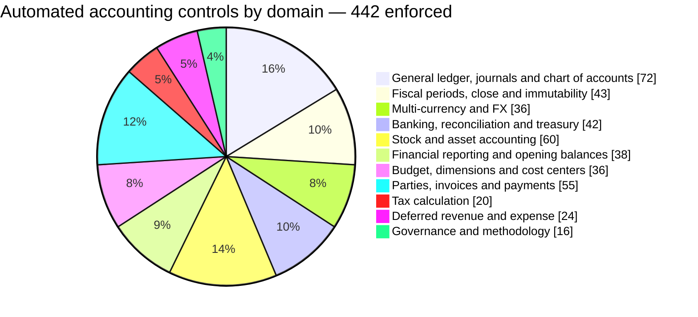

### 1.2 Nine design commitments

1. **One owner per master.** Supplier belongs to Procurement, item to Inventory, physical asset to Assets, petroleum block to Block Management, and the posted books to Accounting. No module keeps a duplicate master.
2. **Accounting is the single book of record.** Operational modules submit governed posting requests. Accounting validates them, posts them and returns an auditable reference.
3. **Defense in depth.** Each control is checked in the user interface, again in the server action, again in the posting engine, and again by PostgreSQL constraints, triggers and row-level security.
4. **Fail closed.** A missing module, missing exchange rate, closed period, missing approval or unresolved block identity stops the transaction. The system never substitutes a silent default.
5. **Immutable history.** Posted journals, approved AFE baselines, stock movements and executed contracts are never edited in place. They are corrected through reversal, revision or amendment.
6. **Effective-dated rules.** Exchange rates, tax codes, participating interests, economic terms, approval limits and tolerances apply by date. Each transaction keeps the version it used.
7. **Controls are tested.** A control counts as enforced only when automated tests prove it, at both the application and database layers.
8. **Evidence by design.** Every material transaction links to its source document, approval history, posting reference and supporting evidence.
9. **Local, governed intelligence.** AI and decision models run inside the deployment. They inform and recommend, uncertain decisions go to people, and every action still passes the system's controls.

### 1.3 Capability highlights

| Area | What SBC ERP delivers |
| --- | --- |
| General ledger and close | Balanced double-entry posting enforced in the database, multi-book ledgers, multi-dimensional coding, maker-checker journal workflow, controlled period close and reopen, versioned financial-statement mapping |
| Multi-currency | Functional and transaction currency on every line, governed rate register sourced from the Central Bank of Oman, monthly rate approval, revaluation and realized FX |
| Procure-to-pay | Block-aware requisitions, budget and AFE commitment control, sourcing, contracts and call-offs, goods receipt and service entry, invoice matching, idempotent AP handoff, supplier settlement with open-item allocation |
| Inventory | Immutable stock ledger, FIFO and weighted-average valuation, net realizable value adjustment, quality hold, transit, repairables, owned and non-owned stock, automatic GL posting |
| Assets | Enterprise asset management aligned with ISO 55001 and ISO 14224, reliability and integrity, and a governed bridge to the fixed-asset register for capitalization, depreciation and disposal |
| Oil & Gas | AFE lifecycle with technical and finance review, block and participating-interest master, effective-dated operatorship and economic terms |
| Banking and treasury | Bank statement import, reconciliation, bank-account currency guards, cash forecasting |
| Local AI and decision intelligence | Self-hosted generative AI, a typed decision engine with confidence gating and human review, close-readiness advisor, financial insights with anomaly detection, KPI alerts, Ask Accounting and cash forecasting |
| Tax and e-invoicing | Effective-dated tax codes, VAT and withholding, tax reporting, Fawtara e-invoicing with immutable submission evidence |

---

## 2. Purpose and scope

This whitepaper defines the architecture and control model of SBC ERP for Oil & Gas. It brings together the product's accounting rulebooks, module standards handbooks, integration contracts and international references in one customer-facing document.

No ERP can make an organization compliant by itself. SBC ERP makes compliance, governance, accounting integrity, operational control, auditability and evidence enforceable through configuration, workflows, validations, approvals, posting controls, immutable records, integrations and automated tests. Each customer still owns its accounting policies, legal determinations and control environment.

The scope covers:

- the SBC Core platform services the Oil & Gas modules rely on;
- the ten Oil & Gas domain modules and their ownership boundaries;
- the integration contracts and events that connect them;
- the end-to-end business workflows;
- the accounting, statutory, assurance and management-system standards the product supports;
- the enterprise control baseline (`WP-*` controls) for every module.

Where the product's detailed rulebooks are more specific than this document, the detailed rules apply.

---

## 3. Assurance and claim policy

SBC ERP keeps four concepts separate:

1. **Requirement defined**: the control is specified in an approved rulebook.
2. **Implemented**: code or configuration enforces it.
3. **Verified**: automated tests, or controlled manual evidence, prove the expected behavior.
4. **Certified or legally compliant**: an authorized external or internal authority has made that determination for a defined organization, scope, period and jurisdiction.

SBC ERP supports an organization's compliance. It does not certify it. No product screen, brochure, tender response or report describes a module as certified to an external standard unless a valid certification exists for the defined scope. A statement that financial statements comply with IFRS can only be made by the reporting entity.

### 3.1 Claim classes

Capability statements made to customers use one of these classes:

| Claim class | Meaning |
| --- | --- |
| Native | Implemented and verified in SBC ERP. |
| Integrated | Verified through a governed external specialist service or integration. |
| Partner-provided | Delivered by a named external provider with defined responsibility. |
| Manual controlled process | Performed outside the system under an approved procedure with retained evidence. |
| Out of scope | Intentionally not provided. |

### 3.2 Severity model

| Severity | Required behavior |
| --- | --- |
| BLOCK | The controlled transaction, posting, payment, filing, close, approval or configuration activation does not continue. |
| ERROR | The result is invalid or incomplete and must be corrected before final release or posting. |
| WARNING | Continuing requires authorized review and explicit acknowledgement, where policy permits. |
| INFO | Guidance or disclosure, with no change to financial or control state. |

Controls protecting the law, accounting integrity, tenant isolation and immutable history have no casual user-interface override.

### 3.3 Control metadata

Each production control carries, where applicable: a stable identifier; title and domain; jurisdiction; industry scope; authoritative or policy source; effective-from and effective-to dates; entity, block, book, contract and transaction scope; conditions and calculation; posting or workflow result; severity; exception and override policy; required evidence; test cases; implementation reference; version history; and approval owner.

---

## 4. Platform architecture

### 4.1 Layered architecture

SBC ERP has four layers. Each layer uses the layer below it only through published contracts.

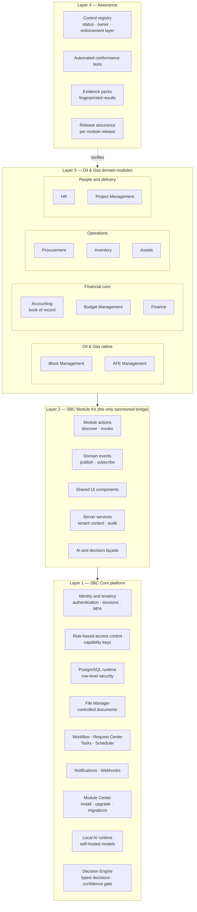

| Layer | Responsibility | Boundary |
| --- | --- | --- |
| 1. SBC Core | Tenancy, identity, access control, database runtime with row-level security, documents, workflow, scheduling, notifications, webhooks, module lifecycle, local AI runtime and decision engine | Holds no Oil & Gas business logic |
| 2. SBC Module Kit | Module actions, domain events, shared UI components, tenant-scoped server services, AI and decision façades | Never exposes one module's data structures to another |
| 3. Domain modules | Masters, transactions, business rules, postings and reports for their own domain | Never read or write another module's private data |
| 4. Assurance | Control registry, automated tests, evidence, release assurance | A control is never marked verified without passing evidence |

Logical module names are stable across industry editions. The Oil & Gas edition provides its own specialized `accounting`, `procurement`, `assets` and `inventory` implementations under the same logical names, so platform services and integrations stay consistent.

### 4.2 System-of-record model

| Domain | Authoritative module | Consumers obtain it through |
| --- | --- | --- |
| Blocks, parties, participating interests, operatorship, petroleum agreements, economic terms | Block Management | Block identity and resolution services |
| Supplier master, sourcing, contracts and procurement documents | Procurement | Supplier Master services and procurement events |
| Item master, warehouses, bins and stock ledger | Inventory | Inventory events and stock-close services |
| Physical and maintainable assets, reliability, maintenance, integrity | Assets | Asset services and asset events |
| AFE authorization, estimates, revisions and commitments | AFE Management | AFE control services |
| Budget authorization, holds, availability and control state | Budget Management | Budget control services |
| Posted books, journals, fixed-asset register, financial statements | Accounting | Accounting posting and inquiry services, accounting events |
| Operational cash workspace | Finance, with Accounting as GL authority | — |
| People, employment and workforce processes | HR | HR events |
| Projects, phases, tasks and milestones | Project Management | Project events |

A module never creates a second authoritative master because it needs the data. Database schema evolves only through forward-only migrations. Applied migrations are never altered.

### 4.3 Module dependency map

Hard dependencies must be installed. Optional dependencies activate integrations when the related module is present.

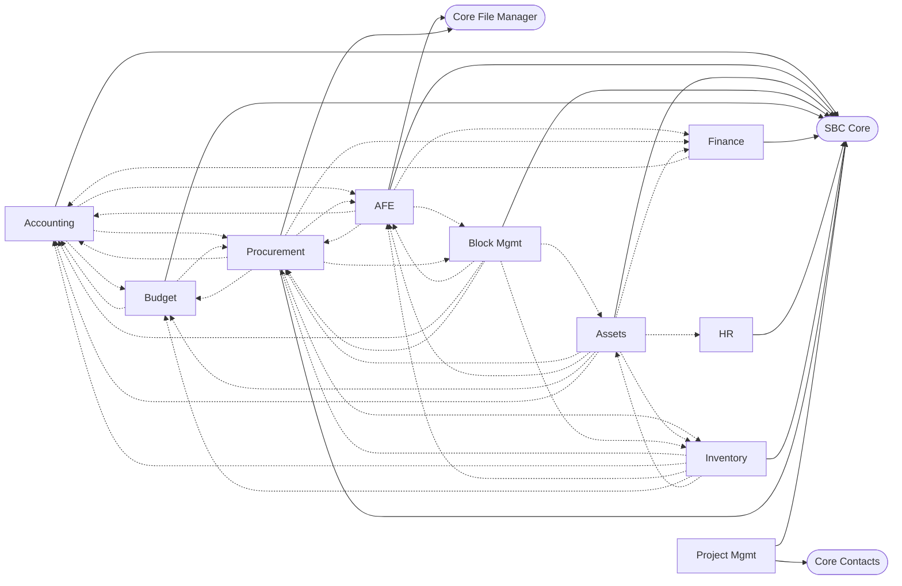

Solid arrows are hard dependencies. Dashed arrows are optional integrations.

### 4.4 Defense in depth at the posting boundary

Every financial write passes five independent control layers. If one layer is bypassed, for example by a direct API call, the remaining layers still hold.

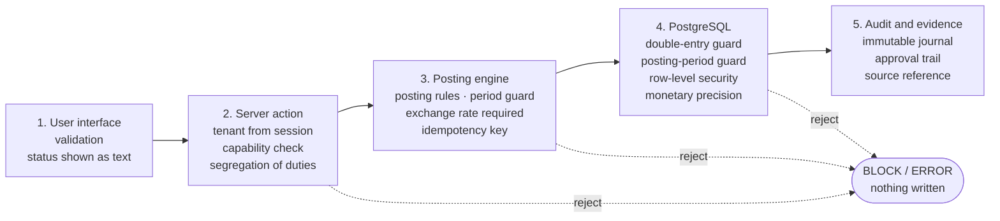

Database-level guards include balanced double entry, open-period posting, mandatory tenant row-level security, non-negative debit and credit amounts, currency-aware monetary precision, fixed-currency bank accounts, protection of posted journals from reset tools, and restricted execution rights on accounting functions.

---

## 5. Integration architecture

### 5.1 Integration principles

| Principle | How it works |
| --- | --- |
| Actions for decisions and writes | Anything that changes money, stock, commitments or identity uses a synchronous module action that returns success or a typed error. |
| Events for notification | Events tell other modules that something happened. They never replace an authoritative read. |
| Tenant from context | The tenant comes only from the authenticated session. It is never accepted from a form or payload. |
| Caller identity | Every call names its source module, and providers check it. For example, the fixed-asset bridge accepts calls only from Assets, and the AP bill handoff only from Procurement. |
| Idempotency | Financial and stock actions carry a stable key. A replay returns the original result and never posts twice. |
| Fail closed | A missing provider, an unknown identifier or an invocation error stops the write. The consumer never falls back to free text or a local copy. |
| Store identifiers, snapshot labels | Consumers store the provider's identifier and may keep a display snapshot for printing. Live identity always comes from the provider. |

### 5.2 Integration contract catalog

| Provider | Contract | Purpose | Consumers |
| --- | --- | --- | --- |
| Block Management | `block_management.listBlocks` | Block selector by identifier and name | Procurement, AFE |
| Block Management | `block_management.getBlock` | Resolve and validate a saved block | Procurement, AFE |
| Block Management | `block_management.resolveParticipation` | Participating interests and operator on a date | Oil & Gas consumers |
| Block Management | `block_management.resolveEconomicTerms` | Government economic terms on a date | Oil & Gas consumers |
| Budget | `budget.evaluateControl` | Warn or block against available budget | Procurement, HR |
| Budget | `budget.readAvailability` | Available budget by line | Procurement |
| Budget | `budget.applyDocumentHold` | Reserve budget for a requisition or order | Procurement |
| Budget | `budget.liquidateDocumentHold` | Consume the reservation on receipt | Procurement |
| Budget | `budget.reverseReceiptLiquidation` | Restore the reservation when a receipt is reversed | Procurement |
| Budget | `budget.releaseDocumentHold` | Release the unconsumed reservation | Procurement |
| Budget | `budget.allocateCallout` | Allocate budget to a contract call-off | Procurement |
| Budget | `budget.validateAccountingPosting` | Budget validation before a journal posts | Accounting |
| Budget | `budget.integrationStatus` | Integration health | Accounting |
| AFE | `afe.checkBudget` | AFE headroom check | Procurement, HR |
| AFE | `afe.postCommitment` | Record an AFE commitment | Procurement |
| AFE | `afe.liquidateCommitment` | Convert commitment to actual | Procurement |
| AFE | `afe.releaseCommitment` | Release unused commitment | Procurement |
| AFE | `afe.validateAccountingPosting` | AFE validation before a journal posts | Accounting |
| AFE | `afe.integrationStatus` | Integration health | Accounting |
| Inventory | `inventory.getStockCloseStatus` | Stock cut-off state for period close | Accounting |
| Assets | `assets.list` | Operational asset lookup | Accounting |
| Accounting | `accounting.getBaseCurrency` | Company functional currency | Procurement, Inventory, AFE, Budget |
| Accounting | `accounting.getRateToBase` | Governed exchange rate on a date | AFE, Budget |
| Accounting | `accounting.getPostingPeriodStatus` | Open or closed period for a date | Inventory |
| Accounting | `accounting.getJournalIntegrationSnapshot` | Posted actuals for commitment control | AFE, Budget |
| Accounting | `accounting.acceptSourceFinancialContext` | GL coding and dimensions from a source document | Procurement, Inventory |
| Accounting | `accounting.createApBillDraft` | Idempotent draft supplier bill from a matched invoice | Procurement |
| Accounting | `accounting.postInventoryMovement` | Post a stock movement | Inventory |
| Accounting | `accounting.reverseInventoryMovement` | Reverse a posted stock movement | Inventory |
| Accounting | `accounting.getSourcePostingStatus` | Posting result for a source document | Inventory |
| Accounting | `accounting.getInventoryGlBalance` | Inventory GL balance for reconciliation | Inventory |
| Accounting | `accounting.ensureFixedAsset` | Link an operational asset to the fixed-asset register | Assets |
| Accounting | `accounting.capitalizeFixedAsset` | Capitalize a linked asset | Assets |
| Accounting | `accounting.postAssetDepreciation` | Post depreciation | Assets |
| Accounting | `accounting.disposeFixedAsset` | Post disposal | Assets |
| Accounting | `accounting.inquireAssetCapitalization` | Capitalization status | Assets |
| Accounting | `accounting.listFixedAssetPostingOptions` | Categories and accounts for linking | Assets |
| Accounting | `accounting.listOperationalAssetLinks` | Register links | Assets |
| Accounting | `accounting.getFixedAssetReconciliation` | Asset register to GL reconciliation | Assets |

### 5.3 Module integration map

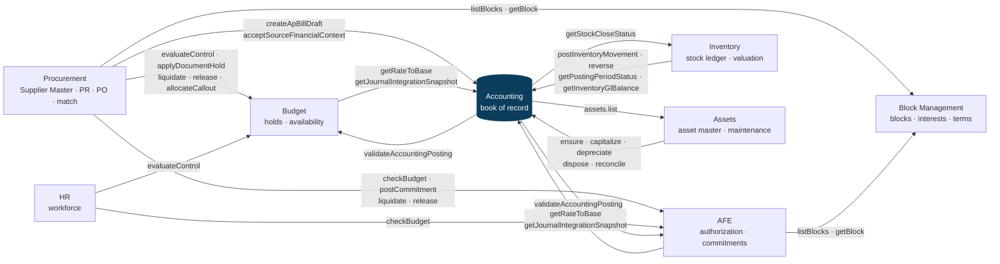

Accounting sits at the center. Operational modules send it posting requests, and AFE and Budget validate each journal before it posts. This two-way validation means a journal cannot bypass AFE or budget control, and an AFE or budget actual always equals a posted Accounting figure.

### 5.4 Event map

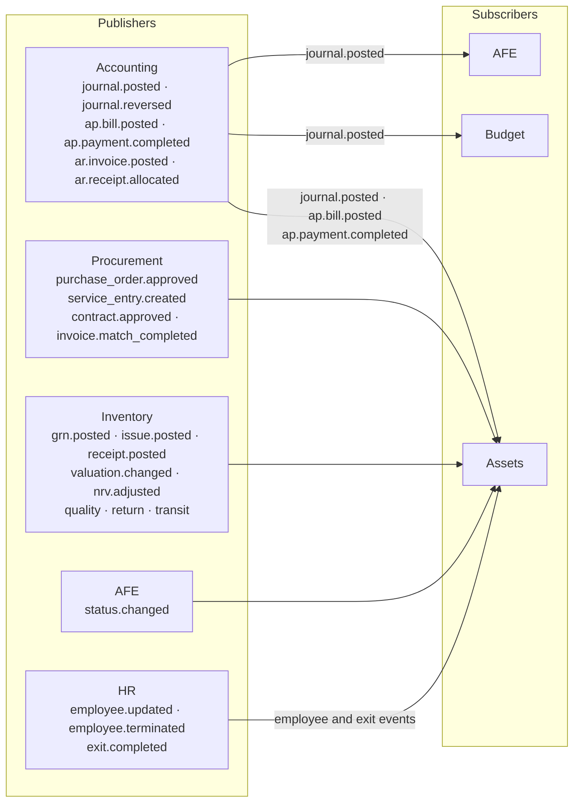

Assets subscribes to procurement, inventory, accounting, AFE and HR events, so each asset keeps a complete lifecycle-cost and custody history without copying another module's data. Block Management publishes block, participation and agreement changes for any subscriber.

### 5.5 Fail-closed invocation pattern

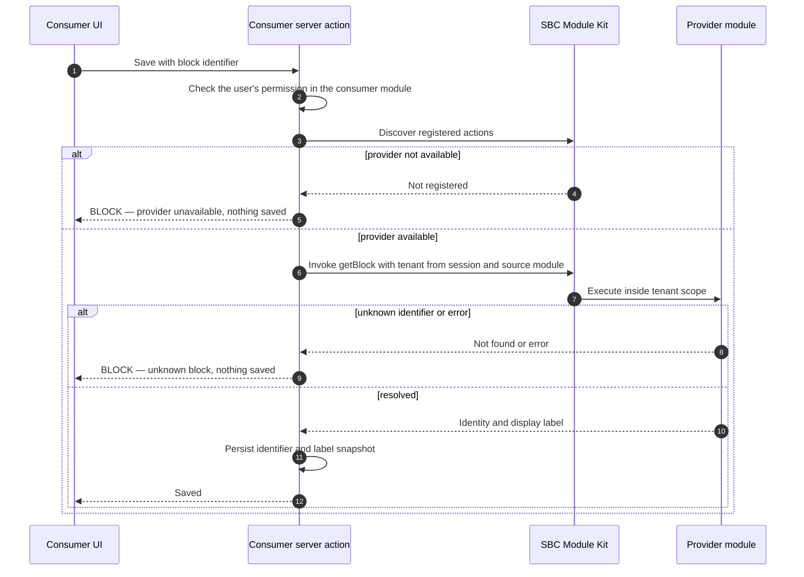

---

## 6. End-to-end business workflows

Each diagram shows which module owns each step and which contract carries the step across module boundaries.

### 6.1 Procure-to-pay

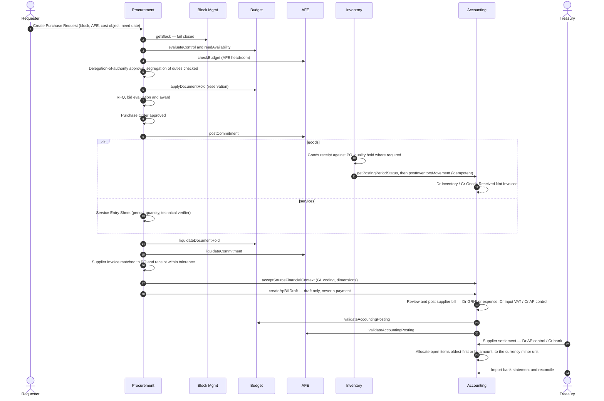

| Control | Enforced by | Control reference |
| --- | --- | --- |
| Block identity comes only from Block Management | Procurement server action | `WP-BLK-011`, `WP-BLK-012` |
| Budget and AFE are checked before commitment | Budget and AFE contracts | `WP-PROC-006`, `WP-BUD-005`, `WP-AFE-014` |
| Over-receipt beyond tolerance is blocked | Procurement and Inventory | `WP-PROC-014` |
| Suppliers come only from the Procurement Supplier Master | Accounting supplier selection | `WP-ACC-022`, `WP-PROC-001` |
| Procurement cannot mark an invoice as paid | AP handoff contract rejects payment fields | `WP-PROC-025` |
| Duplicate invoices are detected | Idempotency key and supplier invoice number | `WP-ACC-024` |
| Settlement credits only a bank or cash account | Supplier settlement controls | `WP-ACC-025` |

### 6.2 Budget and AFE commitment control

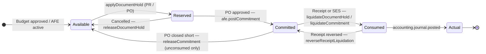

**Control equation:** Available = Approved + Transfers in − Transfers out − Reservations − Commitments − Actuals.

Budget and AFE each keep their own control ledger, and neither fabricates the other's balances. Actuals come only from posted Accounting journals. A release frees only the unconsumed balance, exactly once.

### 6.3 Inventory movement to the general ledger

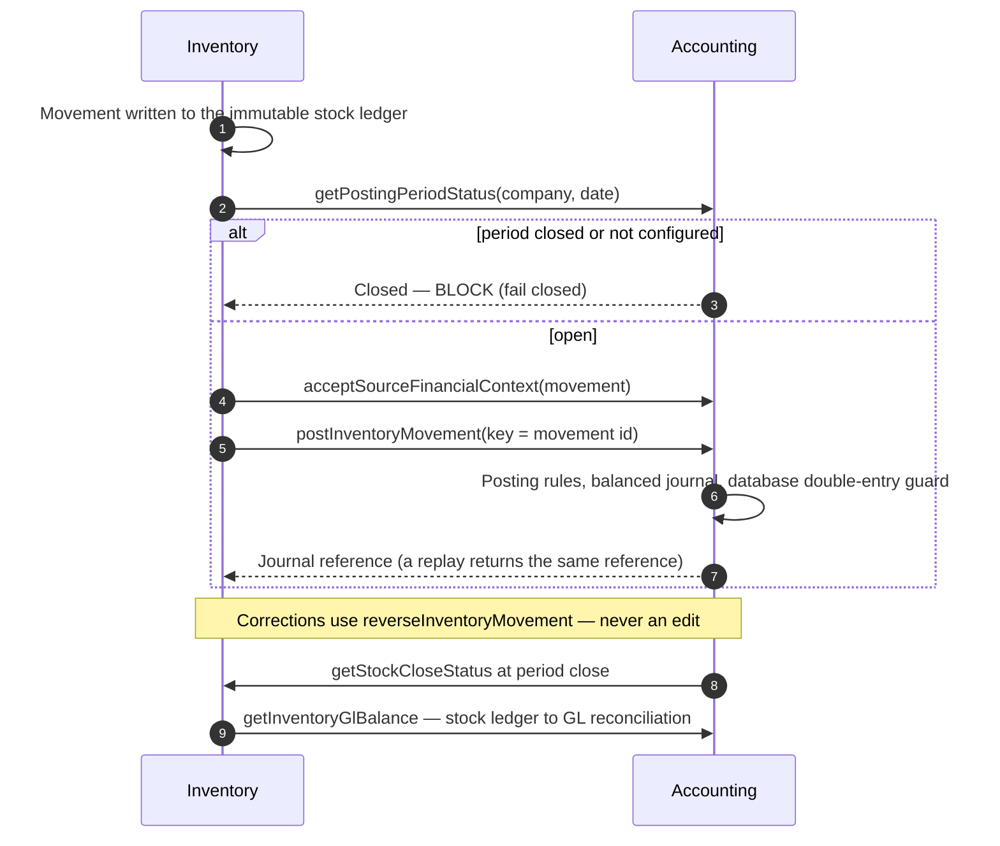

| Movement | Posting pattern (configured through posting rules) |
| --- | --- |
| Goods receipt against PO | Dr Inventory / Cr Goods Received Not Invoiced |
| Issue to AFE, work order, well or project | Dr AFE work in progress or expense / Cr Inventory |
| Return to supplier | Dr GRNI or AP / Cr Inventory |
| Transfer between sites | Dr Inventory in transit / Cr Inventory (origin), then Dr Inventory (destination) / Cr Inventory in transit |
| Approved count variance | Dr or Cr Inventory / Cr or Dr inventory adjustment |
| Net realizable value write-down | Dr NRV write-down expense / Cr Inventory allowance |
| Bill-to-receipt price difference | Purchase price variance |

### 6.4 Fixed-asset bridge: capitalize, depreciate, dispose

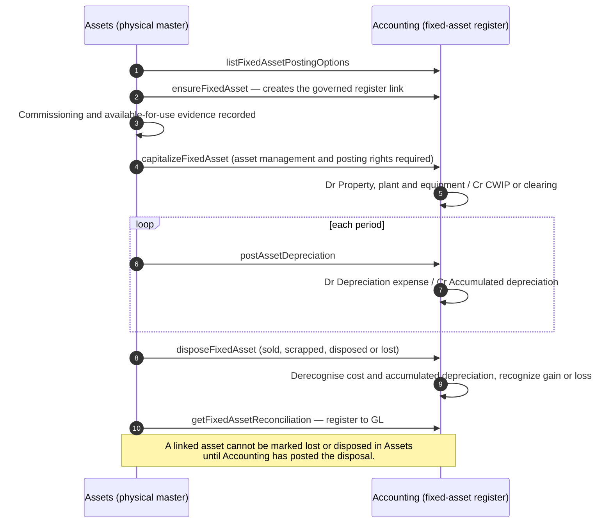

### 6.5 Journal lifecycle with maker-checker

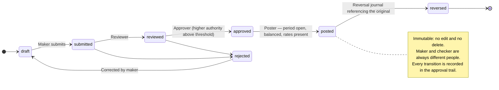

### 6.6 AFE lifecycle

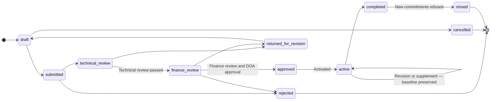

An AFE approval authorizes expenditure. It does not decide accounting capitalization.

### 6.7 Period-end close

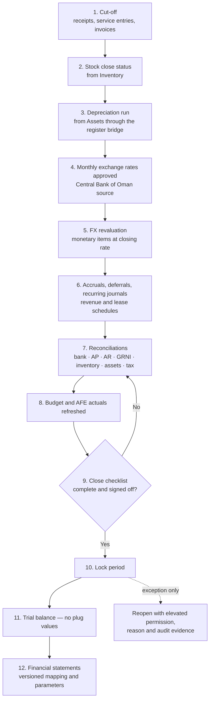

### 6.8 Exchange-rate governance

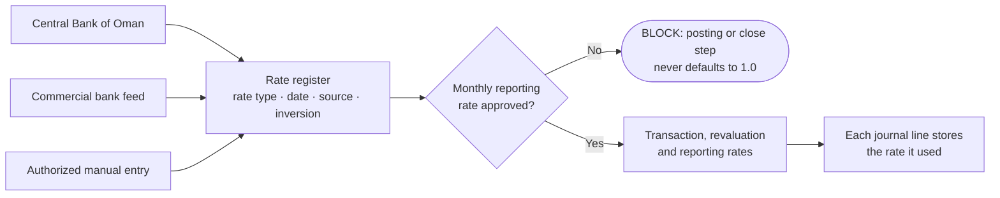

### 6.9 Petroleum block and participating-interest context

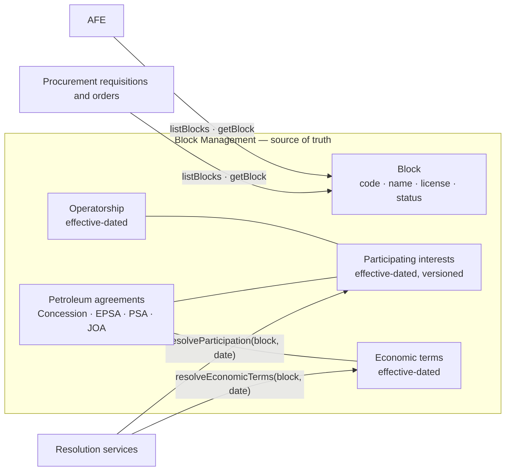

Downstream records store the stable block identifier, never a free-text name. A change in participating interest never rewrites prior periods.

### 6.10 Oman Fawtara e-invoicing

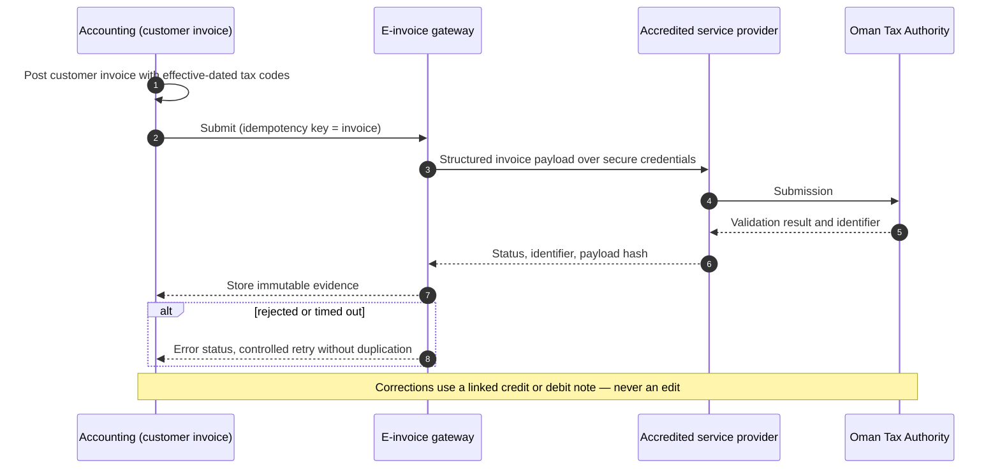

Rollout cohorts and technical specifications are effective-dated configuration, so the product follows Oman Tax Authority changes without code changes to historical invoices.

### 6.11 Record to report

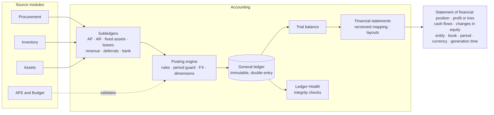

---

## 7. Accounting, statutory and assurance standards coverage

This section lists the standards SBC ERP supports, the modules that carry each one, and how the product supports it. Applying a standard to an entity's financial statements remains the entity's responsibility. The product provides the controls, data and evidence that application requires.

### 7.1 IFRS Accounting Standards

| Standard | Title | Modules | How SBC ERP supports it |
| --- | --- | --- | --- |
| Conceptual Framework | Conceptual Framework for Financial Reporting | Accounting | Accrual-based, double-entry ledger with immutable posted history, enforced in the application and the database |
| IFRS 1 | First-time Adoption of International Financial Reporting Standards | Accounting | Controlled opening-balance process with reconciled source evidence |
| IFRS 6 | Exploration for and Evaluation of Mineral Resources | Accounting, AFE, Block Management | Exploration and appraisal costs captured with block, AFE, well and cost-category context; journals validated against the AFE before posting |
| IFRS 8 | Operating Segments | Accounting | Segment dimensions on journal lines for segment analysis |
| IFRS 9 | Financial Instruments | Accounting | Receivables and payables held as open items with allocation, ageing and settlement history |
| IFRS 10 | Consolidated Financial Statements | Accounting | Consolidation worksheet with a dedicated elimination book; source journals are never altered |
| IFRS 11 | Joint Arrangements | Block Management | Effective-dated participating interests, parties and operatorship, resolved by date for any transaction |
| IFRS 15 | Revenue from Contracts with Customers | Accounting | Revenue contracts with recognition schedules and methods, deferred-revenue accounts and controlled release to revenue |
| IFRS 16 | Leases | Accounting | Lease register with lease schedules |
| IFRS 18 | Presentation and Disclosure in Financial Statements | Accounting | Configurable statement layouts and versioned financial-statement mapping, ready for the new presentation requirements effective 1 January 2027 |

### 7.2 IAS Standards

| Standard | Title | Modules | How SBC ERP supports it |
| --- | --- | --- | --- |
| IAS 1 | Presentation of Financial Statements | Accounting | Complete, versioned financial-statement mapping; trial balance with no plug values; comparative periods |
| IAS 2 | Inventories | Inventory, Accounting | FIFO and weighted-average cost, net realizable value write-down and reversal, automatic posting of every stock movement, stock-to-GL reconciliation at close |
| IAS 7 | Statement of Cash Flows | Accounting | Cash flow statement with governed classification of cash and cash equivalents |
| IAS 10 | Events after the Reporting Period | Accounting | Period lock, with reopening only under elevated permission, documented reason and audit evidence |
| IAS 16 | Property, Plant and Equipment | Assets, Accounting | Physical asset master in Assets, statutory register in Accounting; capitalization on available-for-use evidence, depreciation, disposal with gain or loss, register-to-GL reconciliation |
| IAS 21 | The Effects of Changes in Foreign Exchange Rates | Accounting | Functional and transaction currency, governed rate types and sources, monthly rate approval, revaluation of monetary items, realized FX, rate stored on every line |
| IAS 34 | Interim Financial Reporting | Accounting | Monthly and quarterly fiscal periods with the same close controls as year end |

### 7.3 Oil & Gas industry accounting practice

| Practice | Modules | How SBC ERP supports it |
| --- | --- | --- |
| Authorization for Expenditure | AFE, Procurement, Accounting | Full AFE lifecycle with technical and finance review, delegation of authority, revisions that preserve the baseline, commitments, actuals and estimate at completion |
| Block, partner and interest master | Block Management | Blocks, parties, petroleum agreements, effective-dated participating interests and operatorship |
| Concession, EPSA and PSA economic terms | Block Management | Effective-dated contractual economic terms, resolved by date |
| Materials and spares (MRO) | Inventory | Critical spares, repairables, quality hold, owned and non-owned stock, valuation |
| Maintenance cost capture | Assets | Planned and actual labor, materials and downtime linked to asset and cost object |
| Reliability data | Assets | Failure modes, causes and reliability measures aligned with the ISO 14224 taxonomy |
| Abandonment planning | AFE, Assets | Abandonment and decommissioning AFE types; versioned engineering estimates linked to assets |

### 7.4 Oman statutory, tax and localization

| Source | Modules | How SBC ERP supports it |
| --- | --- | --- |
| Royal Decree 121/2020 — Value Added Tax Law and Executive Regulations | Accounting | Effective-dated VAT codes, input and output tax, tax invoices, tax reporting and tax audit views |
| Withholding tax | Accounting | Withholding captured and reported on supplier payments |
| Fawtara e-invoicing | Accounting | Gateway integration with accredited providers, idempotent submission, immutable status and payload evidence |
| Central Bank of Oman reference rates | Accounting | Governed rate source with monthly approval |
| Royal Decree 18/2019 — Commercial Companies Law | Accounting | Books retention policies, equity categories, controlled company lifecycle |
| Royal Decree 53/2023 — Labor Law | HR | Employment contracts, leave, attendance, rotations, final settlement and Omanization reporting |
| Royal Decree 6/2022 — Personal Data Protection Law | All modules | Tenant isolation, least-privilege access, restricted medical and payroll data |

### 7.5 Internal control, audit and records

| Framework | Modules | How SBC ERP supports it |
| --- | --- | --- |
| COSO Internal Control — Integrated Framework (2013) | All modules | Maker-checker, delegation-of-authority matrix, segregation of duties, immutable audit trail, reconciliations, Ledger Health monitoring (section 25) |
| IIA Global Internal Audit Standards (2024) | Accounting | Read-only audit access, traceability from source document through approval to posting |
| International Standards on Auditing (ISA 230, 240, 315, 330, 450, 500, 501, 505, 510, 530, 540, 550, 560, 570, 600) | Accounting | Reproducible extracts, sampling exports, complete audit trail, period and mapping parameters on every report |
| Record retention and audit trail | All modules | Retention policies, legal-hold-aware design, certificate for every implementation data reset |

---

## 8. Reference frameworks

SBC ERP uses the following standards as design references within their actual scope. Copyrighted standards are referenced, not reproduced. Using a standard as a design reference does not imply certification.

### 8.1 Asset, maintenance and reliability

Design references include:

- ISO 55001:2024 — asset management system requirements;
- ISO 14224:2016 — Oil & Gas reliability and maintenance data taxonomy and exchange;
- ISO 9001:2026 — quality management system requirements;
- ISO 14001:2026 — environmental management systems;
- ISO 45001:2018 and applicable amendments — occupational health and safety management;

### 8.2 Governance, risk, audit and compliance

Design references include:

- COSO Internal Control — Integrated Framework (2013 framework);
- 2024 Global Internal Audit Standards, effective from 9 January 2025;
- International Standards on Auditing, where relevant to audit evidence and system support;
- ISO 31000:2018 — risk management guidelines;
- ISO 37301:2021 with applicable amendment — compliance management systems;
- ISO 37001:2025 — anti-bribery management systems;
- ISO 19011:2026 — management-system auditing guidance.

### 8.3 Information security, resilience and AI

Design references include:

- ISO/IEC 27001:2022 with applicable amendment — information security management systems;
- NIST Cybersecurity Framework 2.0;
- OWASP Application Security Verification Standard as a web-application security verification reference;
- ISO 22301:2019 with applicable amendment — business continuity management;
- ISO/IEC 20000-1:2018 — IT service management systems;
- ISO/IEC 42001:2023 — AI management systems.

---

## 9. Cross-cutting mandatory controls

Sections 9 to 19 and section 24 set out the controls SBC ERP enforces, written in standards language. "SHALL" marks a mandatory control that the product enforces, and "SHOULD" marks a recommended practice that the product supports through configuration. Each control has a stable `WP-*` identifier for reference in implementation, testing and audit.

| Rule | Requirement |
| --- | --- |
| WP-GOV-001 | Every record SHALL belong to the correct tenant and server-side authorization SHALL enforce tenant isolation. |
| WP-GOV-002 | Permissions SHALL use least privilege and explicit capability keys; UI hiding alone is not authorization. |
| WP-GOV-003 | High-risk actions SHALL support segregation of duties between creator, reviewer, approver, poster/releaser and administrator where applicable. |
| WP-GOV-004 | A user SHALL NOT approve their own controlled transaction when the configured policy requires independent approval. |
| WP-GOV-005 | Delegation of Authority SHALL be role-based, amount-banded by document type, multi-step and auditable. |
| WP-GOV-006 | Person names SHALL NOT be used as authorization logic. |
| WP-GOV-007 | All material master-data changes SHALL retain before/after values, actor, timestamp, reason and approval where required. |
| WP-GOV-008 | Posted, approved or legally relevant records SHALL be immutable except through controlled reversal, amendment, supersession or correction workflows. |
| WP-GOV-009 | Hard deletion SHALL be blocked for posted financial records and other retained evidence. |
| WP-GOV-010 | Business dates, accounting dates, tax dates, service dates, bank dates and effective dates SHALL remain distinct where they have different legal or accounting meaning. |
| WP-GOV-011 | Rules SHALL be selected using the effective version applicable to the transaction date and context, not the latest mutable configuration. |
| WP-GOV-012 | Historical transactions SHALL retain the rule version, rate, master-data identifiers and calculation inputs used at the time of execution. |
| WP-GOV-013 | Monetary calculations SHALL use decimal arithmetic with currency-specific precision; binary floating-point SHALL NOT be used for authoritative financial amounts. |
| WP-GOV-014 | Exchange rates, tax rates, thresholds and tolerances SHALL be effective-dated and source-traceable. |
| WP-GOV-015 | Duplicate authoritative masters across modules are prohibited. |
| WP-GOV-016 | External integrations SHALL use stable IDs, idempotency keys and replay-safe behavior for financial or inventory-changing actions. |
| WP-GOV-017 | Concurrency controls SHALL prevent double approval, double posting, double receipt, double payment and double allocation. |
| WP-GOV-018 | Cross-module events SHALL carry the tenant, event type and source transaction identifier. |
| WP-GOV-019 | Integration failure SHALL be visible and retryable without silently duplicating business effects. |
| WP-GOV-020 | Each material transaction SHALL expose source document, approval history, posting/result references and linked evidence. |
| WP-GOV-021 | Exceptions and overrides SHALL require permission, reason, timestamp and immutable audit evidence. |
| WP-GOV-022 | Legal or accounting-integrity BLOCK controls SHALL fail closed when mandatory configuration or evidence is missing. |
| WP-GOV-023 | Data retention SHALL be policy-driven and legal-hold aware. |
| WP-GOV-024 | Sensitive personal, payroll, medical and financial data SHALL be access-controlled and minimized to business need. |
| WP-GOV-025 | Secrets, access tokens and private credentials SHALL NOT be stored in ordinary business tables or logs. |
| WP-GOV-026 | Security-relevant actions SHALL produce auditable security events without leaking secrets. |
| WP-GOV-027 | Backups, restore testing, recovery objectives and disaster-recovery procedures SHALL be defined for production deployments. |
| WP-GOV-028 | Critical scheduled jobs SHALL be idempotent and observable, with failure escalation. |
| WP-GOV-029 | Data quality rules SHALL detect missing keys, duplicate masters, invalid states, orphan references and inconsistent units/currencies. |
| WP-GOV-030 | Imported data SHALL preserve provenance and import batch identity. |
| WP-GOV-031 | Bulk changes SHALL provide validation preview, error reporting and controlled commit. |
| WP-GOV-032 | Every critical rule SHALL have positive, negative, boundary, permission and correction/reversal tests where applicable. |
| WP-GOV-033 | Release gates SHALL prevent a feature from being described as verified when required evidence is missing. |
| WP-GOV-034 | User-facing terminology SHALL be consistent across modules; Supplier is the canonical procurement/AP term. Legacy internal keys may remain only for backward compatibility. |
| WP-GOV-035 | Forms, tables and modals SHALL be responsive, keyboard-usable and readable on supported screen sizes without unintended horizontal overflow. |
| WP-GOV-036 | Long forms SHALL preserve validation context and SHALL NOT hide critical actions or errors outside the user's reachable viewport. |
| WP-GOV-037 | Status SHALL always be represented by text, not color alone. |
| WP-GOV-038 | Destructive or irreversible actions SHALL clearly identify the affected record and consequence before execution. |
| WP-GOV-039 | AI-generated recommendations SHALL NOT bypass permissions, DOA, accounting validation, workflow or audit requirements. |
| WP-GOV-040 | AI-generated postings, approvals or master-data changes SHALL require an authorized deterministic transaction path; AI text alone SHALL NOT mutate the authoritative ledger. |
| WP-GOV-041 | Reports SHALL identify entity, book, period, currency, filter context and generation time. |
| WP-GOV-042 | Audit exports SHALL be reproducible from immutable or versioned source data. |
| WP-GOV-043 | Configuration changes that alter accounting, tax, approval or security behavior SHALL be versioned and subject to controlled activation. |

---

## 10. Accounting module control catalog

| Rule | Requirement |
| --- | --- |
| WP-ACC-001 | All authoritative GL postings SHALL be double-entry and balanced by book, entity and posting transaction. |
| WP-ACC-002 | A journal entry SHALL contain at least two lines and total debit SHALL equal total credit within defined rounding rules. |
| WP-ACC-003 | Negative debit/credit input SHALL be normalized or rejected according to the approved posting model; users SHALL NOT use signs to bypass debit/credit semantics. |
| WP-ACC-004 | Posted journals SHALL be immutable; corrections SHALL use reversal, correcting journal or controlled adjustment. |
| WP-ACC-005 | Reversal SHALL reference the original posting and preserve both documents. |
| WP-ACC-006 | Group/header accounts SHALL NOT accept direct postings. |
| WP-ACC-007 | Frozen or blocked accounts SHALL NOT accept postings until an authorized state change. |
| WP-ACC-008 | Subledger-controlled accounts SHALL reject unauthorized manual journals unless a specifically approved policy permits them. |
| WP-ACC-009 | Reconciliation accounts SHALL preserve party/subledger identity required for reconciliation. |
| WP-ACC-010 | Account currency policy SHALL be explicit; bank and similar monetary accounts requiring a fixed currency SHALL reject ambiguous currency configuration. |
| WP-ACC-011 | Account-combination rules SHALL prevent economically invalid combinations such as depreciation/amortization postings directly against bank merely to force a balanced journal. |
| WP-ACC-012 | Depreciation/amortization processing SHALL normally post expense and accumulated depreciation/amortization or the approved equivalent, not fabricate a cash movement. |
| WP-ACC-013 | The chart of accounts SHALL support controlled hierarchy, normal balance, account type, posting eligibility, reconciliation ownership and reporting mappings. |
| WP-ACC-014 | Changes to account type, currency, control-account ownership or financial-statement mapping SHALL be governed after transactional use. |
| WP-ACC-015 | Base currency SHALL be controlled by entity/book and SHALL NOT be casually changed after postings exist. |
| WP-ACC-016 | Transaction currency, functional/base currency and reporting currency SHALL be separately represented where required. |
| WP-ACC-017 | FX rates SHALL identify rate type such as spot, monthly book, closing or average where policy requires. |
| WP-ACC-018 | Missing required FX rates SHALL block the affected posting or close step rather than silently use 1.0 or a stale rate. |
| WP-ACC-019 | Rate source, date, inversion rule, precision and accountant approval SHALL be retained. |
| WP-ACC-020 | Open and closed fiscal periods SHALL be explicit; closed periods SHALL reject new ordinary postings. |
| WP-ACC-021 | Reopening a closed period SHALL require elevated permission, reason and audit evidence. |
| WP-ACC-022 | Supplier identity for AP SHALL be consumed from the Procurement Supplier master rather than creating a second Accounting supplier master. |
| WP-ACC-023 | Supplier invoices SHALL retain supplier, invoice number/date, tax fields, PO/contract/GRN/SES links where applicable, due terms and approval history. |
| WP-ACC-024 | Duplicate supplier invoices SHALL be detected by supplier and supplier invoice number and through idempotent source references. |
| WP-ACC-025 | Supplier payment SHALL allocate against valid open items and SHALL NOT silently create expense a second time. |
| WP-ACC-026 | Customer invoices and receipts SHALL preserve open-item allocation and aging history. |
| WP-ACC-027 | Revenue recognition SHALL follow the configured contract recognition schedule and method, with deferred-revenue evidence. |
| WP-ACC-028 | Lease accounting SHALL maintain the approved lease schedule, liability movement, interest and right-of-use asset accounting where IFRS 16 applies. |
| WP-ACC-029 | Inventory accounting SHALL consume governed inventory valuation events; Accounting SHALL not recalculate warehouse facts from private Inventory tables. |
| WP-ACC-030 | Inventory costing policy SHALL support IAS 2 requirements including cost allocation and NRV write-down/reversal controls where applicable. |
| WP-ACC-031 | Physical asset facts SHALL originate from the Assets module while Accounting remains authoritative for statutory measurement and GL posting. |
| WP-ACC-032 | PPE capitalization SHALL require approved accounting criteria and SHALL NOT be determined solely by an AFE approval or PO label. |
| WP-ACC-033 | Depreciation method, useful life and residual value SHALL be governed through asset categories and recorded on each register asset. |
| WP-ACC-034 | Exploration and evaluation costs SHALL preserve block, property, AFE and well cost context. |
| WP-ACC-035 | Consolidation eliminations SHALL occur in a controlled consolidation/group context and SHALL NOT mutate entity source journals. |
| WP-ACC-036 | Tax accounting SHALL separate tax payable and receivable, settlement and return reconciliation. |
| WP-ACC-037 | VAT, withholding tax and other tax engines SHALL be jurisdiction/effective-date aware and SHALL not assume one timeless rate. |
| WP-ACC-038 | E-invoicing SHALL retain provider/gateway status, invoice identifier, submission/validation result and immutable payload/hash evidence as required by the jurisdiction. |
| WP-ACC-039 | Period close SHALL use a controlled checklist covering subledger reconciliation, banks, inventory, fixed assets, FX, tax and financial statements. |
| WP-ACC-040 | Trial Balance SHALL reconcile to the posted ledger with no hidden plug values. |
| WP-ACC-041 | Balance Sheet and Profit or Loss mappings SHALL be complete, versioned and auditable. |
| WP-ACC-042 | The cash flow statement SHALL reconcile opening cash, period flows and closing cash and cash equivalents. |
| WP-ACC-043 | Equity movements SHALL distinguish share capital, reserves, retained earnings and other approved equity categories. |
| WP-ACC-044 | Financial statements SHALL support comparative periods and configurable presentation layouts, including the IFRS 18 structure from its effective date. |
| WP-ACC-045 | Financial reports SHALL preserve mapping version and report parameters used to produce the result. |
| WP-ACC-046 | Opening balances SHALL be loaded through a controlled migration/opening process with reconciled source evidence. |
| WP-ACC-047 | Transaction reset/destructive tools, if present for implementation/testing, SHALL require elevated authorization and SHALL be disabled or tightly governed in live production. |
| WP-ACC-048 | Accounting rules SHALL be enforced server-side at the authoritative posting boundary, not only in forms. |
| WP-ACC-049 | Automated tests SHALL cover material posting patterns, reversals, FX, tax and integration events. |
| WP-ACC-050 | Accounting SHALL maintain requirement-to-test traceability for every enforced control. |
| WP-ACC-051 | Any statement of IFRS compliance SHALL be made only by the reporting entity when the financial statements meet all applicable requirements; the ERP itself SHALL not make that legal/accounting assertion automatically. |

---

## 11. Procurement and Contract Management control catalog

| Rule | Requirement |
| --- | --- |
| WP-PROC-001 | Procurement SHALL own the Supplier master used by procurement and AP. |
| WP-PROC-002 | The user-facing canonical term SHALL be Supplier; legacy Vendor routes/keys may exist only for backward compatibility. |
| WP-PROC-003 | Supplier records SHALL hold legal identity, sites, contacts, tax registration, status and supporting documents. |
| WP-PROC-004 | A Purchase Request SHALL identify requester, department/cost object, item/service, quantity, need date, justification, budget/AFE context and delivery/site context as applicable. |
| WP-PROC-005 | PR approval SHALL follow effective DOA and SHALL fail closed when mandatory approval configuration is incomplete. |
| WP-PROC-006 | Budget/AFE availability SHALL be checked at the configured control point before commitment. |
| WP-PROC-007 | RFQs SHALL record the sourcing method, closing date, technical and commercial requirements and the quotations received. |
| WP-PROC-008 | Bid evaluation SHALL combine technical compliance and a technical score with a price score, using configured technical and price weightings. |
| WP-PROC-009 | Evaluation weightings, technical scores, compliance and the resulting ranking SHALL be recorded and auditable. |
| WP-PROC-010 | Award SHALL reference the selected quotation and the required approvals. |
| WP-PROC-011 | Purchase Orders SHALL be created from approved commercial authority and SHALL preserve source PR/RFQ/award/contract references. |
| WP-PROC-012 | Call-out revisions SHALL be versioned (New, V1, V2 and onward), archive the released version and require complete re-approval. |
| WP-PROC-013 | Quantity, price, currency, tax, delivery, Incoterm where used, payment terms and accounting/budget dimensions SHALL be explicit. |
| WP-PROC-014 | Over-receipt SHALL be blocked or routed through authorized tolerance/exception policy. |
| WP-PROC-015 | Partial and multiple GRNs SHALL be supported without losing cumulative ordered, received, returned and invoiced quantities. |
| WP-PROC-016 | Service procurement SHALL support partial and multiple SES records against PO/contract/call-out limits. |
| WP-PROC-017 | Service entries SHALL record the service, quantity or value and link to the purchase order, contract or call-out. |
| WP-PROC-018 | Contracts SHALL maintain type, parties, scope, value and ceiling, validity dates, currency, price basis, guarantees, retention and variation history. |
| WP-PROC-019 | Price basis SHALL distinguish fixed price, unit rate, reimbursable, cost-plus and other approved models. |
| WP-PROC-020 | Contract amendments SHALL be versioned and SHALL NOT overwrite the executed baseline. |
| WP-PROC-021 | Call-outs/release orders SHALL remain within approved contract scope, dates and ceilings unless an authorized amendment exists. |
| WP-PROC-022 | Advance and performance bank guarantees SHALL retain amount, currency, issuer, expiry and a linked evidence document; a checkbox alone is not evidence. |
| WP-PROC-023 | Supplier invoice matching SHALL compare invoice against approved commercial document and receipt/SES evidence according to match policy. |
| WP-PROC-024 | Match tolerance SHALL be configurable, default to zero and fail closed; exceptions SHALL require explicit override permission and reason. |
| WP-PROC-025 | Procurement SHALL NOT mark an invoice paid; payment status SHALL come from the authoritative finance/accounting payment process. |
| WP-PROC-026 | Procurement SHALL expose matched/approved invoice context to Accounting through a sanctioned integration contract. |
| WP-PROC-027 | Taxes and withholding fields SHALL be captured for downstream tax determination but final accounting/tax posting authority remains in the approved tax/accounting process. |
| WP-PROC-028 | Only the approver assigned to the current approval step SHALL decide a requisition; module-wide approval permission alone SHALL NOT be sufficient. |
| WP-PROC-029 | Procurement records SHALL link to Block, AFE, Budget, Inventory, Assets and Accounting by public identifiers rather than private-table access. |

---

## 12. Inventory and Warehouse Management control catalog

| Rule | Requirement |
| --- | --- |
| WP-INV-001 | Inventory SHALL own the material/item master and warehouse stock ledger. |
| WP-INV-002 | Item codes SHALL be unique within the configured scope and SHALL not be recycled in a way that corrupts history. |
| WP-INV-003 | Item master SHALL define base UOM, material class, stock behavior and lot or serial traceability policy. |
| WP-INV-004 | Warehouse, storage location and bin hierarchy SHALL be explicit and site-aware. |
| WP-INV-005 | Lot/batch, serial number and expiry tracking SHALL be enforced where item policy requires. |
| WP-INV-006 | Barcode/QR/GS1 identifiers SHALL map unambiguously to the business object when used. |
| WP-INV-007 | Every stock movement SHALL create an immutable Cardex/stock-ledger event with source reference, quantity, UOM, location and actor/system identity. |
| WP-INV-008 | Stock on hand SHALL reconcile to the stock ledger; direct balance edits are prohibited. |
| WP-INV-009 | Goods receipt SHALL reference the approved procurement source where applicable. |
| WP-INV-010 | Quality inspection/quarantine status SHALL prevent unrestricted issue before release when inspection is required. |
| WP-INV-011 | Rejected material SHALL be segregated logically and, where process requires, physically. |
| WP-INV-012 | Material issue SHALL identify destination/cost object such as AFE, asset, project, department, well or work order where required. |
| WP-INV-013 | Reservations SHALL distinguish reserved, available and on-hand quantities. |
| WP-INV-014 | Return transactions SHALL reference the original issue/receipt where appropriate and preserve valuation linkage. |
| WP-INV-015 | Warehouse transfer SHALL record dispatch and receipt; in-transit stock SHALL not appear simultaneously available at both sites. |
| WP-INV-016 | Negative stock SHALL be blocked for every ownership bucket. |
| WP-INV-017 | Physical count variances SHALL be recorded line by line against system quantity and valued at unit cost before adjustment. |
| WP-INV-018 | Stock adjustments SHALL never be a hidden substitute for missing receiving/issue transactions. |
| WP-INV-019 | Reorder levels SHALL be item-specific and flag low and reorder status from available quantity. |
| WP-INV-020 | Critical spares SHALL be identified on the item master. |
| WP-INV-021 | Repairable/rotable items SHALL support condition/state, repair cycle, custody and return-to-stock history. |
| WP-INV-022 | Customer-owned, partner-owned, consignment or other non-owned inventory SHALL be identified separately from company-owned stock. |
| WP-INV-023 | Inventory valuation method SHALL be an approved accounting policy such as FIFO or weighted average where IAS 2 applies. |
| WP-INV-024 | Standard cost, if used operationally, SHALL have controlled variance/revaluation treatment and SHALL not silently override statutory costing policy. |
| WP-INV-025 | NRV assessment and write-down/reversal events SHALL be controlled and traceable where IAS 2 applies. |
| WP-INV-026 | Expired and expiring inventory SHALL be identifiable for review and accounting action. |
| WP-INV-027 | Inventory SHALL publish governed valuation and quantity events to Accounting rather than allowing Accounting to derive stock from private tables. |
| WP-INV-028 | Inventory SHALL integrate with Assets for spare consumption, capitalization candidates and asset-linked material history without creating duplicate asset masters. |
| WP-INV-029 | Inventory SHALL preserve AFE/Budget coding on relevant material movements for cost-control reconciliation. |

---

## 13. Asset Management control catalog

| Rule | Requirement |
| --- | --- |
| WP-AST-001 | Assets SHALL own the physical/maintainable asset master; Accounting SHALL own statutory GL measurement. |
| WP-AST-002 | Each asset SHALL have stable identity, category/class, lifecycle state, owner/custodian and location as applicable. |
| WP-AST-003 | Functional location and equipment hierarchy SHALL be represented independently from temporary custody. |
| WP-AST-004 | Oil & Gas equipment taxonomy SHOULD align with ISO 14224 where applicable to enable consistent reliability data. |
| WP-AST-005 | Asset provenance SHALL identify creation/import/source and relevant procurement/GRN/project/AFE references. |
| WP-AST-006 | Significant components SHALL be identifiable where maintenance or accounting policy requires component-level control. |
| WP-AST-007 | Lifecycle states SHALL include acquisition/construction, installation/commissioning, in-service/available-for-use, maintenance, idle/mothballed, disposal and decommissioning states as applicable. |
| WP-AST-008 | State transitions SHALL be controlled and SHALL not rewrite historical dates. |
| WP-AST-009 | Custody assignment, return, transfer and handover SHALL retain actor, dates and evidence. |
| WP-AST-010 | Asset movement SHALL use request/approval where policy requires and SHALL preserve from/to location. |
| WP-AST-011 | Maintenance plans SHALL be versioned; changing a plan SHALL not alter the historical plan used for completed work. |
| WP-AST-012 | Preventive, predictive, condition-based and corrective maintenance types SHALL be distinguishable. |
| WP-AST-013 | Work execution SHALL capture planned vs actual labor, materials, downtime, findings and completion evidence as applicable. |
| WP-AST-014 | Controlled maintenance deferral SHALL require reason, risk/impact assessment, approval and next due date. |
| WP-AST-015 | Emergency maintenance SHALL support after-the-fact review without fabricating prior approval. |
| WP-AST-016 | Failure records SHALL capture failure mode, cause, consequence, detection and downtime at the appropriate level. |
| WP-AST-017 | Reliability metrics such as MTBF/MTTR SHALL be calculated from governed source events and clearly define population and period. |
| WP-AST-018 | Availability and downtime SHALL distinguish planned and unplanned states where required. |
| WP-AST-019 | Condition/inspection measurements SHALL retain method, reading, unit, timestamp and source. |
| WP-AST-020 | Criticality SHALL be governed and may drive maintenance priority, spares policy, inspection or approval. |
| WP-AST-021 | Spare-part links SHALL reference Inventory item IDs and SHALL not create an independent spare master. |
| WP-AST-022 | Warranty status SHALL identify supplier/manufacturer, terms, dates and claim references. |
| WP-AST-023 | Insurance records/claims SHALL retain policy reference, coverage period, incident/claim status and evidence. |
| WP-AST-024 | Integrity and regulatory inspections SHALL preserve due dates, results, findings, closure and evidence. |
| WP-AST-025 | QR/barcode/RFID identifiers SHALL resolve to the correct asset and SHALL be replaceable without changing asset identity. |
| WP-AST-026 | Physical verification SHALL support found/not-found, condition, location/custody confirmation and exception resolution. |
| WP-AST-027 | Accounting link SHALL identify the approved fixed-asset/GL context without Assets posting directly to private Accounting tables. |
| WP-AST-028 | Available-for-use/commissioning evidence SHALL be retained for depreciation/capitalization decisions. |
| WP-AST-029 | Operational depreciation views SHALL not be represented as statutory accounting unless posted/approved by Accounting. |
| WP-AST-030 | Impairment indicators may be recorded in Assets; Assets SHALL NOT post impairment to the ledger. |
| WP-AST-031 | Decommissioning/restoration engineering estimates SHALL be versioned and linked to the affected asset/property. |
| WP-AST-032 | Disposal SHALL require authorization, disposal method, proceeds/cost evidence and downstream Accounting result where applicable. |
| WP-AST-033 | Asset offboarding SHALL resolve custody, open maintenance, spare/loan items and document retention. |
| WP-AST-034 | Data-quality controls SHALL detect duplicate IDs, invalid hierarchy, impossible lifecycle dates and orphaned integrations. |
| WP-AST-035 | Field/offline asset updates SHALL be conflict-aware and SHALL not duplicate work or movement transactions. |
| WP-AST-036 | Maintenance and reliability history SHALL remain available after asset retirement according to retention policy. |
| WP-AST-037 | Asset-management dashboards SHALL separate physical condition, maintenance performance, reliability, financial context and risk rather than collapse them into one opaque score. |
| WP-AST-038 | ISO 55001 and ISO 14224 references SHALL be treated as management/data design targets, not an automatic certification claim. |

---

## 14. AFE Management control catalog

| Rule | Requirement |
| --- | --- |
| WP-AFE-001 | Each AFE SHALL identify legal entity, responsible owner, block/asset, field, well/facility/project and other required cost dimensions. |
| WP-AFE-002 | AFE type SHALL be configurable for drilling, completion, workover, exploration/appraisal, development, facility, abandonment/decommissioning and other approved types. |
| WP-AFE-003 | AFE approval authorizes expenditure; it SHALL NOT by itself determine accounting capitalization. |
| WP-AFE-004 | Every AFE SHALL have a controlled lifecycle from draft through review/approval/active/revised/closed or equivalent states. |
| WP-AFE-005 | Approved baselines SHALL be immutable; scope/value changes SHALL use revision, supplement or approved change process. |
| WP-AFE-006 | Cost lines SHALL be structured by phase and mapped to approved cost categories and cost items. |
| WP-AFE-007 | Estimate lines SHALL record quantity and rate, with rates sourced from linked contracts and contract services where applicable. |
| WP-AFE-008 | Contingency SHALL be held as an explicit amount and SHALL NOT be hidden inside line items. |
| WP-AFE-009 | Multi-currency estimates SHALL preserve transaction currency and approved conversion basis. |
| WP-AFE-010 | AFE totals SHALL reconcile to CBS lines and approved revisions. |
| WP-AFE-011 | Technical review SHALL verify scope/plan assumptions before or as configured in the approval chain. |
| WP-AFE-012 | Finance review SHALL verify cost, budget, coding, currency and financial-control requirements. |
| WP-AFE-013 | Final approval SHALL follow DOA based on effective amount/currency and business context. |
| WP-AFE-014 | Commitments SHALL originate from approved procurement/contract events or controlled manual sources with provenance. |
| WP-AFE-015 | Actual costs SHALL originate from authoritative posted financial/inventory/labor sources rather than editable dashboard totals. |
| WP-AFE-016 | Payments SHALL be distinguished from accounting actual cost and commitment. |
| WP-AFE-017 | AFE reporting SHALL distinguish approved amount, commitment, actual and forecast cost. |
| WP-AFE-018 | Closed AFE SHALL reject new ordinary commitments unless reopened/revised through authorized policy. |
| WP-AFE-019 | Well operation plans and daily operational context MAY inform AFE control but SHALL not replace approved accounting actuals. |
| WP-AFE-020 | AFE SHALL obtain block context from Block Management through public contracts. |
| WP-AFE-021 | Abandonment and decommissioning AFEs SHALL identify the relevant block, field and well. |
| WP-AFE-022 | AFE SHALL integrate with Budget without duplicating the authoritative budget ledger. |
| WP-AFE-023 | AFE SHALL integrate with Accounting through controlled cost/posting references; it SHALL not mutate GL private tables. |
| WP-AFE-024 | Revisions SHALL show the approved baseline and the proposed change. |
| WP-AFE-025 | All approvals, overrides, revisions and closures SHALL retain evidence and immutable audit history. |

---

## 15. Block Management and Joint-Interest control catalog

| Rule | Requirement |
| --- | --- |
| WP-BLK-001 | Block Management SHALL be the source of truth for petroleum blocks/assets within the Oil & Gas domain. |
| WP-BLK-002 | Legal entity and petroleum block SHALL be modeled separately; one entity may participate in multiple blocks and one block may have multiple parties. |
| WP-BLK-003 | Parties SHALL have stable identifiers and roles separate from changing commercial interests. |
| WP-BLK-004 | Participating interests SHALL be effective-dated and versioned. |
| WP-BLK-005 | The system SHALL validate participating-interest totals according to the agreement model and flag invalid effective periods. |
| WP-BLK-006 | Changes in participating interest SHALL not rewrite prior-period ownership. |
| WP-BLK-007 | Operatorship SHALL be effective-dated and independently auditable. |
| WP-BLK-008 | Petroleum agreements SHALL retain agreement type, parties, dates and status. |
| WP-BLK-009 | Concession/EPSA/PSA/JOA economic terms SHALL be stored as versioned contractual data and SHALL not be inferred from generic defaults. |
| WP-BLK-010 | Cost-recovery ceilings, royalty, profit/cost petroleum splits and similar terms SHALL be effective-dated where applicable. |
| WP-BLK-011 | Block/partner context SHALL be exposed to Accounting, Procurement, Assets, Inventory and AFE only through supported integration contracts. |
| WP-BLK-012 | Downstream modules SHALL store the stable block ID, not a free-text block name as the authoritative key. |
| WP-BLK-013 | Deactivated/expired agreements SHALL remain available historically and SHALL not break prior transactions. |
| WP-BLK-014 | Government/economic terms SHALL require controlled permission because changes can affect material financial results. |
| WP-BLK-015 | Contract-specific tax or fiscal rates SHALL not be promoted to global defaults without legal/policy approval. |
| WP-BLK-016 | Every block, participation, agreement and economic-term change SHALL be recorded in the audit log with actor and timestamp. |

---

## 16. Budget Management control catalog

| Rule | Requirement |
| --- | --- |
| WP-BUD-001 | Budget SHALL be an independent authorization/control ledger, not a duplicate of the General Ledger. |
| WP-BUD-002 | Budget plans SHALL move through draft, pending approval, approved, rejected and closed states. |
| WP-BUD-003 | Budget lines SHALL identify the fiscal year and the account and cost coding they control. |
| WP-BUD-004 | Approved budgets SHALL be immutable except through controlled revision/transfer/supplement process. |
| WP-BUD-005 | Budget checks SHALL occur at configured business control points such as PR, PO, contract, call-out or posting. |
| WP-BUD-006 | Reservation/pre-commitment, commitment, actual and available budget SHALL be distinct values. |
| WP-BUD-007 | Cancellation/closure of a commitment SHALL release only the valid unconsumed balance. |
| WP-BUD-008 | Actuals SHALL originate from authoritative posted source events. |
| WP-BUD-009 | Budget overrides SHALL require explicit permission, reason and approval. |
| WP-BUD-010 | Over-budget transactions SHALL warn or block according to policy and threshold. |
| WP-BUD-011 | Budget transfer SHALL preserve from/to lines, amount, reason and approval. |
| WP-BUD-012 | Budget currency and control currency SHALL be explicit; conversion SHALL use an approved rate policy. |
| WP-BUD-013 | Budget SHALL not silently consume funds twice for the same business commitment. |
| WP-BUD-014 | Reversals/cancellations SHALL be idempotent and restore the appropriate budget state exactly once. |
| WP-BUD-015 | AFE and Budget SHALL have a defined relationship; neither SHALL fabricate the other's authoritative balances. |
| WP-BUD-016 | Budget reporting SHALL reconcile opening authorization, amendments, commitments, actuals and available balance. |
| WP-BUD-017 | Closed fiscal budgets SHALL reject new ordinary allocations unless formally reopened/revised. |
| WP-BUD-018 | Budget control SHALL fail closed when a transaction requires a budget but no valid budget exists. |
| WP-BUD-019 | Budget rules SHALL be testable for concurrency so simultaneous transactions cannot overspend the same available balance. |

---

## 17. Treasury and banking control catalog

| Rule | Requirement |
| --- | --- |
| WP-FIN-001 | Bank and cash accounts SHALL have stable identity, currency and status. |
| WP-FIN-002 | Payments SHALL pass through the journal approval workflow, so that preparation and posting are performed by different people. |
| WP-FIN-003 | Supplier payment SHALL reference approved payable/open-item authority. |
| WP-FIN-004 | Customer receipt SHALL preserve payer, bank/value date, currency and allocation reference. |
| WP-FIN-005 | Bank transfer SHALL create two-sided cash movement with no artificial income/expense. |
| WP-FIN-006 | Bank fees and charges SHALL be posted through approved expense/clearing treatment, not hidden in reconciliation differences. |
| WP-FIN-007 | Bank statement imports SHALL preserve source file/hash, bank account and import batch identity. |
| WP-FIN-008 | Reconciliation matches SHALL be auditable and reversible without deleting bank-statement history. |
| WP-FIN-009 | Unreconciled items SHALL remain visible until resolved or formally adjusted. |
| WP-FIN-010 | Cash reporting SHALL distinguish book balance, bank statement balance and forecast. |
| WP-FIN-011 | Liquidity forecasts SHALL identify source and forecast horizon and SHALL not be represented as posted accounting. |
| WP-FIN-012 | Bank master data and supporting documentation SHALL be access-controlled. |
| WP-FIN-013 | Manual cash transactions SHALL require the same dimensions and approval controls as equivalent integrated transactions. |
| WP-FIN-014 | Treasury reports SHALL identify currency basis and rate assumptions. |
| WP-FIN-015 | Treasury SHALL not duplicate the statutory GL; Accounting remains the final posted-book authority. |

---

## 18. HR and workforce control catalog

| Rule | Requirement |
| --- | --- |
| WP-HR-001 | HR SHALL own the person/employee master for workforce processes. |
| WP-HR-002 | Person identity and employment assignment SHALL be separate so rehire/history can be represented correctly. |
| WP-HR-003 | Employee records SHALL retain employment status, legal entity, organization, position, manager and work location as applicable. |
| WP-HR-004 | Recruitment SHALL retain vacancy, applicant stage history, interviews and versioned offers. |
| WP-HR-005 | Onboarding SHALL track mandatory documents, access/equipment requests and readiness tasks. |
| WP-HR-006 | Employment contracts SHALL be versioned; amendments SHALL not overwrite executed prior terms. |
| WP-HR-007 | Probation and contract expiry SHALL support alerts and controlled decisions. |
| WP-HR-008 | Attendance/time data SHALL retain source and approval where it affects payroll or cost. |
| WP-HR-009 | Leave balance SHALL be derived from approved entitlements, accrual/adjustment and approved leave events. |
| WP-HR-010 | Oil & Gas rotations/crew assignments SHALL support site, shift/rotation pattern and effective dates. |
| WP-HR-011 | Training, competency and certification records SHALL support expiry and role/site requirements. |
| WP-HR-012 | Medical/fitness-to-work data SHALL be minimized; operational users SHOULD see fitness status rather than unnecessary diagnosis detail. |
| WP-HR-013 | PPE issue/return SHALL identify item, employee, date and status and may integrate with Inventory where appropriate. |
| WP-HR-014 | HSE workforce incident records SHALL follow restricted access and evidence rules appropriate to the process. |
| WP-HR-015 | Payroll calculation SHALL be separated from payment confirmation. |
| WP-HR-016 | Payroll runs SHALL produce payslips from employee contract terms, attendance and leave inputs and allowances. |
| WP-HR-017 | Approved payroll runs SHALL be locked against change. |
| WP-HR-018 | Omanization/localization measures SHALL be configurable and reportable from governed employee/job data. |
| WP-HR-019 | Personal and sensitive data SHALL comply with applicable privacy law, purpose limitation, access control and retention rules. |
| WP-HR-020 | Offboarding SHALL track employment status, access, asset custody, documents and final settlement. |
| WP-HR-021 | Final settlement SHALL be calculated from approved payroll/leave/benefit rules and SHALL be independently reviewable. |
| WP-HR-022 | HR analytics SHALL report headcount, leave and attendance from governed employee data. |
| WP-HR-023 | HR AI features SHALL not expose sensitive personal/medical/payroll data beyond the user's authorized scope. |
| WP-HR-024 | HR integration events SHALL use stable employee/person IDs and SHALL not replicate unrestricted personal data into other modules. |

---

## 19. Project Management control catalog

| Rule | Requirement |
| --- | --- |
| WP-PRJ-001 | Each project SHALL have a stable identity and code, project type, priority, project manager, client context, status and start and end dates. |
| WP-PRJ-002 | Project progress SHALL follow a configurable workflow of ordered stages, including defined closed and won stages. |
| WP-PRJ-003 | Projects SHALL be structured into ordered phases with their own dates and status. |
| WP-PRJ-004 | Milestones SHALL belong to a phase and carry a due date, status, completion percentage and completion date. |
| WP-PRJ-005 | Tasks SHALL carry a title, assignee, status, priority, due date, estimated hours and completion date, and may be linked to a milestone. |
| WP-PRJ-006 | Project budget, currency, actual cost, actual revenue and completion percentage SHALL be recorded on the project. |
| WP-PRJ-007 | Team membership SHALL record each member's type and role on the project. |
| WP-PRJ-008 | Follow-ups SHALL record an owner, due date, status and completion, so that no commitment is left unowned. |
| WP-PRJ-009 | Project activity SHALL be logged with type, description and actor. |
| WP-PRJ-010 | Project documents SHALL be stored through the Core File Manager. |
| WP-PRJ-011 | Creating, updating, deleting and exporting projects, and managing workflows, teams, tasks, milestones, notes, follow-ups and attachments, SHALL each require an explicit capability. |
| WP-PRJ-012 | Deleted project records SHALL be soft-deleted with the deleting actor retained. |
| WP-PRJ-013 | Project lifecycle changes SHALL publish domain events (created, updated, stage changed, completed, task completed, milestone completed) for downstream consumers. |

---

## 20. Oil & Gas lifecycle control model

SBC ERP keeps commercial authorization, physical operations and accounting recognition distinct throughout the Oil & Gas lifecycle.

```mermaid
flowchart LR
    subgraph PH1["Exploration and appraisal"]
        A1["Block and agreement<br/>Block Management"] --> A2["Exploration AFE<br/>AFE"]
        A2 --> A3["Seismic, drilling, testing<br/>Procurement · Inventory"]
    end
    subgraph PH2["Development and construction"]
        B1["Development AFE<br/>AFE"] --> B2["Contracts, materials, CWIP<br/>Procurement · Inventory · Accounting"]
        B2 --> B3["Commissioning evidence<br/>Assets"]
        B3 --> B4["Capitalization to PPE<br/>Accounting"]
    end
    subgraph PH3["Production and operations"]
        C1["Maintenance and reliability<br/>Assets"] --> C2["Operating cost by block, field, well<br/>Accounting"]
        C2 --> C3["Revenue contracts and schedules<br/>Accounting"]
    end
    subgraph PH4["Abandonment"]
        D1["Versioned engineering estimate<br/>Assets"] --> D2["Abandonment AFE<br/>AFE · Procurement"]
        D2 --> D3["Retirement and disposal<br/>Assets · Accounting"]
    end
    A3 --> B1
    B4 --> C1
    C3 --> D1
```

### 20.1 Exploration and appraisal

- Block and agreement context is established before costs are attributed to a petroleum property.
- Exploration and appraisal costs keep block, AFE, well and cost-category dimensions.
- Seismic, geological, drilling and testing costs keep their source and operational context.
- An unsuccessful outcome is handled through accounting review, never by deleting source costs.

### 20.2 Development and construction

- Development AFEs, contracts, materials and assets share stable identifiers.
- Construction in progress is kept separate from assets available for use.
- Commissioning and available-for-use evidence drives capitalization and the start of depreciation.
- Transfer from construction to the fixed-asset register keeps full source traceability.

### 20.3 Production and operations

- Operating expenses keep block, field, well, facility and cost-object context.
- Maintenance materials and services link to the asset, the work order and the financial dimensions.
- Participating interests and operatorship are resolved by date from Block Management.
- Inventory, AFE and budget actuals reconcile to Accounting without parallel ledgers.

### 20.4 Abandonment

- Engineering estimates for abandonment and restoration are versioned and linked to the affected asset.
- Abandonment work is authorized through dedicated AFE types.
- Retirement keeps the asset's maintenance and reliability history available under the retention policy.

---

## 21. Oman tax, e-invoicing and statutory localization

Oman localization works as a versioned, effective-dated jurisdiction configuration, not as conditions scattered through the code. Tax rates, tax points, e-invoicing specifications and contractual fiscal terms are never hard-coded as timeless constants.

### 21.1 Value added tax

SBC ERP supports:

- supplier and customer tax registration identifiers;
- standard-rated, zero-rated, exempt and out-of-scope treatment through effective-dated tax codes;
- input and output tax with recoverability treatment;
- linkage between tax invoices and credit and debit notes;
- tax reporting by return period, reconciled to the tax control accounts in the GL;
- tax audit views tracing every reported amount to its source document.

### 21.2 Withholding tax

SBC ERP:

- captures withholding on supplier payments;
- retains the gross amount, taxable base, rate, withheld amount and payment date;
- reconciles withholding payable to its settlement.

### 21.3 Fawtara e-invoicing

SBC ERP supports Oman Tax Authority e-invoicing with:

- rollout cohort and effective-date configuration;
- integration with accredited service providers;
- structured invoice data and validation status;
- seller and buyer tax identifiers;
- unique invoice and validation references;
- linkage of corrections to credit and debit notes;
- submission, retry and error status without duplicate submission;
- immutable payload, hash and audit evidence;
- secure handling of provider credentials;
- reconciliation between the ERP invoice, the provider status and the Accounting posting.

Technical specifications are versioned, so the product can follow changes during the national rollout.

### 21.4 Contractual fiscal terms

Concession, EPSA and PSA economic terms are held in Block Management as effective-dated contractual data and resolved by date. Contract-specific terms are never promoted to global defaults.

---

## 22. Security, deployment and operations

### 22.1 Security model

The SBC ERP security model includes:

- server-side authentication and authorization on every action;
- tenant isolation enforced by PostgreSQL row-level security on every tenant table;
- least privilege through explicit capability keys, checked on the server;
- role-isolated database credentials: the application, the schema migrator and the backup service each use a separate database role with only the rights it needs;
- separation of privileged administration from business roles;
- MFA and session security through the SBC Core identity service;
- secret storage outside business tables and logs, with automated checks that secrets stay isolated per service;
- encryption in transit through the TLS reverse proxy;
- input validation and output encoding, with protection against common web vulnerabilities;
- audit logging of business, security and AI decision events;
- AI runtimes isolated from all database, storage, signing, backup and authentication credentials;
- legal hold and retention policies.

Security controls are tested at the API and server boundary, not inferred from user-interface behavior.

### 22.2 Deployment architecture

SBC ERP is delivered as a containerized platform that runs entirely inside the customer's chosen environment: an on-premises data center or a private cloud. Business data, documents, AI models and backups all stay inside that environment.

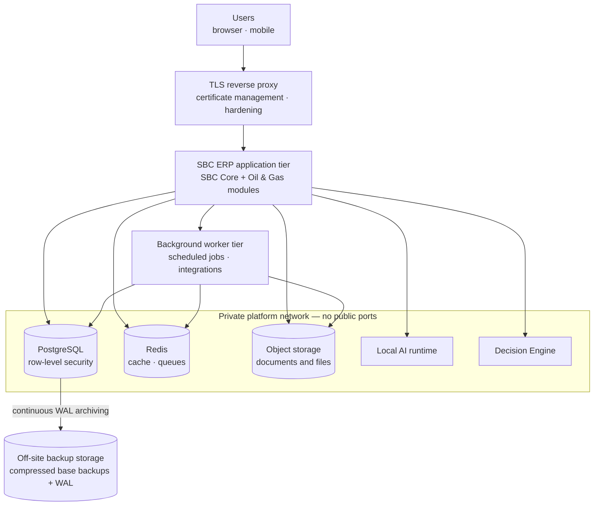

| Component | Role |
| --- | --- |
| TLS reverse proxy | Single public entry point with certificate management and hardened configuration |
| Application tier | SBC Core and the installed modules; schema changes run through a separate migrator with its own credentials |
| Background worker tier | Optional tier for scheduled jobs and integration work, idempotent and tenant-aware |
| PostgreSQL | System of record with row-level security and database-level accounting guards |
| Redis | Cache and queues |
| Object storage | Controlled documents and attachments managed by the Core File Manager |
| Local AI runtime and Decision Engine | Self-hosted on the private network, CPU or optional NVIDIA GPU |

### 22.3 High availability

For deployments that need higher resilience, SBC ERP provides high-availability overlays:

| Layer | High-availability design |
| --- | --- |
| Database | Patroni-managed PostgreSQL cluster with a three-node etcd consensus layer and HAProxy routing to the current primary, so applications reconnect automatically after failover |
| Cache and queues | Redis with Sentinel-managed failover |
| Object storage | Distributed object storage behind a load balancer |
| Application | Stateless application and worker tiers that can be scaled out |

Database credential boundaries are kept in the high-availability topology: only the provisioning job holds the cluster superuser credential.

### 22.4 Backup and recovery

| Capability | Design |
| --- | --- |
| Continuous protection | PostgreSQL write-ahead log archived continuously to off-site, S3-compatible storage |
| Base backups | Scheduled, compressed physical base backups pushed off-site |
| Point-in-time recovery | Restore to any moment, for example to the minute before an erroneous change, by replaying archived WAL onto a base backup |
| Logical snapshots | Database-level logical backups and restores for migration, audit copies and selective recovery |
| Dedicated credentials | Backup and archiving run under their own restricted database roles |
| Verified restore | Restored data is reviewed and verified before production traffic is switched over |

### 22.5 Operations and release management

- **Module lifecycle.** Modules are installed and upgraded through the Core Module Center. Each module is versioned independently and evolves its schema only through forward-only migrations.
- **Release assurance.** Every module release passes automated typecheck, tests, source-boundary checks and artifact build before publication. Production deployment runs preflight checks and contract tests.
- **Auxiliary services.** After each production deployment, platform services such as the local AI runtime and the Decision Engine are checked and brought to the expected state automatically.
- **Offline capability.** AI models can be preloaded so the platform runs without internet access.
- **Observability.** Scheduled jobs are idempotent and observable, and failures are escalated.

---

## 23. Data governance and interoperability

### 23.1 Master-data principles

Every master domain SHALL define:

- owner module;
- stable key;
- display name;
- lifecycle/status;
- effective dates where relevant;
- duplicate detection;
- required attributes;
- change authorization;
- data-quality rules;
- external identifiers;
- retention behavior.

Free-text names SHALL not replace authoritative IDs in cross-module relationships.

### 23.2 API and event principles

Public actions/events SHALL define:

- contract name and version;
- request/response schema;
- tenant and authorization requirements;
- idempotency behavior;
- error semantics;
- retry policy;
- correlation/source IDs;
- currency/UOM semantics;
- effective dates;
- compatibility/deprecation policy.

A module SHALL NOT rely on another module's undocumented private table structure.

### 23.3 Import and migration

Migration SHALL include:

- source inventory;
- field mapping;
- cleansing rules;
- duplicate resolution;
- reconciliation totals;
- exception report;
- approval of transformed data;
- dry run;
- controlled production import;
- post-load reconciliation;
- retained provenance.

Imported historical data SHALL not be presented as verified merely because it loaded successfully.

---

## 24. Local AI, decision engine and management intelligence

All artificial intelligence in SBC ERP runs **locally**, inside the customer's own deployment. Generative AI and decision models are hosted on the platform's private network. Business data is never sent to an external AI service to be analyzed, and no AI component holds database, storage, signing, backup or authentication credentials.

SBC ERP combines three capabilities to help managers decide faster and with better evidence:

1. a **local generative AI runtime** for assistance, summaries and natural-language interaction;
2. a **local decision engine** that returns typed, confidence-scored decisions instead of free text;
3. **management intelligence**: deterministic analytics, anomaly detection, readiness scoring, KPIs and alerts calculated directly from the authoritative ledgers.

Every AI capability stays inside the ERP's control boundary. AI informs and recommends. Postings, approvals, payments and master-data changes still pass through the same deterministic validations, permissions, delegation of authority and audit trail as any other transaction.

### 24.1 Architecture

```mermaid
flowchart TB
    subgraph USERS["Managers and users"]
        M1["Executive and finance dashboards"]
        M2["Operational workspaces"]
        M3["AI assistant"]
    end

    subgraph MOD["Oil & Gas modules"]
        A1["Accounting · AFE · Budget"]
        A2["Procurement · Inventory · Assets"]
        A3["Block Management · HR · Projects"]
    end

    subgraph KIT["SBC Module Kit — AI and decision bridge"]
        K1["Generation and tool-calling façade"]
        K2["Decision façade"]
        K3["Tenant context · permission check · audit"]
    end

    subgraph CORE["SBC Core — private network, self-hosted"]
        LLM["Local generative AI runtime<br/>self-hosted open-weight models<br/>CPU or GPU"]
        DE["Decision Engine<br/>typed decisions · calibrated confidence<br/>no text generation"]
        AUD[("Decision and AI audit records")]
    end

    subgraph INT["Management intelligence (deterministic)"]
        I1["Close-readiness advisor"]
        I2["Financial insights<br/>trends · projection · anomalies"]
        I3["KPI dashboard and alerts"]
        I4["Ask Accounting"]
        I5["Ledger Health · data-quality runs"]
    end

    M1 & M2 --> INT
    M3 --> K1
    MOD --> K1 & K2
    K1 --> LLM
    K2 --> DE
    K3 --> AUD
    DE --> AUD
    INT --> A1 & A2

    classDef local fill:#0b3d5c,color:#fff,stroke:#0b3d5c
    class LLM,DE local
```

Modules never talk to an AI runtime directly. They use the SBC Module Kit, which applies tenant context, permission checks and audit before any request reaches a model.

### 24.2 Local generative AI runtime

| Property | Design |
| --- | --- |
| Hosting | Self-hosted inside the deployment. Production exposes no AI port to the host or the internet. |
| Models | Open-weight models, selected and upgraded by configuration. Model files are cached on persistent local storage. |
| Hardware | Runs on CPU, with optional NVIDIA GPU acceleration. |
| Isolation | The AI runtime receives no database, storage, signing, backup or authentication credentials. |
| Access | Only through the Core AI façade, which supports generation, streaming and tool calling. Modules do not implement their own AI clients. |
| Offline operation | Models can be preloaded so the platform runs without internet access. |

### 24.3 Decision engine

The decision engine is a dedicated, self-hosted service for **typed business decisions**. It is deliberately separate from generative AI: it does not write text. It answers structured questions about a given business state.

| Decision type | Returns | Example use |
| --- | --- | --- |
| Choice | One option from a named list | Which approval route fits this purchase request? |
| Score | A position on an ordered rubric | How critical is this asset finding? |
| Boolean | True or false | Is the available budget sufficient for this request? |

```mermaid
sequenceDiagram
    autonumber
    participant MD as Module
    participant KT as Module Kit
    participant DE as Decision Engine (local)
    actor HU as Manager
    MD->>KT: Business state + typed questions + required confidence
    KT->>KT: Tenant, actor, module, purpose, resource attached
    KT->>DE: Internal call on the private network
    DE-->>KT: Answer + calibrated confidence
    alt confidence below the platform floor or the caller's threshold
        KT-->>MD: requiresReview = true
        MD->>HU: Route to human review — no automatic action
    else confident
        KT-->>MD: Typed answer
        MD->>MD: Continue through normal validations, DOA and audit
    end
    KT->>KT: Audit record — output, confidence, gate, correlation (no state payload)
```

Key safeguards:

- **Confidence floor.** The platform sets a minimum confidence. A caller may require a higher threshold but can never lower it.
- **Review routing.** An uncertain answer is marked for review and goes to a person or an explicitly configured review path. The engine never turns a low-confidence result into an approval.
- **Privacy-preserving audit.** Each decision is recorded with its output, confidence, gate and correlation identifiers. The submitted business state is not stored in the audit record.
- **Multilingual.** English and Arabic requests are served by resident models without cold-start delay.
- **Pinned models.** Model revisions are pinned to reviewed versions, not to a moving "latest".

### 24.4 Management intelligence

Management intelligence is calculated deterministically from posted, authoritative data, so every figure a manager sees reconciles to the books. It reuses the same ledger conventions as the financial statements and never creates a parallel set of numbers.

| Capability | What it gives managers |
| --- | --- |
| Close-readiness advisor | A 100-point readiness score for the period, with explicit recommendations: unposted work, overdue open periods, budget overruns, budgets awaiting approval, recurring documents due, and expense accounts rising quarter on quarter |
| Financial insights | A 12-month activity trend with next-month projection, expense trends, largest month-on-month movers, and statistical anomaly detection on expenses |
| KPI dashboard and alerts | Financial KPIs in base currency from posted data, with an alert feed |
| Ask Accounting | Instant answers to a catalog of management questions, parameterised by period, account and date, with every answer traceable to the ledger |
| Ledger Health | Continuous integrity checks across journals, subledgers, asset register links and control accounts |
| AFE and budget control views | Commitments, actuals, available budget and estimate at completion by AFE and budget line |
| Asset data quality and strategy evidence | Configurable data-quality rules and runs with findings, plus evidence supporting asset strategy and renewal decisions |
| Cash forecasting | Forward cash position projected from posted cash history with a statistical trend, using the same definition of cash as the cash flow statement |

### 24.5 AI assistants with governed data access

AI assistants reach business data through read-only tools exposed under the Model Context Protocol. Each tool declares the permission it needs, and that permission is checked against the owner of the access key on every call.

```mermaid
flowchart LR
    U["Authorized user<br/>AI access capability"] --> K["Personal access key"]
    K --> AS["AI assistant<br/>local model"]
    AS --> T["Read-only ERP tools<br/>overview · lists · reports"]
    T --> C{"Key owner holds<br/>the tool's permission?"}
    C -- "No" --> X(["Refused"])
    C -- "Yes" --> Q["Tenant-scoped query<br/>bounded row limit"]
    Q --> AS
    AS -. "cannot post, approve,<br/>pay or change masters" .-> L[("Authoritative records")]
```

### 24.6 AI and decision governance controls

| Rule | Requirement |
| --- | --- |
| WP-AI-001 | All generative AI and decision models SHALL run locally within the deployment. Business data SHALL NOT be sent to an external AI service. |
| WP-AI-002 | AI runtimes SHALL run on the private platform network with no public port, and SHALL hold no database, storage, signing, backup or authentication credentials. |
| WP-AI-003 | Modules SHALL reach AI only through the Core AI and decision façades, which apply tenant context, permissions and audit. |
| WP-AI-004 | AI access SHALL require an explicit capability, and assistant access SHALL use a personal key issued to the authorizing user. |
| WP-AI-005 | Every AI tool SHALL declare its required permission, checked against the key owner on each call, and SHALL return no data beyond that user's tenant and authorized scope. |
| WP-AI-006 | AI tools SHALL be read-only. AI SHALL NOT post, approve, pay, release, delete or change a controlled master. |
| WP-AI-007 | A decision SHALL be typed (choice, score or boolean) and carry a calibrated confidence. |
| WP-AI-008 | A decision below the platform confidence floor or the caller's threshold SHALL be routed to review and SHALL NOT trigger an automatic action. Callers SHALL NOT lower the platform floor. |
| WP-AI-009 | Every decision SHALL be audited with output, confidence, gate and correlation identifiers, without storing the submitted business state. |
| WP-AI-010 | Any action that follows AI advice or a decision SHALL pass the same deterministic validations, permissions, delegation of authority and audit controls as one entered by a user. |
| WP-AI-011 | Management analytics SHALL be calculated from posted, authoritative data, using the same conventions as the financial statements. |
| WP-AI-012 | Model versions SHALL be pinned to reviewed revisions and changed only through configuration. |
| WP-AI-013 | Sensitive personal, medical and payroll data SHALL reach AI only where the requesting user is already authorized to see it. |
| WP-AI-014 | AI governance SHALL use ISO/IEC 42001:2023 as a design reference, without implying certification. |

---

## 25. Internal control, audit and assurance model

SBC ERP supports the five COSO control components through system design:

1. Control environment — roles, responsibilities, policy acknowledgement and ethical controls.
2. Risk assessment — risk registers, thresholds and change impact.
3. Control activities — approvals, reconciliations, validation, SoD and access controls.
4. Information and communication — reliable reporting, workflow, notifications and evidence.
5. Monitoring — exception dashboards, access reviews, close checklists, audit and control testing.

Internal audit support includes:

- read-only evidence access;
- immutable audit trail;
- sampling/export capability;
- traceability from source document to approval to posting/result;
- control owner and test evidence;
- protection of auditor independence from transaction approval.

External-audit support provides reproducible extracts and source references without altering production history.

### 25.1 COSO components mapped to SBC ERP mechanisms

```mermaid
flowchart LR
    C1["1. Control environment"] --> M1["Roles and capability keys<br/>policy acknowledgement<br/>no person names in authorization"]
    C2["2. Risk assessment"] --> M2["Severity model BLOCK / ERROR / WARNING / INFO<br/>project risk registers<br/>asset criticality"]
    C3["3. Control activities"] --> M3["Maker-checker · DOA matrix<br/>budget and AFE control<br/>database guards · reconciliations"]
    C4["4. Information and communication"] --> M4["Versioned FS mapping<br/>source-to-posting traceability<br/>workflow notifications"]
    C5["5. Monitoring"] --> M5["Ledger Health · close checklist<br/>access reviews · data-quality runs<br/>rule-conformance tests"]
```

---

## 26. Testing and release assurance

A world-class ERP control is incomplete until it is testable.

Each critical rule SHOULD have the following test classes where relevant:

- positive case;
- negative/prohibited case;
- boundary/tolerance case;
- effective-date case;
- permission/SoD case;
- concurrency/idempotency case;
- reversal/correction case;
- cross-module integration case;
- migration/upgrade case.

Financial modules SHOULD add:

- golden journal tests;
- Trial Balance reconciliation tests;
- subledger-to-GL reconciliation tests;
- period-close tests;
- FX precision tests;
- tax rounding tests;
- reversal tests.

Inventory/Assets/AFE/Procurement SHOULD add:

- quantity/value conservation tests;
- overrun/over-receipt controls;
- partial receipt/SES scenarios;
- state-machine tests;
- version/amendment history tests;
- integration replay tests.

Security tests SHOULD cover:

- tenant isolation;
- unauthorized action rejection;
- privilege escalation attempts;
- direct API calls without UI;
- sensitive-field leakage;
- audit-log creation.

UI tests SHOULD cover:

- desktop/mobile layouts;
- modal and form responsiveness;
- keyboard operation;
- no unintended horizontal scroll;
- long values and localization;
- error focus and validation visibility.

A release SHALL NOT change a requirement's status to Verified when tests or evidence have not actually passed.

### 26.1 Requirement-to-release traceability

Each control moves from its authoritative source to a released, evidenced capability through seven linked steps. A control counts as verified only when every link is in place.

```mermaid
flowchart LR
    L["Authoritative source<br/>standard · law · contract"] --> CR["Control requirement"]
    CR --> BR["Behavioral rule<br/>observable, testable"]
    BR --> RG["Control registry<br/>owner · status · enforcement layer"]
    RG --> IM["Implementation<br/>server action and database guard"]
    IM --> TS["Automated test"]
    TS --> EV["Evidence<br/>fingerprinted result"]
    EV --> RL["Release<br/>release assurance record"]
```

| Link | Gate |
| --- | --- |
| Requirement to behavioral rule | Rewritten as observable behavior with a source reference |
| Rule to registry | The registry is synchronized automatically with the rulebooks |
| Registry to implementation and test | A conformance test fails the build if an enforced control has no implementation or no test |
| Test to evidence | The conformance harness writes fingerprinted evidence |
| Evidence to release | Release assurance is regenerated for every release; no status is raised without passing evidence |

---

## 27. Document and evidence governance

Controlled documents SHALL support:

- stable document identity;
- version/revision;
- owner;
- classification;
- effective date;
- approval status;
- linked transaction;
- checksum/hash where required;
- retention class;
- legal hold;
- supersession history.

Replacing an attachment SHALL not erase the historical evidence that supported an earlier approval.

Signed contracts, guarantees, invoices, approvals, engineering estimates, inspection certificates and other material evidence SHALL remain traceable to the business event they support.

---

## 28. Enterprise reconciliation framework

The following reconciliations are available at period end or at operational intervals:

| Reconciliation | Bridge |
| --- | --- |
| Accounts payable | Supplier open items ↔ AP control account |
| Accounts receivable | Customer open items ↔ AR control account |
| Goods received not invoiced | Receipts and service entries ↔ GRNI account |
| Inventory | Stock ledger quantity and value ↔ inventory GL |
| Fixed assets | Asset register ↔ PPE, construction in progress and accumulated depreciation accounts |
| Bank | Bank statement ↔ bank and cash GL |
| Tax | VAT and withholding schedules ↔ tax control accounts |
| AFE | Approved AFE ↔ commitments ↔ actuals ↔ estimate at completion |
| Budget | Approved budget ↔ transfers ↔ reservations ↔ commitments ↔ actuals ↔ available |
| Procurement | Order and contract value ↔ receipts and service entries ↔ matched invoices ↔ remaining commitment |

Every unreconciled difference has an owner, a reason, a status and resolution evidence.

```mermaid
flowchart LR
    subgraph SUB["Operational and subledger records"]
        S1["Supplier open items"]
        S2["Customer open items"]
        S3["Stock ledger"]
        S4["Asset register"]
        S5["Bank statements"]
        S6["Tax schedules · e-invoice status"]
        S7["AFE and budget ledgers"]
    end
    subgraph GLC["General ledger"]
        G1["AP control"]
        G2["AR control"]
        G3["Inventory and GRNI"]
        G4["PPE · CWIP · accumulated depreciation"]
        G5["Bank and cash"]
        G6["VAT and withholding"]
        G7["Posted actuals by AFE and budget line"]
    end
    S1 <--> G1
    S2 <--> G2
    S3 <-->|"getInventoryGlBalance"| G3
    S4 <-->|"getFixedAssetReconciliation"| G4
    S5 <--> G5
    S6 <--> G6
    S7 <-->|"getJournalIntegrationSnapshot"| G7
    GLC --> LH["Ledger Health<br/>integrity checks and exceptions"]
```

---

## 29. Prohibited design patterns

The following patterns are prohibited unless an explicitly approved architecture decision says otherwise:

- direct cross-module writes to private tables;
- duplicate supplier masters in Accounting and Procurement;
- duplicate authoritative asset masters;
- editable posted journals;
- deleting posted history to correct errors;
- using a bank account as a balancing plug;
- hiding accounting errors with suspense/rounding entries without approval and cause;
- hard-coded person names for approvals;
- hard-coded tax or concession rates with no effective date;
- treating an AFE approval as automatic capitalization;
- treating a PO as proof that goods/services were received;
- treating payment as proof that an invoice was valid;
- treating a GRN/SES as a payment;
- treating an abandonment fund as automatic settlement of the decommissioning liability;
- silently changing participating interests historically;
- updating an approved contract/AFE/project baseline in place;
- using UI-only validation for financial integrity;
- using color alone to show status;
- allowing mobile/modals to hide inaccessible fields through horizontal overflow;
- AI bypass of business controls;
- reporting unverifiable figures with no source/period/currency context.

---

## 30. Minimum evidence package for customer acceptance

For each critical business capability, implementation acceptance SHOULD include:

1. Approved requirement/rule ID.
2. Process and ownership definition.
3. Configuration snapshot.
4. Role/permission matrix.
5. DOA/SoD rules.
6. Master-data definition.
7. Happy-path test.
8. Negative/prohibited-path test.
9. Boundary/tolerance test.
10. Integration test.
11. Audit-trail sample.
12. Reversal/correction sample.
13. Reconciliation evidence.
14. Security/tenant-isolation evidence.
15. UAT approval.
16. Release/version reference.

This evidence model allows a customer, auditor or implementation team to distinguish a feature demonstration from a controlled production capability.

---

## 31. Primary public verification anchors

The following public pages are suitable verification anchors for standard/law identity and current status. They do not replace licensed standard text or professional/legal advice.

- IFRS Foundation standards: https://www.ifrs.org/issued-standards/list-of-standards/
- IFRS 6: https://www.ifrs.org/issued-standards/list-of-standards/ifrs-6-exploration-for-and-evaluation-of-mineral-resources/
- IFRS 11: https://www.ifrs.org/issued-standards/list-of-standards/ifrs-11-joint-arrangements/
- IFRS 15: https://www.ifrs.org/issued-standards/list-of-standards/ifrs-15-revenue-from-contracts-with-customers/
- IFRS 18: https://www.ifrs.org/issued-standards/list-of-standards/ifrs-18-presentation-and-disclosure-in-financial-statements/
- ISO 55001:2024: https://www.iso.org/standard/83054.html
- ISO 14224:2016: https://www.iso.org/standard/64076.html
- ISO/IEC 27001:2022: https://www.iso.org/standard/27001
- ISO 31000:2018: https://www.iso.org/standard/65694.html
- ISO 9001:2026: https://www.iso.org/standard/9001
- ISO 14001:2026: https://www.iso.org/standard/14001
- ISO 37001:2025: https://www.iso.org/standard/37001
- ISO 37301:2021: https://www.iso.org/standard/75080.html
- ISO/IEC 42001:2023: https://www.iso.org/standard/42001
- NIST CSF 2.0: https://www.nist.gov/cyberframework
- OWASP ASVS: https://owasp.org/projects/asvs
- COSO Internal Control: https://www.coso.org/internal-control
- IIA Global Internal Audit Standards: https://www.theiia.org/en/standards/
- Oman Tax Authority VAT guidance: https://tms.taxoman.gov.om/portal/vat-guidelines
- Oman Tax Authority VAT law/regulations: https://tms.taxoman.gov.om/portal/vat-law-regulations
- Oman Tax Authority Fawtara: https://fawtara.taxoman.gov.om/
- Oman Tax Authority Fawtara FAQs: https://tms.taxoman.gov.om/portal/web/taxportal/fawtara-faqs
- Oman Tax Authority withholding tax: https://tms.taxoman.gov.om/portal/withholding-tax
- Oman Commercial Companies Law (Royal Decree 18/2019): https://qanoon.om/p/2019/rd2019018/
- Oman Labor Law (Royal Decree 53/2023): https://qanoon.om/p/2023/rd2023053/
- Oman Personal Data Protection Law (Royal Decree 6/2022): https://qanoon.om/p/2022/rd2022006/
- IFRS Accounting Taxonomy: https://www.ifrs.org/issued-standards/ifrs-taxonomy/
- IAS 16: https://www.ifrs.org/issued-standards/list-of-standards/ias-16-property-plant-and-equipment/
- IAS 21: https://www.ifrs.org/issued-standards/list-of-standards/ias-21-the-effects-of-changes-in-foreign-exchange-rates/
- IAS 2: https://www.ifrs.org/issued-standards/list-of-standards/ias-2-inventories/
- IAASB International Standards on Auditing: https://www.iaasb.org/standards-pronouncements
- Central Bank of Oman: https://cbo.gov.om/

---

## 32. Governance of this whitepaper

This document is reviewed whenever any of the following changes:

- IFRS, IAS or IFRIC requirements or effective dates;
- Oman tax law, Tax Authority decisions or e-invoicing specifications;
- Oman commercial, labor, privacy or related law;
- editions of the reference standards used by the product;
- material concession, EPSA, PSA or JOA templates;
- module ownership boundaries or integration contracts;
- accounting, delegation-of-authority or segregation-of-duties policy;
- the cybersecurity baseline.

Each edition is versioned. Earlier editions remain available for implementation and audit reference.

---

## Appendix A. Module-by-standard responsibility matrix

**O** = owns the authoritative data or posting. **C** = contributes source data or a control.

| Standard or area | Acc | AFE | Assets | Block | Budget | Finance | HR | Inv | Proc | Proj |
| --- | :-: | :-: | :-: | :-: | :-: | :-: | :-: | :-: | :-: | :-: |
| IFRS 6 Exploration and evaluation | O | C | | C | | | | C | C | |
| IFRS 11 Joint arrangements | C | | | O | | | | | | |
| IFRS 15 Revenue | O | | | | | | | | | |
| IFRS 16 Leases | O | | | | | | | | | |
| IFRS 18 Presentation | O | | | | | | | | | |
| IAS 2 Inventories | O | C | | | | | | O | C | |
| IAS 7 Cash flows | O | | | | | | | | | |
| IAS 16 Property, plant and equipment | O | C | O | | | | | C | C | |
| IAS 21 Foreign exchange | O | C | | | C | | | C | C | |
| Budget and commitment control | C | O | | | O | | C | | C | |
| VAT, withholding and Fawtara | O | | | | | | | | C | |
| COSO internal control | O | O | O | O | O | O | O | O | O | O |

## Appendix B. Glossary

| Term | Meaning |
| --- | --- |
| AFE | Authorization for Expenditure: approval to spend on a well, facility or project |
| CBS | Cost breakdown structure of an AFE |
| CWIP | Construction work in progress |
| DOA | Delegation of authority: who may approve what, up to which amount |
| EAC | Estimate at completion |
| EPSA / PSA | Exploration and production sharing agreement / production sharing agreement |
| Fawtara | Oman Tax Authority e-invoicing program |
| GRN / GRNI | Goods receipt note / goods received not invoiced |
| JOA | Joint operating agreement |
| Decision engine | Local service that answers typed business questions (choice, score, boolean) with a calibrated confidence and routes uncertain answers to review |
| Local AI | AI models hosted inside the customer's deployment, with no business data sent to external AI services |
| Maker-checker | The person who prepares a transaction cannot approve or post it |
| Module action | A sanctioned, tenant-scoped call from one module to another through the SBC Module Kit |
| NRV | Net realizable value |
| RLS | PostgreSQL row-level security, used for tenant isolation |
| SES | Service entry sheet: confirmation that services were performed |
| SoD | Segregation of duties |
| WP-* | Identifier of a control in this whitepaper |

---

## Final design principle

SBC ERP behaves as a controlled system of record, not as a collection of independent forms.

Every enterprise transaction can be understood end to end: who initiated it, under which authority, against which master data and contract, what evidence existed, which rule version applied, who approved it, what inventory, asset, AFE, budget and accounting effect it had, how it reconciles, and how the system proves that history later.

That traceability is the foundation of every Oil & Gas module in SBC ERP.
